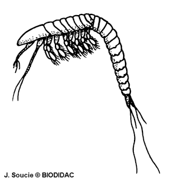

---
aliases:
- cefalocàrides
- Cefalocáridos
- Cefalokaridai
- Cefalokarïdalar
- Cefalokarīdas
- Cephalocarida
- cephalocarider
- horseshoe shrimp
- Hutchinsoniellidae
- kilpipäiset
- Podkowiastogłowe
- Sefalokaridlər
- ősrákok
- Цефалокаридалар
- Цефалокариди
- Цефалокариды
- تسەفالوكارىيدالار
- خرچنگان
- رأسيات الدرقة
- راسيات الدرقه
- カシラエビ綱
- 头虾纲
- 頭蝦綱
- 두판강
title: Cephalocarida
has_id_wikidata: Q132649
dv_has_:
  name_:
    an: Cephalocarida
    ar: رأسيات الدرقة
    arz: راسيات الدرقه
    ast: Cephalocarida
    az: Sefalokaridlər
    bg: Цефалокариди
    ca: cefalocàrides
    ceb: Cephalocarida
    de: Cephalocarida
    en: Cephalocarida
    eo: Cephalocarida
    es: Cephalocarida
    eu: Hutchinsoniellidae
    ext: Cephalocarida
    fa: خرچنگان
    fi: kilpipäiset
    fr: Cephalocarida
    ga: Cephalocarida
    gl: Cefalocáridos
    he: Cephalocarida
    hr: Cephalocarida
    hu: ősrákok
    ia: Cephalocarida
    id: Cephalocarida
    ie: Cephalocarida
    io: Cephalocarida
    it: Hutchinsoniellidae
    ja: カシラエビ綱
    kk: Цефалокаридалар
    kk_arab: تسەفالوكارىيدالار
    kk-cn: تسەفالوكارىيدالار
    kk_cyrl: Цефалокаридалар
    kk-kz: Цефалокаридалар
    kk_latn: Cefalokarïdalar
    kk-tr: Cefalokarïdalar
    ko: 두판강
    la: Cephalocarida
    li: Cephalocarida
    lt: Cefalokaridai
    lv: Cefalokarīdas
    mul: Cephalocarida
    nb: cephalocarider
    nl: Cephalocarida
    oc: Cephalocarida
    pl: Podkowiastogłowe
    pt: Cephalocarida
    pt_br: Cephalocarida
    ro: Cephalocarida
    ru: Цефалокариды
    sq: Cephalocarida
    sv: Cephalocarida
    tr: Cephalocarida
    uk: Цефалокариди
    vi: Cephalocarida
    vo: Cephalocarida
    war: Cephalocarida
    zh: 頭蝦綱
    zh_cn: 头虾纲
    zh_hans: 头虾纲
    zh_hant: 頭蝦綱
    zh_hk: 頭蝦綱
    zh_sg: 头虾纲
    zh_tw: 頭蝦綱
---

# [[Cephalocarida]] 
 

## #has_/text_of_/abstract 

> The **Cephalocarida**, from Ancient Greek κεφαλή (kephalḗ), meaning "head", 
> and καρίς (karís), meaning "shrimp", 
> are a class in the subphylum Crustacea comprising only 12 species. 
> 
> Both the nauplii and the adults are benthic. 
> 
> They were discovered in 1955 by Howard L. Sanders, 
> and are commonly referred to as horseshoe shrimp. 
> 
> They have been grouped together with the Remipedia in the Xenocarida. 
> Although a second family, Lightiellidae, is sometimes used, all 
> cephalocaridans are generally considered to belong in just one family: Hutchinsoniellidae. 
> 
> Fossil records of cephalocaridans have been found in the Ordovician Castle Bank site.
>
> [Wikipedia](https://en.wikipedia.org/wiki/Cephalocarida) 

## Phylogeny 

-   « Ancestral Groups  
    -  [Crustacea](../Crustacea.md) 
    -  [Arthropoda](../../Arthropoda.md) 
    -  [Bilateria](../../../Bilateria.md) 
    -  [Animals](../../../../Animals.md) 
    -  [Eukarya](../../../../../Eukarya.md) 
    -   [Tree of Life](../../../../../Tree_of_Life.md)

-   ◊ Sibling Groups of  Crustacea
    -  [Branchiopoda](Branchiopoda.md) 
    -  [Remipedia](Remipedia.md) 
    -   Cephalocarida
    -  [Copepoda](Copepoda.md) 
    -  [Ostracoda](Ostracoda.md) 
    -  [Branchiura](Branchiura.md) 
    -  [Thecostraca](Thecostraca.md) 
    -  [Malacostraca](Malacostraca.md) 

-   » Sub-Groups 
	-   *Hutchinsoniella*
	-   *Lightiella*
	-   *Chiltonella*
	-   *Sandersiella*
	-   *Hampsonellus*

## Title Illustrations

-------------------------------------------------------------------------- 
 
scientific_name ::  Hutchinsoniella
Comments          External features of a primitive crustacean. Important features are the carapace and the number of legs.
Creator           J. Soucie
copyright ::         © [BIODIDAC](http://biodidac.bio.uottawa.ca/index.htm) 

## Confidential Links & Embeds: 

### #is_/same_as :: [[/_Standards/bio/bio~Domain/Eukarya/Animal/Bilateria/Arthropoda/Crustacea/Cephalocarida|Cephalocarida]] 

### #is_/same_as :: [[/_public/bio/bio~Domain/Eukarya/Animal/Bilateria/Arthropoda/Crustacea/Cephalocarida.public|Cephalocarida.public]] 

### #is_/same_as :: [[/_internal/bio/bio~Domain/Eukarya/Animal/Bilateria/Arthropoda/Crustacea/Cephalocarida.internal|Cephalocarida.internal]] 

### #is_/same_as :: [[/_protect/bio/bio~Domain/Eukarya/Animal/Bilateria/Arthropoda/Crustacea/Cephalocarida.protect|Cephalocarida.protect]] 

### #is_/same_as :: [[/_private/bio/bio~Domain/Eukarya/Animal/Bilateria/Arthropoda/Crustacea/Cephalocarida.private|Cephalocarida.private]] 

### #is_/same_as :: [[/_personal/bio/bio~Domain/Eukarya/Animal/Bilateria/Arthropoda/Crustacea/Cephalocarida.personal|Cephalocarida.personal]] 

### #is_/same_as :: [[/_secret/bio/bio~Domain/Eukarya/Animal/Bilateria/Arthropoda/Crustacea/Cephalocarida.secret|Cephalocarida.secret]] 

