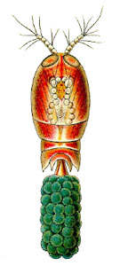
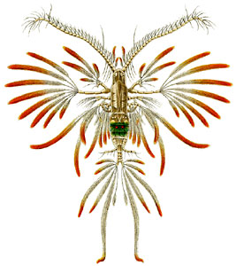
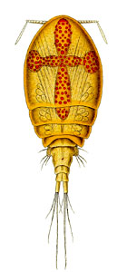

---
aliases:
- Aerjalalised
- Airkājvēži
- ceponožci
- copepod
- Copepoda
- Copepode
- Copepodo
- Copèpodes
- copépode
- Copépodos
- cópapód
- eenoogkreeftjes
- Eshkakoyoqli qisqichbaqalar
- Eskekayaqtı şayantärizdiler
- evezőlábú rákok
- hankajalkaiset
- hoppekreps
- Hoppkräftor
- Irklakojai vėžiagyviai
- klanonožci
- kopepod
- Kopepodo
- Krabbaflær
- Ruderfusskrebse
- Ruderfußkrebse
- SUCC
- Táyiʼ naatʼiʼí bikágí ntłʼizígíí
- Vandlopper
- Veslonošci
- widłonogi
- Κωπήποδα
- Весланогія ракападобныя
- веслоногі раки
- Веслоноги рачета
- веслоногие ракообразные
- Ескекаяқты шаянтәрізділер
- ишкәгаяклы кысласыманнар
- Ишкәгаяҡ
- שטרגליים
- مجذافيات الأرجل
- مجذافيات الارجل
- پاروپایان
- ەسكەكاياقتى شايانتارىزدىلەر
- कोपेपॉड्स
- ნიჩაბფეხიანები
- カイアシ類
- 桡脚类
- 桡足亚纲
- 橈腳類
- 橈足亞綱
- 요각류
title: Copepoda
has_id_wikidata: Q189973
dv_has_:
  name_:
    ar: مجذافيات الأرجل
    arz: مجذافيات الارجل
    ast: Copepoda
    ba: Ишкәгаяҡ
    be: Весланогія ракападобныя
    bg: Веслоноги рачета
    ca: Copèpodes
    ceb: Copepoda
    cs: klanonožci
    cy: copepod
    da: Vandlopper
    de: Ruderfußkrebse
    de_ch: Ruderfusskrebse
    el: Κωπήποδα
    en: copepod
    eo: Kopepodo
    es: SUCC
    et: Aerjalalised
    eu: Copepoda
    fa: پاروپایان
    fi: hankajalkaiset
    fr: Copepoda
    ga: cópapód
    gl: Copépodos
    he: שטרגליים
    hi: कोपेपॉड्स
    hr: Veslonošci
    hu: evezőlábú rákok
    id: Copepoda
    is: Krabbaflær
    it: Copepoda
    ja: カイアシ類
    jv: Copepoda
    ka: ნიჩაბფეხიანები
    kk: Ескекаяқты шаянтәрізділер
    kk_arab: ەسكەكاياقتى شايانتارىزدىلەر
    kk-cn: ەسكەكاياقتى شايانتارىزدىلەر
    kk_cyrl: Ескекаяқты шаянтәрізділер
    kk-kz: Ескекаяқты шаянтәрізділер
    kk_latn: Eskekayaqtı şayantärizdiler
    kk-tr: Eskekayaqtı şayantärizdiler
    ko: 요각류
    la: Copepoda
    lfn: Copepodo
    lt: Irklakojai vėžiagyviai
    lv: Airkājvēži
    mul: Copepoda
    nb: hoppekreps
    nl: eenoogkreeftjes
    nn: hoppekreps
    nv: Táyiʼ naatʼiʼí bikágí ntłʼizígíí
    pl: widłonogi
    pt: copépode
    ro: Copepode
    ru: веслоногие ракообразные
    sl: ceponožci
    sq: Copepoda
    sr: Copepod
    sv: Hoppkräftor
    tr: kopepod
    tt: ишкәгаяклы кысласыманнар
    uk: веслоногі раки
    uz: Eshkakoyoqli qisqichbaqalar
    vi: Copepoda
    war: Copepoda
    zh: 桡足亚纲
    zh_cn: 桡足亚纲
    zh_hans: 桡脚类
    zh_hant: 橈腳類
    zh_hk: 橈腳類
    zh_sg: 桡脚类
    zh_tw: 橈足亞綱
---
# [[Copepoda]] 

 ) ) 

## #has_/text_of_/abstract 

> Copepods (meaning 'oar-feet') are a group of small crustaceans 
> found in nearly every freshwater and saltwater habitat. 
> 
> Some species are planktonic (living in the water column), 
> some are benthic (living on the sediments), several species have parasitic phases, 
> and some continental species may live in limnoterrestrial habitats 
> and other wet terrestrial places, such as swamps, under leaf fall 
> in wet forests, bogs, springs, ephemeral ponds, puddles, damp moss, 
> or water-filled recesses of plants (phytotelmata) such as bromeliads and pitcher plants. 
> 
> Many live underground in marine and freshwater caves, sinkholes, or stream beds. 
> Copepods are sometimes used as biodiversity indicators.
>
> As with other crustaceans, copepods have a larval form. 
> For copepods, the egg hatches into a nauplius form, 
> with a head and a tail but no true thorax or abdomen. 
> 
> The larva molts several times until it resembles the adult 
> and then, after more molts, achieves adult development. 
> 
> The nauplius form is so different from the adult form 
> that it was once thought to be a separate species. 
> 
> The metamorphosis had, until 1832, 
> led to copepods being misidentified as zoophytes or insects (albeit aquatic ones), 
> or, for parasitic copepods, 'fish lice'.
>
> [Wikipedia](https://en.wikipedia.org/wiki/Copepod) 

### Information on the Internet

-   [The World of Copepods](http://www.nmnh.si.edu/iz/copepod/). Smithsonian National Museum of Natural History, USA.
-   [World Association of     Copepodologists](http://www.copepoda.uconn.edu/)
-   [The Virtual Copepod     Page](http://jaffeweb.ucsd.edu/jaffelab/people/celeste/copepods.html). Scripps Institution of Oceanography, USA.
-   [The Biology of     Copepods](http://www.uni-oldenburg.de/zoomorphology/Biology.html).
    Zoosystematics & Morphology Section at the University of Oldenburg, Germany.
-   [Copepod Web Portal](http://copepods.interfree.it/index.html). G. L. Pesce, University L\'Aquila, Italy.
-   [Copepods](http://www.museum.vic.gov.au/crust/copbiol.html). Museum Victoria, Australia.
-   [Diversity and Geographical Distribution of Pelagic     Copepoda](http://www.obs-banyuls.fr/razouls/webcd/razouls1.htm). 
    Observatoire océanologique, Laboratoire Arago, Banyuls/Mer, France.
-   [The Copepod     Page](http://www.ocean.washington.edu/people/oc549/savent/copepod.htm). Sean Avent.
-   [Phylogeny of     Copepods](http://www.biol.sc.edu/%7Ecoull_lab/copepoda.html). Bruce C. Coull, University of South Carolina, USA.

## Phylogeny 

-   « Ancestral Groups  
    -  [Crustacea](../Crustacea.md) 
    -  [Arthropoda](../../Arthropoda.md) 
    -  [Bilateria](../../../Bilateria.md) 
    -  [Animals](../../../../Animals.md) 
    -  [Eukarya](../../../../../Eukarya.md) 
    -   [Tree of Life](../../../../../Tree_of_Life.md)

-   ◊ Sibling Groups of  Crustacea
    -  [Branchiopoda](Branchiopoda.md) 
    -  [Remipedia](Remipedia.md) 
    -  [Cephalocarida](Cephalocarida.md) 
    -   Copepoda
    -  [Ostracoda](Ostracoda.md) 
    -  [Branchiura](Branchiura.md) 
    -  [Thecostraca](Thecostraca.md) 
    -  [Malacostraca](Malacostraca.md) 

-   » Sub-Groups
    -  [Platycopioida](Copepoda/Platycopioida.md) 
    -  [Calanoida](Copepoda/Calanoida.md) 
    -  [Misophrioida](Copepoda/Misophrioida.md) 
    -  [Cyclopoida](Copepoda/Cyclopoida.md) 
    -  [Harpacticoida](Copepoda/Harpacticoida.md) 
    -  [Poecilostomatoida](Copepoda/Poecilostomatoida.md) 
    -  [Siphonostomatoida](Copepoda/Siphonostomatoida.md) 
	-   *Gelyelloida*
	-   *Mormonilloida*
	-   *Monstrilloida*

## Title Illustrations

-   Corycaeus venustus female (Poecilostomatoida: Corycaeidae).
-   Augaptilus filigerus male (Calanoida: Augaptilidae).
-   Acontiophorus scutatus female (Siphonostomatoida: Asterocheridae).

Images from Ernst Haeckel\'s Kunstformen der Natur published 1899-1904
by Verlag des Bibliographischen Instituts, Leipzig and Vienna. Scans
courtesy of [Kurt Stüber\'s online library of historic and classical biology books.](http://caliban.mpiz-koeln.mpg.de/%7Estueber/stueber_library.html)

## Confidential Links & Embeds: 

### #is_/same_as :: [[/_Standards/bio/bio~Domain/Eukarya/Animal/Bilateria/Arthropoda/Crustacea/Copepoda|Copepoda]] 

### #is_/same_as :: [[/_public/bio/bio~Domain/Eukarya/Animal/Bilateria/Arthropoda/Crustacea/Copepoda.public|Copepoda.public]] 

### #is_/same_as :: [[/_internal/bio/bio~Domain/Eukarya/Animal/Bilateria/Arthropoda/Crustacea/Copepoda.internal|Copepoda.internal]] 

### #is_/same_as :: [[/_protect/bio/bio~Domain/Eukarya/Animal/Bilateria/Arthropoda/Crustacea/Copepoda.protect|Copepoda.protect]] 

### #is_/same_as :: [[/_private/bio/bio~Domain/Eukarya/Animal/Bilateria/Arthropoda/Crustacea/Copepoda.private|Copepoda.private]] 

### #is_/same_as :: [[/_personal/bio/bio~Domain/Eukarya/Animal/Bilateria/Arthropoda/Crustacea/Copepoda.personal|Copepoda.personal]] 

### #is_/same_as :: [[/_secret/bio/bio~Domain/Eukarya/Animal/Bilateria/Arthropoda/Crustacea/Copepoda.secret|Copepoda.secret]] 

