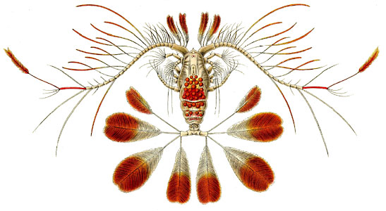

---
aliases:
  - Calanoida
title: Calanoida
has_id_wikidata: Q478553
---
# [[Calanoida]]  

 

## #has_/text_of_/abstract 

> **Calanoida** is an order of copepods, a group of arthropods commonly found as zooplankton. 
> The order includes around 46 families 
> with about 1800 species of both marine and freshwater copepods between them.
>
> [Wikipedia](https://en.wikipedia.org/wiki/Calanoida) 

## Phylogeny 

-   « Ancestral Groups  
    -  [Copepoda](../Copepoda.md) 
    -  [Crustacea](../../Crustacea.md) 
    -  [Arthropoda](../../../Arthropoda.md) 
    -  [Bilateria](../../../../Bilateria.md) 
    -  [Animals](../../../../../Animals.md) 
    -  [Eukarya](../../../../../../Eukarya.md) 
    -   [Tree of Life](../../../../../../Tree_of_Life.md)

-   ◊ Sibling Groups of  Copepoda
    -  [Platycopioida](Platycopioida.md) 
    -   Calanoida
    -  [Misophrioida](Misophrioida.md) 
    -  [Cyclopoida](Cyclopoida.md) 
    -  [Harpacticoida](Harpacticoida.md) 
    -  [Poecilostomatoida](Poecilostomatoida.md) 
    -  [Siphonostomatoida](Siphonostomatoida.md) 

-   » Sub-Groups 

	-   *Acartiidae*
	-   *Aetideidae*
	-   *Arietellidae*
	-   *Augaptilidae*
	-   *Bathypontiidae*
	-   *Boholinidae*
	-   *Calanidae*
	-   *Candaciidae*
	-   *Centropagidae*
	-   *Clausocalanidae*
	-   *Diaixidae*
	-   *Diaptomidae*
	-   *Discoidae*
	-   *Epacteriscidae*
	-   *Eucalanidae*
	-   *Euchaetidae*
	-   *Fosshageniidae*
	-   *Heterorhabdidae*
	-   *Hyperbionychidae*
	-   *Lucicutiidae*
	-   *Mecynoceridae*
	-   *Megacalanidae*
	-   *Mesaiokeratidae*
	-   *Metridinidae*
	-   *Nullosetigeridae*
	-   *Paracalanidae*
	-   *Parapontellidae*
	-   *Parkiidae*
	-   *Phaennidae*
	-   *Pontellidae*
	-   *Pseudocyclopidae*
	-   *Pseudocyclopiidae*
	-   *Pseudodiaptomidae*
	-   *Rhincalanidae*
	-   *Ridgewayiidae*
	-   *Ryocalanidae*
	-   *Scolecithricidae*
	-   *Spinocalanidae*
	-   *Stephidae*
	-   *Sulcanidae*
	-   *Temoridae*
	-   *Tharybidae*
	-   *Tortanidae*

List of families after Martin & Davis 2001.

Containing group:[Copepoda](../Copepoda.md) 

### Information on the Internet

[ZooGene](http://www.zoogene.org/). A DNA Sequence Database for Calanoid
Copepods and Euphausiids.

### References

Braga, E., R. Zardoya, A. Meyer, and J. Yen. 1999. Mitochondrial and
nuclear rRNA based copepod phylogeny with emphasis on the Euchaetidae
(Calanoida). Marine Biology 133:79-90.

Damkaer, D. M. 1996. Copepod taxonomy: discovery vs. recognition.
Proceedings of the Biological Society of Washington 109:687-694.

Huys, R. and G. A. Boxshall. 1991. Copepod Evolution. The Ray Society,
London.

Klein, J. C. V. 1998. Interpretation of character phylogenies in
calanoid copepods by implementing Dollo\'s law. Journal of Crustacean
Biology 18:153-160.

Martin, J. W. and G. E. Davis. 2001. An updated Classification of the
Recent Crustacea. Natural History Museum of Los Angeles County Science
Series 39. Los Angeles, CA.

Ohtsuka, S. and R. Huys. 2001. Sexual dimorphism in calanoid copepods:
morphology and function. Hydrobiologia 453:441-466.

## Title Illustrations

Calanus pavo male (Calanidae).

Image from Ernst Haeckel\'s Kunstformen der Natur published 1899-1904 by
Verlag des Bibliographischen Instituts, Leipzig and Vienna. Scans
courtesy of [Kurt Stüber\'s online library of historic and classical biology books.](http://caliban.mpiz-koeln.mpg.de/%7Estueber/stueber_library.html)
 

## Confidential Links & Embeds: 

### #is_/same_as :: [[/_Standards/bio/bio~Domain/Eukarya/Animal/Bilateria/Arthropoda/Crustacea/Copepoda/Calanoida|Calanoida]] 

### #is_/same_as :: [[/_public/bio/bio~Domain/Eukarya/Animal/Bilateria/Arthropoda/Crustacea/Copepoda/Calanoida.public|Calanoida.public]] 

### #is_/same_as :: [[/_internal/bio/bio~Domain/Eukarya/Animal/Bilateria/Arthropoda/Crustacea/Copepoda/Calanoida.internal|Calanoida.internal]] 

### #is_/same_as :: [[/_protect/bio/bio~Domain/Eukarya/Animal/Bilateria/Arthropoda/Crustacea/Copepoda/Calanoida.protect|Calanoida.protect]] 

### #is_/same_as :: [[/_private/bio/bio~Domain/Eukarya/Animal/Bilateria/Arthropoda/Crustacea/Copepoda/Calanoida.private|Calanoida.private]] 

### #is_/same_as :: [[/_personal/bio/bio~Domain/Eukarya/Animal/Bilateria/Arthropoda/Crustacea/Copepoda/Calanoida.personal|Calanoida.personal]] 

### #is_/same_as :: [[/_secret/bio/bio~Domain/Eukarya/Animal/Bilateria/Arthropoda/Crustacea/Copepoda/Calanoida.secret|Calanoida.secret]] 

