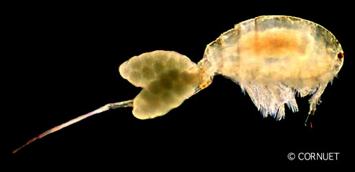

---
title: Cyclopoida
---

# [[Cyclopoida]] 
)

## #has_/text_of_/abstract 

> The **Cyclopoida** are an order of small crustaceans from the class Copepoda. 
> 
> Like many other copepods, members of Cyclopoida are small, planktonic animals 
> living both in the sea and in freshwater habitats. 
> 
> They are capable of rapid movement. 
> 
> Their larval development is metamorphic, 
> and the embryos are carried in paired or single sacs attached to first abdominal somite.
>
> [Wikipedia](https://en.wikipedia.org/wiki/Cyclopoida) 

## Phylogeny 

-   « Ancestral Groups  
    -  [Copepoda](../Copepoda.md))
    -  [Crustacea](../../Crustacea.md))
    -  [Arthropoda](../../../Arthropoda.md))
    -  [Bilateria](../../../../Bilateria.md))
    -  [Animals](../../../../../Animals.md))
    -  [Eukarya](../../../../../../Eukarya.md))
    -   [Tree of Life](../../../../../../Tree_of_Life.md)

-   ◊ Sibling Groups of  Copepoda
    -  [Platycopioida](Platycopioida.md))
    -  [Calanoida](Calanoida.md))
    -  [Misophrioida](Misophrioida.md))
    -   Cyclopoida
    -  [Harpacticoida](Harpacticoida.md))
    -  [Poecilostomatoida](Poecilostomatoida.md))
    -  [Siphonostomatoida](Siphonostomatoida.md))

-   » Sub-Groups 
	-   *Archinotodelphyidae*
	-   *Ascidicolidae*
	-   *Buproridae*
	-   *Chordeumiidae*
	-   *Cucumaricolidae*
	-   *Cyclopidae*
	-   *Cyclopinidae*
	-   *Fratiidae*
	-   *Lernaeidae*
	-   *Mantridae*
	-   *Notodelphyidae*
	-   *Oithonidae*
	-   *Ozmanidae*
	-   *Speleoithonidae*
	-   *Thaumatopsyllidae*

## Title Illustrations

---------------------------------------------------------------------------)
Scientific Name ::   Cyclops
Creator            Photograph by Jean-François Cornuet
Sex ::              Female
Life Cycle Stage ::   Female with egg sacs
Copyright ::          © [BIODIDAC](http://biodidac.bio.uottawa.ca/index.htm) 

## Confidential Links & Embeds: 

### #is_/same_as ::[Cyclopoida](Cyclopoida.md)) 

### #is_/same_as :: [Cyclopoida.public](/_public/bio/bio~Domain/Eukarya/Animal/Bilateria/Arthropoda/Crustacea/Copepoda/Cyclopoida.public.md) 

### #is_/same_as :: [Cyclopoida.internal](/_internal/bio/bio~Domain/Eukarya/Animal/Bilateria/Arthropoda/Crustacea/Copepoda/Cyclopoida.internal.md) 

### #is_/same_as :: [Cyclopoida.protect](/_protect/bio/bio~Domain/Eukarya/Animal/Bilateria/Arthropoda/Crustacea/Copepoda/Cyclopoida.protect.md) 

### #is_/same_as :: [Cyclopoida.private](/_private/bio/bio~Domain/Eukarya/Animal/Bilateria/Arthropoda/Crustacea/Copepoda/Cyclopoida.private.md) 

### #is_/same_as :: [Cyclopoida.personal](/_personal/bio/bio~Domain/Eukarya/Animal/Bilateria/Arthropoda/Crustacea/Copepoda/Cyclopoida.personal.md) 

### #is_/same_as :: [Cyclopoida.secret](/_secret/bio/bio~Domain/Eukarya/Animal/Bilateria/Arthropoda/Crustacea/Copepoda/Cyclopoida.secret.md)

