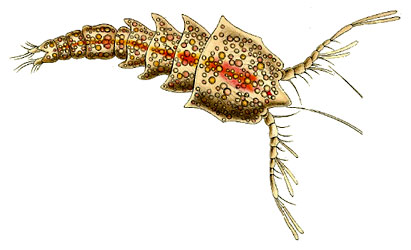

---
aliases:
  - Harpacticoida
title: Harpacticoida
---

# [[Harpacticoida]] 
 
## #has_/text_of_/abstract 

> **Harpacticoida** is an order of copepods, in the subphylum Crustacea. 
> This order comprises 463 genera and about 3,000 species; 
> 
> its members are benthic copepods found throughout the world in the marine environment 
> (most families) and in fresh water (essentially the Ameiridae, Parastenocarididae and the Canthocamptidae). 
> 
> A few of them are planktonic or live in association with other organisms. 
> Harpacticoida represents the second-largest meiofaunal group in marine sediments, 
> after nematodes. 
> 
> In Arctic and Antarctic seas, Harpacticoida are common inhabitants of sea ice. 
> The name Harpacticoida comes from the Greek noun harpacticon (rapacious predator) 
> and the suffix -oid (akin to) and means reminiscent of a predator .
>
> Harpacticoids are distinguished from other copepods 
> by the presence of only a very short pair of first antennae. 
> 
> The second pair of antennae are biramous, 
> and the major joint within the body is located between the fourth and fifth body segments. 
> They typically have a wide abdomen, and often have a somewhat worm-like body.
>
> [Wikipedia](https://en.wikipedia.org/wiki/Harpacticoida) 

## Phylogeny 

-   « Ancestral Groups  
    -  [Copepoda](../Copepoda.md) 
    -  [Crustacea](../../Crustacea.md) 
    -  [Arthropoda](../../../Arthropoda.md) 
    -  [Bilateria](../../../../Bilateria.md) 
    -  [Animals](../../../../../Animals.md) 
    -  [Eukarya](../../../../../../Eukarya.md) 
    -   [Tree of Life](../../../../../../Tree_of_Life.md)

-   ◊ Sibling Groups of  Copepoda
    -  [Platycopioida](Platycopioida.md) 
    -  [Calanoida](Calanoida.md) 
    -  [Misophrioida](Misophrioida.md) 
    -  [Cyclopoida](Cyclopoida.md) 
    -   Harpacticoida
    -  [Poecilostomatoida](Poecilostomatoida.md) 
    -  [Siphonostomatoida](Siphonostomatoida.md) 

-   » Sub-Groups 
	-   *Adenopleurellidae*
	-   *Aegisthidae*
	-   *Ambunguipedidae*
	-   *Ameiridae*
	-   *Ancorabolidae*
	-   *Argestidae*
	-   *Balaenophilidae*
	-   *Cancrincolidae*
	-   *Canthocamptidae*
	-   *Canuellidae*
	-   *Cerviniidae*
	-   *Chappuisiidae*
	-   *Cletodidae*
	-   *Cletopsyllidae*
	-   *Clytemnestridae*
	-   *Cristacoxidae*
	-   *Cylindropsyllidae*
	-   *Darcythompsoniidae*
	-   *Diosaccidae*
	-   *Ectinosomatidae*
	-   *Euterpinidae*
	-   *Hamondiidae*
	-   *Harpacticidae*
	-   *Huntemanniidae*
	-   *Laophontidae*
	-   *Laophontopsidae*
	-   *Latiremidae*
	-   *Leptastacidae*
	-   *Leptopontiidae*
	-   *Longipediidae*
	-   *Louriniidae*
	-   *Metidae*
	-   *Miraciidae*
	-   *Neobradyidae*
	-   *Normanellidae*
	-   *Novocriniidae*
	-   *Orthopsyllidae*
	-   *Paramesochridae*
	-   *Parastenheliidae*
	-   *Parastenocarididae*
	-   *Peltidiidae*
	-   *Phyllognathopodidae*
	-   *Porcellidiidae*
	-   *Pseudotachidiidae*
	-   *Rhizothricidae*
	-   *Rotundiclipeidae*
	-   *Styracothoracidae*
	-   *Superornatiremidae*
	-   *Tachidiidae*
	-   *Tegastidae*
	-   *Tetragonicipitidae*
	-   *Thalestridae*
	-   *Thompsonulidae*
	-   *Tisbidae*

## Title Illustrations

Clytemnestra scutellata female (Clytemnestridae).

Image from Ernst Haeckel\'s Kunstformen der Natur published 1899-1904 by
Verlag des Bibliographischen Instituts, Leipzig and Vienna. Scans
courtesy of [Kurt Stüber\'s online library of historic and classical biology books.](http://caliban.mpiz-koeln.mpg.de/%7Estueber/stueber_library.html)
 
::::::::::::::::

## Confidential Links & Embeds: 

### #is_/same_as :: [[/_Standards/bio/bio~Domain/Eukarya/Animal/Bilateria/Arthropoda/Crustacea/Copepoda/Harpacticoida|Harpacticoida]] 

### #is_/same_as :: [[/_public/bio/bio~Domain/Eukarya/Animal/Bilateria/Arthropoda/Crustacea/Copepoda/Harpacticoida.public|Harpacticoida.public]] 

### #is_/same_as :: [[/_internal/bio/bio~Domain/Eukarya/Animal/Bilateria/Arthropoda/Crustacea/Copepoda/Harpacticoida.internal|Harpacticoida.internal]] 

### #is_/same_as :: [[/_protect/bio/bio~Domain/Eukarya/Animal/Bilateria/Arthropoda/Crustacea/Copepoda/Harpacticoida.protect|Harpacticoida.protect]] 

### #is_/same_as :: [[/_private/bio/bio~Domain/Eukarya/Animal/Bilateria/Arthropoda/Crustacea/Copepoda/Harpacticoida.private|Harpacticoida.private]] 

### #is_/same_as :: [[/_personal/bio/bio~Domain/Eukarya/Animal/Bilateria/Arthropoda/Crustacea/Copepoda/Harpacticoida.personal|Harpacticoida.personal]] 

### #is_/same_as :: [[/_secret/bio/bio~Domain/Eukarya/Animal/Bilateria/Arthropoda/Crustacea/Copepoda/Harpacticoida.secret|Harpacticoida.secret]] 

