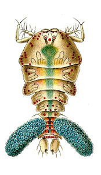
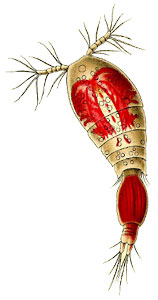

---
aliases:
- Poecilostomatoida
- 杯口水蚤目
title: Poecilostomatoida
has_id_wikidata: Q2344407
dv_has_:
  name_:
    an: Poecilostomatoida
    ast: Poecilostomatoida
    bg: Poecilostomatoida
    ca: Poecilostomatoida
    ceb: Poecilostomatoida
    da: Poecilostomatoida
    de: Poecilostomatoida
    en: Poecilostomatoida
    eo: Poecilostomatoida
    es: Poecilostomatoida
    eu: Poecilostomatoida
    ext: Poecilostomatoida
    fi: Poecilostomatoida
    fr: Poecilostomatoida
    ga: Poecilostomatoida
    gl: Poecilostomatoida
    ia: Poecilostomatoida
    ie: Poecilostomatoida
    io: Poecilostomatoida
    it: Poecilostomatoida
    la: Poecilostomatoida
    mul: Poecilostomatoida
    nb: Poecilostomatoida
    nl: Poecilostomatoida
    nn: Poecilostomatoida
    oc: Poecilostomatoida
    pl: Poecilostomatoida
    pt: Poecilostomatoida
    pt_br: Poecilostomatoida
    ro: Poecilostomatoida
    ru: Poecilostomatoida
    sq: Poecilostomatoida
    sv: Poecilostomatoida
    tr: Poecilostomatoida
    uk: Poecilostomatoida
    vi: Poecilostomatoida
    vo: Poecilostomatoida
    war: Poecilostomatoida
    zh: 杯口水蚤目
    zh_cn: 杯口水蚤目
    zh_hans: 杯口水蚤目
    zh_tw: 杯口水蚤目
---

# [[Poecilostomatoida]] 
)   

## #has_/text_of_/abstract 

> **Poecilostomatoida** is a suborder of copepods. 
> Although it was previously considered a separate order.
>
> [Wikipedia](https://en.wikipedia.org/wiki/Poecilostomatoida) 

## Phylogeny 

-   « Ancestral Groups  
    -  [Copepoda](../Copepoda.md) 
    -  [Crustacea](../../Crustacea.md) 
    -  [Arthropoda](../../../Arthropoda.md) 
    -  [Bilateria](../../../../Bilateria.md) 
    -  [Animals](../../../../../Animals.md) 
    -  [Eukarya](../../../../../../Eukarya.md) 
    -   [Tree of Life](../../../../../../Tree_of_Life.md)

-   ◊ Sibling Groups of  Copepoda
    -  [Platycopioida](Platycopioida.md) 
    -  [Calanoida](Calanoida.md) 
    -  [Misophrioida](Misophrioida.md) 
    -  [Cyclopoida](Cyclopoida.md) 
    -  [Harpacticoida](Harpacticoida.md) 
    -   Poecilostomatoida
    -  [Siphonostomatoida](Siphonostomatoida.md) 

-   » Sub-Groups 
	-   *Anchimolgidae*
	-   *Anomoclausiidae*
	-   *Antheacherida*
	-   *Anthessiidae*
	-   *Bomolochidae*
	-   *Catiniidae*
	-   *Chitonophilidae*
	-   *Chondracanthidae*
	-   *Clausidiidae*
	-   *Clausiidae*
	-   *Corallovexiidae*
	-   *Corycaeidae*
	-   *Echiurophilidae*
	-   *Entobiidae*
	-   *Erebonasteridae*
	-   *Ergasilidae*
	-   *Eunicicolidae*
	-   *Gastrodelphyidae*
	-   *Herpyllobiidae*
	-   *Intramolgidae*
	-   *Kelleriidae*
	-   *Lampippidae*
	-   *Lernaeosoleidae*
	-   *Lichomolgidae*
	-   *Lubbockiidae*
	-   *Macrochironidae*
	-   *Mesoglicolidae*
	-   *Micrallectidae*
	-   *Myicolidae*
	-   *Mytilicolidae*
	-   *Nereicolidae*
	-   *Nucellicolidae*
	-   *Octopicolidae*
	-   *Oncaeidae*
	-   *Paralubbockiidae*
	-   *Pharodidae*
	-   *Philichthyidae*
	-   *Philoblennidae*
	-   *Phyllodicolidae*
	-   *Polyankylidae*
	-   *Pseudanthessiidae*
	-   *Rhynchomolgidae*
	-   *Sabelliphilidae*
	-   *Saccopsidae*
	-   *Sapphirinidae*
	-   *Serpulidicolidae*
	-   *Shiinoidae*
	-   *Spiophanicolidae*
	-   *Splanchnotrophidae*
	-   *Synapticolidae*
	-   *Synaptiphilidae*
	-   *Taeniacanthidae*
	-   *Tegobomolochidae*
	-   *Telsidae*
	-   *Thamnomolgidae*
	-   *Tuccidae*
	-   *Urocopiidae*
	-   *Vahiniidae*
	-   *Ventriculinidae*
	-   *Xarifiidae*
	-   *Xenocoelomatidae*

## Title Illustrations

-   Sapphirina darwinii female (Sapphirinidae).
-   Oncaea venusta male (Oncaeidae).

Image from Ernst Haeckel\'s Kunstformen der Natur published 1899-1904 by
Verlag des Bibliographischen Instituts, Leipzig and Vienna. Scans
courtesy of [Kurt Stüber\'s online library of historic and classical biology books.](http://caliban.mpiz-koeln.mpg.de/%7Estueber/stueber_library.html)
 
)
::::::::::::::::::

## Confidential Links & Embeds: 

### #is_/same_as :: [[/_Standards/bio/bio~Domain/Eukarya/Animal/Bilateria/Arthropoda/Crustacea/Copepoda/Poecilostomatoida|Poecilostomatoida]] 

### #is_/same_as :: [[/_public/bio/bio~Domain/Eukarya/Animal/Bilateria/Arthropoda/Crustacea/Copepoda/Poecilostomatoida.public|Poecilostomatoida.public]] 

### #is_/same_as :: [[/_internal/bio/bio~Domain/Eukarya/Animal/Bilateria/Arthropoda/Crustacea/Copepoda/Poecilostomatoida.internal|Poecilostomatoida.internal]] 

### #is_/same_as :: [[/_protect/bio/bio~Domain/Eukarya/Animal/Bilateria/Arthropoda/Crustacea/Copepoda/Poecilostomatoida.protect|Poecilostomatoida.protect]] 

### #is_/same_as :: [[/_private/bio/bio~Domain/Eukarya/Animal/Bilateria/Arthropoda/Crustacea/Copepoda/Poecilostomatoida.private|Poecilostomatoida.private]] 

### #is_/same_as :: [[/_personal/bio/bio~Domain/Eukarya/Animal/Bilateria/Arthropoda/Crustacea/Copepoda/Poecilostomatoida.personal|Poecilostomatoida.personal]] 

### #is_/same_as :: [[/_secret/bio/bio~Domain/Eukarya/Animal/Bilateria/Arthropoda/Crustacea/Copepoda/Poecilostomatoida.secret|Poecilostomatoida.secret]] 

