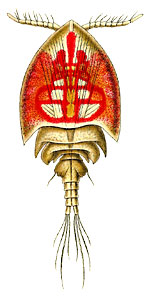

# [[Siphonostomatoida]] 

 

## #has_/text_of_/abstract 

> **Siphonostomatoida** is an order of copepods, containing around 75% of all the copepods that parasitise fishes. Their success has been linked to their possession of siphon-like mandibles and of a "frontal filament" to aid attachment to their hosts. Most are marine, but a few live in fresh water. There are 40 recognised families:
>
> [Wikipedia](https://en.wikipedia.org/wiki/Siphonostomatoida) 

## Phylogeny 

-   « Ancestral Groups  
    -  [Copepoda](../Copepoda.md))
    -  [Crustacea](../../Crustacea.md))
    -  [Arthropoda](../../../Arthropoda.md))
    -  [Bilateria](../../../../Bilateria.md))
    -  [Animals](../../../../../Animals.md))
    -  [Eukarya](../../../../../../Eukarya.md))
    -   [Tree of Life](../../../../../../Tree_of_Life.md)

-   ◊ Sibling Groups of  Copepoda
    -  [Platycopioida](Platycopioida.md))
    -  [Calanoida](Calanoida.md))
    -  [Misophrioida](Misophrioida.md))
    -  [Cyclopoida](Cyclopoida.md))
    -  [Harpacticoida](Harpacticoida.md))
    -  [Poecilostomatoida](Poecilostomatoida.md))
    -   Siphonostomatoida

-   » Sub-Groups 
	-   *Archidactylinidae*
	-   *Artotrogidae*
	-   *Asterocheridae*
	-   *Brychiopontiidae*
	-   *Caligidae*
	-   *Calverocheridae*
	-   *Cancerillidae*
	-   *Cecropidae*
	-   *Codobidae*
	-   *Coralliomyzontidae*
	-   *Dichelinidae*
	-   *Dichelesthiidae*
	-   *Dinopontiidae*
	-   *Dirivultidae*
	-   *Dissonidae*
	-   *Ecbathyriontidae*
	-   *Entomolepididae*
	-   *Eudactylinidae*
	-   *Euryphoridae*
	-   *Hatschekiidae*
	-   *Hyponeoidae*
	-   *Kroyeriidae*
	-   *Lernaeopodidae*
	-   *Lernanthropidae*
	-   *Megapontiidae*
	-   *Micropontiidae*
	-   *Nanaspididae*
	-   *Nicothoidae*
	-   *Pandaridae*
	-   *Pennellidae*
	-   *Pontoeciellidae*
	-   *Pseudocycnidae*
	-   *Rataniidae*
	-   *Scottomyzontidae*
	-   *Sphyriidae*
	-   *Sponginticolidae*
	-   *Spongiocnizontidae*
	-   *Stellicomitidae*
	-   *Tanypleuridae*
	-   *Trebiidae*

## Title Illustrations

Cryptopontius thorelli female (Artotrogidae).

Image from Ernst Haeckel\'s Kunstformen der Natur published 1899-1904 by
Verlag des Bibliographischen Instituts, Leipzig and Vienna. 
Scans courtesy of [Kurt Stüber\'s online library of historic and classical biology books.](http://caliban.mpiz-koeln.mpg.de/%7Estueber/stueber_library.html)
) 

## Confidential Links & Embeds: 

### #is_/same_as :: [Siphonostomatoida](/_Standards/bio/bio~Domain/Eukarya/Animal/Bilateria/Arthropoda/Crustacea/Copepoda/Siphonostomatoida.md) 

### #is_/same_as :: [Siphonostomatoida.public](/_public/bio/bio~Domain/Eukarya/Animal/Bilateria/Arthropoda/Crustacea/Copepoda/Siphonostomatoida.public.md) 

### #is_/same_as :: [Siphonostomatoida.internal](/_internal/bio/bio~Domain/Eukarya/Animal/Bilateria/Arthropoda/Crustacea/Copepoda/Siphonostomatoida.internal.md) 

### #is_/same_as :: [Siphonostomatoida.protect](/_protect/bio/bio~Domain/Eukarya/Animal/Bilateria/Arthropoda/Crustacea/Copepoda/Siphonostomatoida.protect.md) 

### #is_/same_as :: [Siphonostomatoida.private](/_private/bio/bio~Domain/Eukarya/Animal/Bilateria/Arthropoda/Crustacea/Copepoda/Siphonostomatoida.private.md) 

### #is_/same_as :: [Siphonostomatoida.personal](/_personal/bio/bio~Domain/Eukarya/Animal/Bilateria/Arthropoda/Crustacea/Copepoda/Siphonostomatoida.personal.md) 

### #is_/same_as :: [Siphonostomatoida.secret](/_secret/bio/bio~Domain/Eukarya/Animal/Bilateria/Arthropoda/Crustacea/Copepoda/Siphonostomatoida.secret.md)

