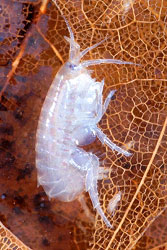
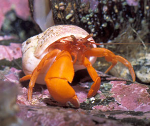
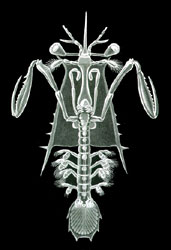

---
aliases:
- Ali xərçənglər
- augstākie vēži
- Aukštesnieji vėžiagyviai
- Echte kreeftachtigen
- felsőbbrendű rákok
- Högere Kreefte
- Höhere Krebse
- Joğarğı satıdağı şayantärizdiler
- korrârapuelleeh
- kuoriäyriäiset
- kõrgemad vähid
- Lớp Giáp mềm
- Malacostraca
- Malacostraci
- Malacostráceos
- Malakostraka
- Malakostrakoj
- pancerzowce
- Pura-pura qara
- Qalikdarên nerm
- rakovci
- Storkrebs
- Storkreps
- storkrepser
- storkräftor
- Viši rakovi
- višji raki
- ʻUo moʻoni
- Μαλακόστρακα
- Висши ракообразни
- виши ракови
- Вищі ракоподібні
- высшие раки
- вышэйшыя ракі
- вышэйшыя ракападобныя
- Жоғарғы сатыдағы шаянтәрізділер
- բարձրակարգ խեցգետնակերպեր
- סרטנים עילאיים
- جوعارعى ساتىداعى شايانتارىزدىلەر
- عالی سرطانلر
- لينات الدرقة
- لينات الدرقه
- نرمزرهیان
- چنگاښ ډوله ژوي
- 軟甲綱
- 软甲纲
- 연갑강
has_id_wikidata: Q182978
Commons_category: Malacostraca
described_by_source:
- '[[_Standards/WikiData/WD~Encyclopædia_Britannica_11th_edition,867541]]'
- '[[_Standards/WikiData/WD~Meyers_Konversations_Lexikon,_4th_edition_(1885_1890),19219752]]'
- '[[_Standards/WikiData/WD~Great_Soviet_Encyclopedia_(1926_1947),20078554]]'
EPPO_Code: 1MALAC
image:
- http://commons.wikimedia.org/wiki/Special:FilePath/Eoph%20MagelaT%20site2.jpg
- http://commons.wikimedia.org/wiki/Special:FilePath/Crustacea.jpg
instance_of: '[[_Standards/WikiData/WD~taxon,16521]]'
ITIS_TSN: 89787
parent_taxon: '[[_Standards/WikiData/WD~Multicrustacea,11937877]]'
taxon_common_name:
- storkrepser
- Echte kreeftachtigen
- višji raki
taxon_name: Malacostraca
taxon_rank: '[[_Standards/WikiData/WD~class,37517]]'
title: Malacostraca
topic_s_main_category: '[[_Standards/WikiData/WD~Q9011687,9011687]]'
topic_s_main_template: '[[_Standards/WikiData/WD~Template_Malacostraca,14334371]]'
dv_has_:
  name_:
    af: Malacostraca
    an: Malacostraca
    ar: لينات الدرقة
    arz: لينات الدرقه
    ast: Malacostraca
    az: Ali xərçənglər
    azb: عالی سرطانلر
    bar: Malacostraca
    be: вышэйшыя ракі
    be_tarask: вышэйшыя ракападобныя
    bg: Висши ракообразни
    br: Malacostraca
    ca: Malacostraci
    ceb: Malacostraca
    co: Malacostraca
    cs: rakovci
    cy: Malacostraca
    da: Storkrebs
    de: Höhere Krebse
    de-at: Malacostraca
    de_ch: Malacostraca
    el: Μαλακόστρακα
    en: Malacostraca
    en_ca: Malacostraca
    en_gb: Malacostraca
    eo: Malakostrakoj
    es: Malacostraca
    et: kõrgemad vähid
    eu: Malacostraca
    ext: Malacostraca
    fa: نرمزرهیان
    fi: kuoriäyriäiset
    fr: Malacostraca
    frp: Malacostraca
    fur: Malacostraca
    ga: Malacostraca
    gd: Malacostraca
    gl: Malacostráceos
    gsw: Malacostraca
    he: סרטנים עילאיים
    hr: Malacostraca
    hu: felsőbbrendű rákok
    hy: բարձրակարգ խեցգետնակերպեր
    ia: Malacostraca
    id: Malacostraca
    ie: Malacostraca
    io: Malacostraca
    is: Malacostraca
    it: Malacostraca
    ja: 軟甲綱
    jv: Malacostraca
    kg: Malacostraca
    kk: Жоғарғы сатыдағы шаянтәрізділер
    kk_arab: جوعارعى ساتىداعى شايانتارىزدىلەر
    kk-cn: جوعارعى ساتىداعى شايانتارىزدىلەر
    kk_cyrl: Жоғарғы сатыдағы шаянтәрізділер
    kk-kz: Жоғарғы сатыдағы шаянтәрізділер
    kk_latn: Joğarğı satıdağı şayantärizdiler
    kk-tr: Joğarğı satıdağı şayantärizdiler
    ko: 연갑강
    ku: Qalikdarên nerm
    la: Malacostraca
    lad: Malacostraca
    lb: Malacostraca
    li: Malacostraca
    lij: Malacostraca
    lmo: Malacostraca
    lt: Aukštesnieji vėžiagyviai
    lv: augstākie vēži
    mg: Malacostraca
    min: Malacostraca
    mk: виши ракови
    ms: Malacostraca
    mt: Malacostraca
    mul: Malacostraca
    nap: Malacostraca
    nb: storkrepser
    nds: Högere Kreefte
    nds_nl: Malacostraca
    nl: Malacostraca
    nn: Storkreps
    nov: Malacostraca
    nrm: Malacostraca
    nys: Malacostraca
    oc: Malacostraca
    pcd: Malacostraca
    pl: pancerzowce
    pms: Malacostraca
    ps: چنگاښ ډوله ژوي
    pt: Malacostraca
    pt_br: Malacostraca
    qu: Pura-pura qara
    rm: Malacostraca
    ro: Malacostraca
    ru: высшие раки
    rup: Malacostraca
    sc: Malacostraca
    scn: Malacostraca
    sco: Malacostraca
    sh: Viši rakovi
    sk: Malacostraca
    sl: višji raki
    smn: korrârapuelleeh
    sq: Malacostraca
    sr: Malacostraca
    sv: storkräftor
    sw: Malacostraca
    tl: Malacostraca
    to: ʻUo moʻoni
    tr: Malakostraka
    uk: Вищі ракоподібні
    vec: Malacostraca
    vi: Lớp Giáp mềm
    vls: Malacostraca
    vo: Malacostraca
    wa: Malacostraca
    war: Malacostraca
    wo: Malacostraca
    wuu: 软甲纲
    yue: 軟甲綱
    zh: 软甲纲
    zh_cn: 软甲纲
    zh_hans: 软甲纲
    zh_hant: 軟甲綱
    zh_hk: 軟甲綱
    zh_sg: 软甲纲
    zh_tw: 軟甲綱
    zu: Malacostraca
---
# [[Malacostraca]] 

   ) 

#is_/same_as :: [[../../../../../../../../WikiData/WD~Malacostraca,182978|WD~Malacostraca,182978]] 

## #has_/text_of_/abstract 

> **Malacostraca** is the second largest of the six classes of pancrustaceans behind insects, 
> containing about 40,000 living species, divided among 16 orders. 
> 
> Its members, the malacostracans, display a great diversity of body forms 
> and include crabs, lobsters, spiny lobsters, crayfish, shrimp, krill, prawns, 
> isopods, amphipods, mantis shrimp, and many other less familiar animals. 
> 
> They are abundant in all marine environments 
> and have colonised freshwater and terrestrial habitats. 
> 
> They are segmented animals, united by a common body plan 
> comprising 20 body segments (rarely 21), and divided into a head, thorax, and abdomen.
>
> [Wikipedia](https://en.wikipedia.org/wiki/Malacostraca) 

## Phylogeny 

-   « Ancestral Groups  
    -  [Crustacea](../Crustacea.md) 
    -  [Arthropoda](../../Arthropoda.md) 
    -  [Bilateria](../../../Bilateria.md) 
    -  [Animals](../../../../Animals.md) 
    -  [Eukarya](../../../../../Eukarya.md) 
    -   [Tree of Life](../../../../../Tree_of_Life.md)

-   ◊ Sibling Groups of  Crustacea
    -  [Branchiopoda](Branchiopoda.md) 
    -  [Remipedia](Remipedia.md) 
    -  [Cephalocarida](Cephalocarida.md) 
    -  [Copepoda](Copepoda.md) 
    -  [Ostracoda](Ostracoda.md) 
    -  [Branchiura](Branchiura.md) 
    -  [Thecostraca](Thecostraca.md) 
    -   Malacostraca

-   » Sub-Groups
    -   [Leptostraca](Leptostraca)
    -  [Stomatopoda](Malacostraca/Stomatopoda.md) 
    -  [Decapoda](Malacostraca/Decapoda.md) 
    -  [Peracarida](Malacostraca/Peracarida.md) 

## Title Illustrations

-   An amphipod, Hyalella azteca (Peracarida, Amphipoda).\
	Photograph by Scott Bauer, courtesy [USDA Agricultural Research     Service](http://www.ars.usda.gov/is/index.html).
	
-   Pacific red hermit, Elassochirus gilli (Decapoda, Anomura). NOAA
	Auke Bay Lab, Juneau, Alaska.\
	Photograph courtesy
	[CalPhotos](http://elib.cs.berkeley.edu/photos/), copyright © 2001 [William Leonard](mailto:mollusca1@attbi.com).
	
-   Larva of the mantis shrimp, Alima gracilis (Stomatopoda, Squillidae). 
  Image from Ernst Haeckel\'s Kunstformen der Natur
	published 1899-1904 by Verlag des Bibliographischen Instituts,
	Leipzig and Vienna. Scans courtesy of [Kurt Stüber\'s online library     of historic and classical biology     books.](http://caliban.mpiz-koeln.mpg.de/%7Estueber/stueber_library.html)
 

## Confidential Links & Embeds: 

### #is_/same_as :: [[/_Standards/bio/bio~Domain/Eukarya/Animal/Bilateria/Arthropoda/Crustacea/Malacostraca|Malacostraca]] 

### #is_/same_as :: [[/_public/bio/bio~Domain/Eukarya/Animal/Bilateria/Arthropoda/Crustacea/Malacostraca.public|Malacostraca.public]] 

### #is_/same_as :: [[/_internal/bio/bio~Domain/Eukarya/Animal/Bilateria/Arthropoda/Crustacea/Malacostraca.internal|Malacostraca.internal]] 

### #is_/same_as :: [[/_protect/bio/bio~Domain/Eukarya/Animal/Bilateria/Arthropoda/Crustacea/Malacostraca.protect|Malacostraca.protect]] 

### #is_/same_as :: [[/_private/bio/bio~Domain/Eukarya/Animal/Bilateria/Arthropoda/Crustacea/Malacostraca.private|Malacostraca.private]] 

### #is_/same_as :: [[/_personal/bio/bio~Domain/Eukarya/Animal/Bilateria/Arthropoda/Crustacea/Malacostraca.personal|Malacostraca.personal]] 

### #is_/same_as :: [[/_secret/bio/bio~Domain/Eukarya/Animal/Bilateria/Arthropoda/Crustacea/Malacostraca.secret|Malacostraca.secret]] 

