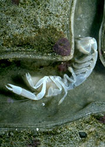
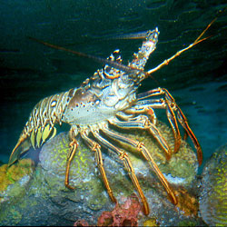
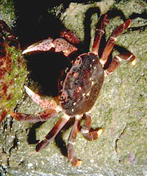

---
aliases:
- Cha̍p-kha-ba̍k
- Chʼosh bijáád neeznánígíí
- Decapoda
- decàpode
- Decápodos
- Dehpê
- Dekapoda
- Dekpieduloj
- Desaťnožce
- Deseteronošci
- deseteronožci
- desetinožci
- desmitkājvēži
- Dešimtkojai vėžiai
- dziesięcionogi
- giáp xác mười chân
- Hà
- Imṛawdaren
- Kamba
- Kreeften, krabben & garnalen
- kymmenjalkaiset
- kümnejalalised
- lovejuálgásiih
- On ayaklılar
- Onayaqlılar
- oʻnoyoqli qisqichbaqalar
- Tibenede krebsdyr
- tienpotigen
- Tienpotiges
- tifotkreps
- tifotkrepser
- tiofotade kräftdjur
- Tjiinbiankraaben
- tízlábú rákok
- tīenfōt
- Veʻehongofulu
- Zehnfusskrebse
- Zehnfußkrebse
- Δεκάποδα
- Дæскъахджынтæ
- десетношци
- десетоноги
- Десятиногі раки
- десятиногие ракообразные
- дзесяціногія ракападобныя
- Он буттуулар
- Онаяқты шаянтәрізділер
- Унаяклы кысласыманнар
- տասնոտանի խեցգետնակերպեր
- מעשירי רגל
- اوْن ایاقلیلار
- دسپا
- دهپایان
- عشاريات الأرجل
- عشاريات الارجل
- لس پښې لرونکی ژوي
- பத்துக்காலிகள்
- ഡെക്കാപോഡ
- ပုစွန်
- ათფეხა კიბოები
- 十脚目
- 十腳目
- 十足目
- 십각목
has_id_wikidata: Q4610
Commons_category: Decapoda
described_by_source:
- '[[../../../../../../../../WikiData/WD~Brockhaus_and_Efron_Encyclopedic_Dictionary,602358]]'
- '[[_Standards/WikiData/WD~Small_Brockhaus_and_Efron_Encyclopedic_Dictionary,19180675]]'
EPPO_Code: 1DECAO
image: http://commons.wikimedia.org/wiki/Special:FilePath/Haeckel%20Decapoda.jpg
instance_of: '[[_Standards/WikiData/WD~taxon,16521]]'
ITIS_TSN: 95599
MeSH_tree_code: B01.050.500.131.365.190
NBN_System_Key: NHMSYS0021049528
parent_taxon: '[[_Standards/WikiData/WD~Eucarida,127341]]'
taxon_common_name:
- tifotkrepser
- Kreeften, krabben & garnalen
taxon_name: Decapoda
taxon_rank: '[[_Standards/WikiData/WD~order,36602]]'
title: Decapoda
topic_s_main_template: '[[_Standards/WikiData/WD~Template_Decapoda,112034186]]'
dv_has_:
  name_:
    af: Tienpotiges
    an: Decapoda
    ang: tīenfōt
    ar: عشاريات الأرجل
    arz: عشاريات الارجل
    ast: Decapoda
    az: Onayaqlılar
    azb: اوْن ایاقلیلار
    bar: Decapoda
    be: дзесяціногія ракападобныя
    be_tarask: дзесяціногія ракападобныя
    bg: десетоноги
    br: Decapoda
    ca: decàpode
    cdo: Hà
    ceb: Decapoda
    co: Decapoda
    cs: desetinožci
    cy: Decapoda
    da: Tibenede krebsdyr
    de: Zehnfußkrebse
    de-at: Decapoda
    de_ch: Zehnfusskrebse
    el: Δεκάποδα
    en: Decapoda
    en_ca: Decapoda
    en_gb: Decapoda
    eo: Dekpieduloj
    es: Decapoda
    et: kümnejalalised
    eu: Decapoda
    ext: Decapoda
    fa: دهپایان
    fi: kymmenjalkaiset
    fr: Decapoda
    frp: Decapoda
    frr: Tjiinbiankraaben
    fur: Decapoda
    ga: Decapoda
    gd: Decapoda
    gl: Decápodos
    gsw: Decapoda
    he: מעשירי רגל
    hr: Deseteronošci
    hu: tízlábú rákok
    hy: տասնոտանի խեցգետնակերպեր
    ia: Decapoda
    id: Dekapoda
    ie: Decapoda
    io: Decapoda
    is: Decapoda
    it: Decapoda
    ja: 十脚目
    ka: ათფეხა კიბოები
    kab: Imṛawdaren
    kg: Decapoda
    kk: Онаяқты шаянтәрізділер
    ko: 십각목
    ku: Dehpê
    ky: Он буттуулар
    la: Decapoda
    lb: Decapoda
    lfn: Decapoda
    li: Decapoda
    lij: Decapoda
    lt: Dešimtkojai vėžiai
    lv: desmitkājvēži
    mg: Decapoda
    min: Decapoda
    mk: десетношци
    ml: ഡെക്കാപോഡ
    ms: Decapoda
    mt: Decapoda
    mul: Decapoda
    my: ပုစွန်
    nan: Cha̍p-kha-ba̍k
    nap: Decapoda
    nb: tifotkreps
    nds: Decapoda
    nds_nl: Decapoda
    nl: tienpotigen
    nn: tifotkreps
    nrm: Decapoda
    nv: Chʼosh bijáád neeznánígíí
    nys: Decapoda
    oc: Decapoda
    os: Дæскъахджынтæ
    pcd: Decapoda
    pl: dziesięcionogi
    pms: Decapoda
    ps: لس پښې لرونکی ژوي
    pt: Decapoda
    pt_br: Decapoda
    rm: Decapoda
    ro: Decapoda
    ru: десятиногие ракообразные
    sc: Decapoda
    scn: Decapoda
    sco: decapoda
    sh: Deseteronošci
    sk: Desaťnožce
    sl: deseteronožci
    smn: lovejuálgásiih
    sq: Decapoda
    sr: Decapoda
    sv: tiofotade kräftdjur
    sw: Kamba
    ta: பத்துக்காலிகள்
    tl: Decapoda
    to: Veʻehongofulu
    tr: On ayaklılar
    tt: Унаяклы кысласыманнар
    uk: Десятиногі раки
    ur: دسپا
    uz: oʻnoyoqli qisqichbaqalar
    vec: Decapoda
    vi: giáp xác mười chân
    vls: Decapoda
    vo: Decapoda
    wa: Decapoda
    war: Decapoda
    wo: Decapoda
    wuu: 十足目
    yue: 十腳目
    zh: 十足目
    zh_cn: 十足目
    zh_hans: 十足目
    zh_hk: 十足目
    zh_tw: 十足目
    zu: Decapoda
---

# [[Decapoda]]  

 ) ) 

#is_/same_as :: [[../../../../../../../../WikiData/WD~Decapoda,4610|WD~Decapoda,4610]]  

## #has_/text_of_/abstract 

> The **Decapoda** or decapods, from Ancient Greek δεκάς (dekás), 
> meaning "ten", and πούς (poús), meaning "foot", 
> is a large order of crustaceans within the class Malacostraca, 
> and includes crabs, lobsters, crayfish, shrimp, and prawns. 
> 
> Most decapods are scavengers. 
> 
> The order is estimated to contain nearly 15,000 extant species in around 2,700 genera, 
> with around 3,300 fossil species. 
> 
> Nearly half of these species are crabs, with the shrimp (about 3,000 species) 
> and Anomura including hermit crabs, king crabs, porcelain crabs, 
> squat lobsters (about 2500 species) making up the bulk of the remainder. 
> 
> The earliest fossils of the group date to the Devonian.
>
> [Wikipedia](https://en.wikipedia.org/wiki/Decapod) 

### Information on the Internet

-   Central Pacific Crustacea Database ([Decapoda](http://decapoda.free.fr/) & Stomatopoda)
-   [Smithsonian Marine Station at Fort Pierce,     Florida](http://www.sms.si.edu/IRLSpec/Phyl_Arthrop4.htm)
-   [Decapoda at     DiscoverLife.org](http://pick5.pick.uga.edu/mp/20q?act=x_ant&name=Decapoda&path=Crustacea/Decapoda&xml=Groups_Crustacea;&btxt=Discover+Life&burl=http://www.discoverlife.org)

## Phylogeny 

-   « Ancestral Groups  
    -  [Malacostraca](../Malacostraca.md) 
    -  [Crustacea](../../Crustacea.md) 
    -  [Arthropoda](../../../Arthropoda.md) 
    -  [Bilateria](../../../../Bilateria.md) 
    -  [Animals](../../../../../Animals.md) 
    -  [Eukarya](../../../../../../Eukarya.md) 
    -   [Tree of Life](../../../../../../Tree_of_Life.md)

-   ◊ Sibling Groups of  Malacostraca
    -   [Leptostraca](Leptostraca)
    -  [Stomatopoda](Stomatopoda.md) 
    -   Decapoda
    -  [Peracarida](Peracarida.md) 

-   » Sub-Groups
    -  [Astacidea](Decapoda/Astacidea.md) 
    -  [Anomura](Decapoda/Anomura.md) 

## Title Illustrations

------------------------------------------------------------------------------ 
 
scientific_name ::    Neotrypaea californiensis
Comments            Bay ghost shrimp (Anomura)
Creator             Gerald and Buff Corsi
Source Collection   [CalPhotos](http://calphotos.berkeley.edu/)
copyright ::           © 1999 [California Academy of Sciences](http://www.calacademy.org/) 

------------------- 
 
scientific_name ::    Panulirus argus
Comments            Caribbean spiny lobster (Palinura)
Source Collection   [CalPhotos](http://calphotos.berkeley.edu/)
copyright ::           © 2002 [John White](mailto:reptiles@erols.com)

------------------------------------------------------------------------------ 
 
scientific_name ::    Hemigrapsus nudus
Comments            Purple shore crab (Brachyura)
Creator             Gerald and Buff Corsi
Source Collection   [CalPhotos](http://calphotos.berkeley.edu/)
copyright ::           © 1999 [California Academy of Sciences](http://www.calacademy.org/) 

## Confidential Links & Embeds: 

### #is_/same_as :: [[/_Standards/bio/bio~Domain/Eukarya/Animal/Bilateria/Arthropoda/Crustacea/Malacostraca/Decapoda|Decapoda]] 

### #is_/same_as :: [[/_public/bio/bio~Domain/Eukarya/Animal/Bilateria/Arthropoda/Crustacea/Malacostraca/Decapoda.public|Decapoda.public]] 

### #is_/same_as :: [[/_internal/bio/bio~Domain/Eukarya/Animal/Bilateria/Arthropoda/Crustacea/Malacostraca/Decapoda.internal|Decapoda.internal]] 

### #is_/same_as :: [[/_protect/bio/bio~Domain/Eukarya/Animal/Bilateria/Arthropoda/Crustacea/Malacostraca/Decapoda.protect|Decapoda.protect]] 

### #is_/same_as :: [[/_private/bio/bio~Domain/Eukarya/Animal/Bilateria/Arthropoda/Crustacea/Malacostraca/Decapoda.private|Decapoda.private]] 

### #is_/same_as :: [[/_personal/bio/bio~Domain/Eukarya/Animal/Bilateria/Arthropoda/Crustacea/Malacostraca/Decapoda.personal|Decapoda.personal]] 

### #is_/same_as :: [[/_secret/bio/bio~Domain/Eukarya/Animal/Bilateria/Arthropoda/Crustacea/Malacostraca/Decapoda.secret|Decapoda.secret]] 

