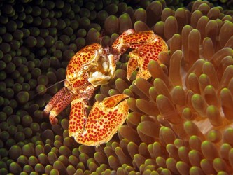
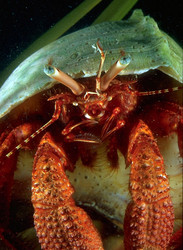

---
aliases:
- Anomala
- Anomur
- Anomura
- anomurar
- Anomuras
- Anomuros
- Erakkoravut
- Mittelkrebse
- Miękkoodwłokowce
- крабоїди
- неполнохвостые
- مختلفات الذيل
- อันดับฐานปูไม่แท้จริง
- ヤドカリ下目
- 异尾下目
- 異尾下目
- 집게하목
title: Anomura
has_id_wikidata: Q526867
dv_has_:
  name_:
    af: Anomura
    an: Anomura
    ar: مختلفات الذيل
    arz: مختلفات الذيل
    ast: Anomura
    bar: Anomura
    bg: Anomura
    br: Anomura
    ca: Anomur
    ceb: Anomura
    co: Anomura
    cs: Anomura
    cy: Anomura
    da: Anomura
    de: Mittelkrebse
    de-at: Anomura
    de_ch: Anomura
    el: Anomura
    en: Anomura
    en_ca: Anomura
    en_gb: Anomura
    eo: Anomura
    es: Anomura
    et: Anomura
    eu: Anomura
    ext: Anomura
    fi: Erakkoravut
    fr: Anomura
    frp: Anomura
    fur: Anomura
    ga: Anomura
    gd: Anomura
    gl: Anomuros
    gsw: Anomura
    hr: Anomura
    hu: Anomura
    ia: Anomura
    id: Anomura
    ie: Anomura
    io: Anomura
    is: Anomura
    it: Anomura
    ja: ヤドカリ下目
    kg: Anomura
    ko: 집게하목
    la: Anomura
    lb: Anomura
    li: Anomura
    lij: Anomura
    lv: Anomuras
    mg: Anomura
    min: Anomura
    ms: Anomura
    mul: Anomura
    nap: Anomura
    nb: Anomura
    nds: Anomura
    nds_nl: Anomura
    nl: Anomura
    nn: anomurar
    nrm: Anomura
    nys: Anomura
    oc: Anomura
    pcd: Anomura
    pl: Miękkoodwłokowce
    pms: Anomura
    pt: Anomura
    pt_br: Anomura
    rm: Anomura
    ro: Anomura
    ru: неполнохвостые
    sc: Anomura
    scn: Anomura
    sco: Anomura
    sk: Anomura
    sl: Anomura
    sq: Anomura
    sv: Anomura
    sw: Anomura
    th: อันดับฐานปูไม่แท้จริง
    uk: крабоїди
    vec: Anomura
    vi: Anomura
    vls: Anomura
    vo: Anomura
    wa: Anomura
    war: Anomura
    wo: Anomura
    zh: 異尾下目
    zh_cn: 异尾下目
    zh_hans: 异尾下目
    zh_tw: 異尾下目
    zu: Anomura
---
# [[Anomura]] 

   

## #has_/text_of_/abstract 

> **Anomura** (sometimes Anomala) is a group of decapod crustaceans, 
> including hermit crabs and others. 
> 
> Although the names of many anomurans include the word crab, 
> all true crabs are in the sister group to the Anomura, 
> the Brachyura (the two groups together form the clade Meiura).
>
> [Wikipedia](https://en.wikipedia.org/wiki/Anomura) 

## Phylogeny 

-   « Ancestral Groups  
    -  [Decapoda](../Decapoda.md) 
    -  [Malacostraca](../../Malacostraca.md) 
    -  [Crustacea](../../../Crustacea.md) 
    -  [Arthropoda](../../../../Arthropoda.md) 
    -  [Bilateria](../../../../../Bilateria.md) 
    -  [Animals](../../../../../../Animals.md) 
    -  [Eukarya](../../../../../../../Eukarya.md) 
    -   [Tree of Life](../../../../../../../Tree_of_Life.md)

-   ◊ Sibling Groups of  Decapoda
    -  [Astacidea](Astacidea.md) 
    -   Anomura

-   » Sub-Groups
    -   [Aegla](Aegla)

## Title Illustrations

-----------------------------

scientific_name ::                    Porcellanidae
location ::                          Sipadan, Malaysia
Acknowledgements                    The copyright owner has released this image under the
								  [Attribution-NonCommercial-NoDerivs 2.0 Creative Commons                                       license](http://creativecommons.org/licenses/by-nc-nd/2.0/).\
								  source: [flickr: Cangrejo de                                       Porcelana](http://flickr.com/photos/festeban/9201191/)
specimen_condition ::                 Live Specimen
Source Collection                   [Flickr](http://flickr.com/)
copyright ::                           © 2004 [Felix Esteban](http://flickr.com/people/festeban/)

-----------------------------------------------------------------------------

scientific_name ::     Petrochirus diogenes
location ::           from Gulf of Mexico, captive at Texas State Aquarium
Comments             giant red hermit crab
specimen_condition ::  Live Specimen
copyright ::            © [Greg and Marybeth Dimijian](http://www.dimijianimages.com/) 

## Confidential Links & Embeds: 

### #is_/same_as :: [[/_Standards/bio/bio~Domain/Eukarya/Animal/Bilateria/Arthropoda/Crustacea/Malacostraca/Decapoda/Anomura|Anomura]] 

### #is_/same_as :: [[/_public/bio/bio~Domain/Eukarya/Animal/Bilateria/Arthropoda/Crustacea/Malacostraca/Decapoda/Anomura.public|Anomura.public]] 

### #is_/same_as :: [[/_internal/bio/bio~Domain/Eukarya/Animal/Bilateria/Arthropoda/Crustacea/Malacostraca/Decapoda/Anomura.internal|Anomura.internal]] 

### #is_/same_as :: [[/_protect/bio/bio~Domain/Eukarya/Animal/Bilateria/Arthropoda/Crustacea/Malacostraca/Decapoda/Anomura.protect|Anomura.protect]] 

### #is_/same_as :: [[/_private/bio/bio~Domain/Eukarya/Animal/Bilateria/Arthropoda/Crustacea/Malacostraca/Decapoda/Anomura.private|Anomura.private]] 

### #is_/same_as :: [[/_personal/bio/bio~Domain/Eukarya/Animal/Bilateria/Arthropoda/Crustacea/Malacostraca/Decapoda/Anomura.personal|Anomura.personal]] 

### #is_/same_as :: [[/_secret/bio/bio~Domain/Eukarya/Animal/Bilateria/Arthropoda/Crustacea/Malacostraca/Decapoda/Anomura.secret|Anomura.secret]] 

