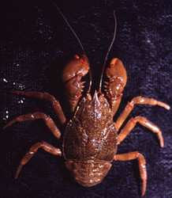
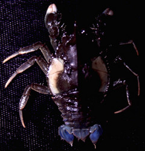

---
aliases:
  - Aeglidae
title: Aegla
---

## Phylogeny 

-   « Ancestral Groups  
    -  [Anomura](../Anomura.md) 
    -  [Decapoda](../../Decapoda.md) 
    -  [Malacostraca](../../../Malacostraca.md) 
    -  [Crustacea](../../../../Crustacea.md) 
    -  [Arthropoda](../../../../../Arthropoda.md) 
    -  [Bilateria](../../../../../../Bilateria.md) 
    -  [Animals](../../../../../../../Animals.md) 
    -  [Eukarya](../../../../../../../../Eukarya.md) 
    -   [Tree of Life](../../../../../../../../Tree_of_Life.md)

-   ◊ Sibling Groups of  Anomura
    -   Aegla

-   » Sub-Groups
    -   [Aegla leptochela](Aegla_leptochela)
    -   [Aegla marginata](Aegla_marginata)
    -   [Aegla inconspicua](Aegla_inconspicua)
    -   [Aegla serrana](Aegla_serrana)
    -   [Aegla ligulata](Aegla_ligulata)
    -   [Aegla franciscana](Aegla_franciscana)
    -   [Aegla obstipa](Aegla_obstipa)
    -   [Aegla itacolomiensis](Aegla_itacolomiensis)
    -   [Aegla plana](Aegla_plana)
    -   [Aegla grisella](Aegla_grisella)
    -   [Aegla inermis](Aegla_inermis)
    -   [Aegla longirostri](Aegla_longirostri)
    -   [Aegla humahuaca](Aegla_humahuaca)
    -   [Aegla septentrionalis](Aegla_septentrionalis)
    -   [Aegla sanlorenzo](Aegla_sanlorenzo)
    -   [Aegla jujuyana](Aegla_jujuyana)
    -   [Aegla intercalata](Aegla_intercalata)
    -   [Aegla violacea](Aegla_violacea)
    -   [Aegla prado](Aegla_prado)
    -   [Aegla platensis](Aegla_platensis)
    -   [Aegla singularis](Aegla_singularis)
    -   [Aegla rossiana](Aegla_rossiana)
    -   [Aegla uruguayana](Aegla_uruguayana)
    -   [Aegla spinipalma](Aegla_spinipalma)
    -   [Aegla camargoi](Aegla_camargoi)
    -   [Aegla leptodactyla](Aegla_leptodactyla)
    -   [Aegla spinosa](Aegla_spinosa)
    -   [Aegla odebrechtii](Aegla_odebrechtii)
    -   [Aegla jarai](Aegla_jarai)
    -   [Aegla paulensis](Aegla_paulensis)
    -   [Aegla perobae](Aegla_perobae)
    -   [Aegla cavernicola](Aegla_cavernicola)
    -   [Aegla strinatii](Aegla_strinatii)
    -   [Aegla schmitti](Aegla_schmitti)
    -   [Aegla parana](Aegla_parana)
    -   [Aegla castro](Aegla_castro)
    -   [Aegla parva](Aegla_parva)
    -   [Aegla abtao riolimayana](Aegla_abtao_riolimayana)
    -   [Aegla abtao abtao](Aegla_abtao_abtao)
    -   [Aegla spectabilis](Aegla_spectabilis)
    -   [Aegla araucaniensis](Aegla_araucaniensis)
    -   [Aegla laevis laevis](Aegla_laevis_laevis)
    -   [Aegla rostrata](Aegla_rostrata)
    -   [Aegla laevis talcahuano](Aegla_laevis_talcahuano)
    -   [Aegla bahamondei](Aegla_bahamondei)
    -   [Aegla neuquensis](Aegla_neuquensis)
    -   [Aegla affinis](Aegla_affinis)
    -   [Aegla alacalufi](Aegla_alacalufi)
    -   [Aegla manni](Aegla_manni)
    -   [Aegla denticulata         lacustris](Aegla_denticulata_lacustris)
    -   [Aegla denticulata         denticulata](Aegla_denticulata_denticulata)
    -   [Aegla scamosa](Aegla_scamosa)
    -   [Aegla ringueleti](Aegla_ringueleti)
    -   [Aegla papudo](Aegla_papudo)
    -   [Aegla microphthalma](Aegla_microphthalma)
    -   [Aegla franca](Aegla_franca)
    -   [Aegla lata](Aegla_lata)
    -   [Aegla intermedia](Aegla_intermedia)
    -   [Aegla concepcionensis](Aegla_concepcionensis)

## [[Aeglidae]] 

Aegla 
)   

## #has_/text_of_/abstract 

> The **Aeglidae** are a family of freshwater crustaceans currently restricted to South America. 
> They are the only anomurans to be found in fresh water 
> except for a single hermit crab species, Clibanarius fonticola, on Espiritu Santo, Vanuatu. 
> 
> They live between 20° S and 50° S, at altitudes between 320 and 3,500 m (1,050–11,480 ft).
>
> [Wikipedia](https://en.wikipedia.org/wiki/Aeglidae) 

## Title Illustrations

------------------------------------------------------------------------------- 
)
Scientific Name ::  Aegla abtao abtao
Copyright ::         © [Keith A. Crandall](http://inbio.byu.edu/Faculty/kac/crandall%5Flab/) 

-------------------------------------------------------------------------------

Scientific Name ::  Aegla denticulata denticulata
Copyright ::         © [Keith A. Crandall](http://inbio.byu.edu/Faculty/kac/crandall%5Flab/) 

## Confidential Links & Embeds: 

### #is_/same_as :: [[/_Standards/bio/bio~Domain/Eukarya/Animal/Bilateria/Arthropoda/Crustacea/Malacostraca/Decapoda/Anomura/Aeglidae|Aeglidae]] 

### #is_/same_as :: [[/_public/bio/bio~Domain/Eukarya/Animal/Bilateria/Arthropoda/Crustacea/Malacostraca/Decapoda/Anomura/Aeglidae.public|Aeglidae.public]] 

### #is_/same_as :: [[/_internal/bio/bio~Domain/Eukarya/Animal/Bilateria/Arthropoda/Crustacea/Malacostraca/Decapoda/Anomura/Aeglidae.internal|Aeglidae.internal]] 

### #is_/same_as :: [[/_protect/bio/bio~Domain/Eukarya/Animal/Bilateria/Arthropoda/Crustacea/Malacostraca/Decapoda/Anomura/Aeglidae.protect|Aeglidae.protect]] 

### #is_/same_as :: [[/_private/bio/bio~Domain/Eukarya/Animal/Bilateria/Arthropoda/Crustacea/Malacostraca/Decapoda/Anomura/Aeglidae.private|Aeglidae.private]] 

### #is_/same_as :: [[/_personal/bio/bio~Domain/Eukarya/Animal/Bilateria/Arthropoda/Crustacea/Malacostraca/Decapoda/Anomura/Aeglidae.personal|Aeglidae.personal]] 

### #is_/same_as :: [[/_secret/bio/bio~Domain/Eukarya/Animal/Bilateria/Arthropoda/Crustacea/Malacostraca/Decapoda/Anomura/Aeglidae.secret|Aeglidae.secret]] 

