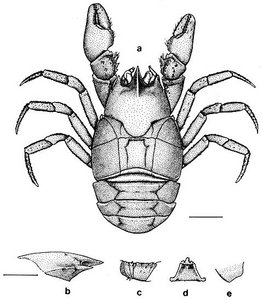
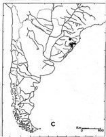

# Aegla inconspicua 
)

Containing group:[Aeglidae](../Aeglidae.md))

### Types

[Keith A. Crandall]() 

Holotype, *Departamento de Zoologia, Instituto de Bionciencias,
Universidade Federal do Rio Grande do Sul, Porto Alegre, RS, Brasil*
00116H (1 male).

Paratypes, *Departamento de Zoologia, Instituto de Biociencias,
Universidade Federal do Rio Grande do Sul, Porto Alegre, RS, Brasil*
00116P (8 males, 9 females).

### Type Locality

Arroio D. Pedro, Sao Francisco de Paula, Rio Grande do Sul, Brazil.

### Distribution

Eastern and northeastern parts of Rio Grande do Sul, Brazil.
)

© 1994 Georgina Bond-Buckup, Ludwig Buckup
## Phylogeny 

-   « Ancestral Groups  
    -   [Aegla](Aegla)
    -  [Anomura](../../Anomura.md))
    -  [Decapoda](../../../Decapoda.md))
    -  [Malacostraca](../../../../Malacostraca.md))
    -  [Crustacea](../../../../../Crustacea.md))
    -  [Arthropoda](../../../../../../Arthropoda.md))
    -  [Bilateria](../../../../../../../Bilateria.md))
    -  [Animals](../../../../../../../../Animals.md))
    -  [Eukarya](../../../../../../../../../Eukarya.md))
    -   [Tree of Life](../../../../../../../../../Tree_of_Life.md)

-   ◊ Sibling Groups of  Aegla
    -   [Aegla leptochela](Aegla_leptochela)
    -   [Aegla marginata](Aegla_marginata)
    -   Aegla inconspicua
    -   [Aegla serrana](Aegla_serrana)
    -   [Aegla ligulata](Aegla_ligulata)
    -   [Aegla franciscana](Aegla_franciscana)
    -   [Aegla obstipa](Aegla_obstipa)
    -   [Aegla itacolomiensis](Aegla_itacolomiensis)
    -   [Aegla plana](Aegla_plana)
    -   [Aegla grisella](Aegla_grisella)
    -   [Aegla inermis](Aegla_inermis)
    -   [Aegla longirostri](Aegla_longirostri)
    -   [Aegla humahuaca](Aegla_humahuaca)
    -   [Aegla septentrionalis](Aegla_septentrionalis)
    -   [Aegla sanlorenzo](Aegla_sanlorenzo)
    -   [Aegla jujuyana](Aegla_jujuyana)
    -   [Aegla intercalata](Aegla_intercalata)
    -   [Aegla violacea](Aegla_violacea)
    -   [Aegla prado](Aegla_prado)
    -   [Aegla platensis](Aegla_platensis)
    -   [Aegla singularis](Aegla_singularis)
    -   [Aegla rossiana](Aegla_rossiana)
    -   [Aegla uruguayana](Aegla_uruguayana)
    -   [Aegla spinipalma](Aegla_spinipalma)
    -   [Aegla camargoi](Aegla_camargoi)
    -   [Aegla leptodactyla](Aegla_leptodactyla)
    -   [Aegla spinosa](Aegla_spinosa)
    -   [Aegla odebrechtii](Aegla_odebrechtii)
    -   [Aegla jarai](Aegla_jarai)
    -   [Aegla paulensis](Aegla_paulensis)
    -   [Aegla perobae](Aegla_perobae)
    -   [Aegla cavernicola](Aegla_cavernicola)
    -   [Aegla strinatii](Aegla_strinatii)
    -   [Aegla schmitti](Aegla_schmitti)
    -   [Aegla parana](Aegla_parana)
    -   [Aegla castro](Aegla_castro)
    -   [Aegla parva](Aegla_parva)
    -   [Aegla abtao riolimayana](Aegla_abtao_riolimayana)
    -   [Aegla abtao abtao](Aegla_abtao_abtao)
    -   [Aegla spectabilis](Aegla_spectabilis)
    -   [Aegla araucaniensis](Aegla_araucaniensis)
    -   [Aegla laevis laevis](Aegla_laevis_laevis)
    -   [Aegla rostrata](Aegla_rostrata)
    -   [Aegla laevis talcahuano](Aegla_laevis_talcahuano)
    -   [Aegla bahamondei](Aegla_bahamondei)
    -   [Aegla neuquensis](Aegla_neuquensis)
    -   [Aegla affinis](Aegla_affinis)
    -   [Aegla alacalufi](Aegla_alacalufi)
    -   [Aegla manni](Aegla_manni)
    -   [Aegla denticulata         lacustris](Aegla_denticulata_lacustris)
    -   [Aegla denticulata         denticulata](Aegla_denticulata_denticulata)
    -   [Aegla scamosa](Aegla_scamosa)
    -   [Aegla ringueleti](Aegla_ringueleti)
    -   [Aegla papudo](Aegla_papudo)
    -   [Aegla microphthalma](Aegla_microphthalma)
    -   [Aegla franca](Aegla_franca)
    -   [Aegla lata](Aegla_lata)
    -   [Aegla intermedia](Aegla_intermedia)
    -   [Aegla concepcionensis](Aegla_concepcionensis)

-   » Sub-Groups 

## Title Illustrations

-----------------)
Scientific Name ::  Aegla inconspicua
Creator           Ana Rossi
Sex ::             Male
View              dorsal
Copyright ::         © 1994 Georgina Bond-Buckup, Ludwig Buckup

## Confidential Links & Embeds: 

### #is_/same_as :: [inconspicua](/_Standards/bio/bio~Domain/Eukarya/Animal/Bilateria/Arthropoda/Crustacea/Malacostraca/Decapoda/Anomura/Aeglidae/inconspicua.md) 

### #is_/same_as :: [inconspicua.public](/_public/bio/bio~Domain/Eukarya/Animal/Bilateria/Arthropoda/Crustacea/Malacostraca/Decapoda/Anomura/Aeglidae/inconspicua.public.md) 

### #is_/same_as :: [inconspicua.internal](/_internal/bio/bio~Domain/Eukarya/Animal/Bilateria/Arthropoda/Crustacea/Malacostraca/Decapoda/Anomura/Aeglidae/inconspicua.internal.md) 

### #is_/same_as :: [inconspicua.protect](/_protect/bio/bio~Domain/Eukarya/Animal/Bilateria/Arthropoda/Crustacea/Malacostraca/Decapoda/Anomura/Aeglidae/inconspicua.protect.md) 

### #is_/same_as :: [inconspicua.private](/_private/bio/bio~Domain/Eukarya/Animal/Bilateria/Arthropoda/Crustacea/Malacostraca/Decapoda/Anomura/Aeglidae/inconspicua.private.md) 

### #is_/same_as :: [inconspicua.personal](/_personal/bio/bio~Domain/Eukarya/Animal/Bilateria/Arthropoda/Crustacea/Malacostraca/Decapoda/Anomura/Aeglidae/inconspicua.personal.md) 

### #is_/same_as :: [inconspicua.secret](/_secret/bio/bio~Domain/Eukarya/Animal/Bilateria/Arthropoda/Crustacea/Malacostraca/Decapoda/Anomura/Aeglidae/inconspicua.secret.md)

