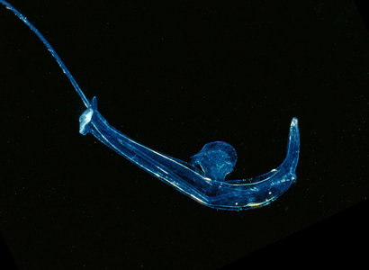

---
aliases:
- Apanqura
- Astacidea
- Astacideos
- Astacideu
- Chʼoshtsoh bíláshgaantsohí
- Großkrebse
- kreeften
- Krewe
- Krift'n
- Langhalekreps
- pitkäpyrstöiset ravut
- Raci mari
- vēži
- Xərçənglər
- Αστακιδεία
- Раки
- استاسيديا
- خارچنگیان
- ပုစွန်တုပ်
- ᏥᏍᏛᎾ
- ザリガニ下目
- 螯虾下目
- 螯蝦下目
- 가재하목
title: Astacidea
has_id_wikidata: Q929163
dv_has_:
  name_:
    af: Krewe
    an: Astacidea
    arz: استاسيديا
    ast: Astacidea
    az: Xərçənglər
    bar: Astacidea
    bg: Astacidea
    br: Astacidea
    ca: Astacideu
    ceb: Astacidea
    chr: ᏥᏍᏛᎾ
    co: Astacidea
    cs: Astacidea
    cy: Astacidea
    da: Astacidea
    de: Großkrebse
    de-at: Astacidea
    de_ch: Astacidea
    el: Αστακιδεία
    en: Astacidea
    en_ca: Astacidea
    en_gb: Astacidea
    eo: Astacidea
    es: Astacidea
    et: Astacidea
    eu: Astacidea
    ext: Astacidea
    fa: خارچنگیان
    fi: pitkäpyrstöiset ravut
    fr: Astacidea
    frp: Astacidea
    fur: Astacidea
    ga: Astacidea
    gd: Astacidea
    gl: Astacideos
    gsw: Astacidea
    hr: Astacidea
    hu: Astacidea
    hy: Astacidea
    ia: Astacidea
    id: Astacidea
    ie: Astacidea
    io: Astacidea
    is: Astacidea
    it: Astacidea
    ja: ザリガニ下目
    kg: Astacidea
    ko: 가재하목
    la: Astacidea
    lb: Astacidea
    li: Astacidea
    lij: Astacidea
    lv: vēži
    mg: Astacidea
    min: Astacidea
    ms: Astacidea
    mul: Astacidea
    my: ပုစွန်တုပ်
    nap: Astacidea
    nb: Langhalekreps
    nds: Astacidea
    nds_nl: Astacidea
    nl: kreeften
    nn: Langhalekreps
    nrm: Astacidea
    nv: Chʼoshtsoh bíláshgaantsohí
    nys: Astacidea
    oc: Astacidea
    pcd: Astacidea
    pl: Astacidea
    pms: Astacidea
    pt: Astacidea
    pt_br: Astacidea
    qu: Apanqura
    rm: Astacidea
    ro: Raci mari
    ru: Astacidea
    sc: Astacidea
    scn: Astacidea
    sco: Astacidea
    sk: Astacidea
    sl: Astacidea
    sq: Astacidea
    sv: Astacidea
    sw: Astacidea
    uk: Раки
    vec: Astacidea
    vi: Astacidea
    vls: Krift'n
    vo: Astacidea
    wa: Astacidea
    war: Astacidea
    wo: Astacidea
    zh: 螯虾下目
    zh_cn: 螯蝦下目
    zh_hans: 螯虾下目
    zh_tw: 螯蝦下目
    zu: Astacidea
---
# [[Astacidea]]

Freshwater crayfish 

## #has_/text_of_/abstract 

> **Astacidea** is an infraorder of decapod crustaceans including lobsters 
> (but not "lobsters" such as the spiny lobster etc.), crayfish, and their close relatives.
>
> [Wikipedia](https://en.wikipedia.org/wiki/Astacidea) 

### Information on the Internet

-   [Keith Crandall\'s Crayfish Home     Page](http://crayfish.byu.edu/index.htm)
-   [Crayfish. An Introduction to the Study of Zoology. By T. H. Huxley,     F.R.S.](http://www2.biology.ualberta.ca/palmer/thh/crayfish.htm)

## Introduction

[Keith A. Crandall and James W. Fetzner, Jr.]() 

Freshwater crayfishes are taxonomically distributed among three
families; two Northern Hemisphere families, Astacidae and Cambaridae and
one Southern Hemisphere family, Parastacidae. There are two centers of
species diversity for freshwater crayfishes. The first is located in the
Southeastern United States where some 80% of the cambarid species can be
found. The second center of diversity is in Victoria, Australia; housing
a large proportion of the parastacid species. Freshwater crayfishes
naturally occur on all of the continents except Africa (Figure 1). The
Astacidae are distributed West of the Rocky Mountains in the Northwest
United States into British Columbia, Canada and in Europe. The
Cambaridae are found in the Eastern United States and south through
Mexico. The Parastacidae are distributed in Australia, New Zealand,
South America, and Madagascar.

------------------------
 

Figure 1. World distributions of the three crayfish families.

### Discussion of Phylogenetic Relationships

The phylogenetic relationships among the freshwater crayfish families
and their relationships to lobster-like ancestors has been of
considerable debate for at least 100 years. Two alternative hypotheses
have been proposed for the origins of crayfishes. The first supposes a
diphyletic origin of astacoids and parastacoids suggesting independent
invasion of the freshwater habitat (Huxley, 1880). This idea is
supported by the two centers of diversity in the northern and southern
hemispheres and by a number of morphological features (Hobbs, 1974).
However, Ortmann (1902) argued for a monophyletic origin of the
crayfishes. This position has recently been supported by sperm
ultrastructure characteristics (Jamieson, 1991) and by embryonic
characters (Scholtz, 1993). Because of this ongoing debate, the
positioning of Parastacidae is shown as unresolved.

## Phylogeny 

-   « Ancestral Groups  
    -  [Decapoda](../Decapoda.md) 
    -  [Malacostraca](../../Malacostraca.md) 
    -  [Crustacea](../../../Crustacea.md) 
    -  [Arthropoda](../../../../Arthropoda.md) 
    -  [Bilateria](../../../../../Bilateria.md) 
    -  [Animals](../../../../../../Animals.md) 
    -  [Eukarya](../../../../../../../Eukarya.md) 
    -   [Tree of Life](../../../../../../../Tree_of_Life.md)

-   ◊ Sibling Groups of  Decapoda
    -   Astacidea
    -  [Anomura](Anomura.md) 

-   » Sub-Groups
    -   [Parastacidae](Parastacidae)
    -  [Astacidae](Astacidea/Astacidae.md) 
    -  [Cambaridae](Astacidea/Astacidae/Cambaridae.md) 

## Title Illustrations

---------------------------------------------------------------------------------

scientific_name ::  Fallicambarus devastator
copyright ::         © 1998 [Keith A. Crandall](http://inbio.byu.edu/Faculty/kac/crandall%5Flab/) 

## Confidential Links & Embeds: 

### #is_/same_as :: [[/_Standards/bio/bio~Domain/Eukarya/Animal/Bilateria/Arthropoda/Crustacea/Malacostraca/Decapoda/Astacidea|Astacidea]] 

### #is_/same_as :: [[/_public/bio/bio~Domain/Eukarya/Animal/Bilateria/Arthropoda/Crustacea/Malacostraca/Decapoda/Astacidea.public|Astacidea.public]] 

### #is_/same_as :: [[/_internal/bio/bio~Domain/Eukarya/Animal/Bilateria/Arthropoda/Crustacea/Malacostraca/Decapoda/Astacidea.internal|Astacidea.internal]] 

### #is_/same_as :: [[/_protect/bio/bio~Domain/Eukarya/Animal/Bilateria/Arthropoda/Crustacea/Malacostraca/Decapoda/Astacidea.protect|Astacidea.protect]] 

### #is_/same_as :: [[/_private/bio/bio~Domain/Eukarya/Animal/Bilateria/Arthropoda/Crustacea/Malacostraca/Decapoda/Astacidea.private|Astacidea.private]] 

### #is_/same_as :: [[/_personal/bio/bio~Domain/Eukarya/Animal/Bilateria/Arthropoda/Crustacea/Malacostraca/Decapoda/Astacidea.personal|Astacidea.personal]] 

### #is_/same_as :: [[/_secret/bio/bio~Domain/Eukarya/Animal/Bilateria/Arthropoda/Crustacea/Malacostraca/Decapoda/Astacidea.secret|Astacidea.secret]] 

