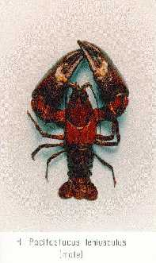

---
aliases:
  - Astacidae
title: Astacidae
---

# [[Astacidae]] 

)
Photograph copyright © 1995 David Holdich

## #has_/text_of_/abstract 

> **Astacidae** is a family of freshwater crayfish 
> native to Europe, western Asia and western North America. 
> 
> The family is made up of four extant (living) genera: 
> - The genera Astacus (which includes the European crayfish), 
> - Pontastacus (which includes the Turkish crayfish), and 
> - Austropotamobius are all found throughout Europe and parts of western Asia, 
> - while Pacifastacus (which includes the signal crayfish) is native to western United States 
>   and British Columbia, but has also been introduced elsewhere.
>
> [Wikipedia](https://en.wikipedia.org/wiki/Astacidae) 

## Phylogeny 

-   « Ancestral Groups  
    -  [Astacidea](../Astacidea.md) 
    -  [Decapoda](../../Decapoda.md) 
    -  [Malacostraca](../../../Malacostraca.md) 
    -  [Crustacea](../../../../Crustacea.md) 
    -  [Arthropoda](../../../../../Arthropoda.md) 
    -  [Bilateria](../../../../../../Bilateria.md) 
    -  [Animals](../../../../../../../Animals.md) 
    -  [Eukarya](../../../../../../../../Eukarya.md) 
    -   [Tree of Life](../../../../../../../../Tree_of_Life.md)

-   ◊ Sibling Groups of  Astacidea
    -   [Parastacidae](Parastacidae)
    -   Astacidae
    -  [Cambaridae](Astacidae/Cambaridae.md) 

-   » Sub-Groups
    -  [Pacifastacus](Astacidae/Pacifastacus.md) 
    -  [Astacus](Astacidae/Astacus.md) 

## Confidential Links & Embeds: 

### #is_/same_as :: [Astacidae](/_Standards/bio/bio~Domain/Eukarya/Animal/Bilateria/Arthropoda/Crustacea/Malacostraca/Decapoda/Astacidea/Astacidae.md) 

### #is_/same_as :: [Astacidae.public](/_public/bio/bio~Domain/Eukarya/Animal/Bilateria/Arthropoda/Crustacea/Malacostraca/Decapoda/Astacidea/Astacidae.public.md) 

### #is_/same_as :: [Astacidae.internal](/_internal/bio/bio~Domain/Eukarya/Animal/Bilateria/Arthropoda/Crustacea/Malacostraca/Decapoda/Astacidea/Astacidae.internal.md) 

### #is_/same_as :: [Astacidae.protect](/_protect/bio/bio~Domain/Eukarya/Animal/Bilateria/Arthropoda/Crustacea/Malacostraca/Decapoda/Astacidea/Astacidae.protect.md) 

### #is_/same_as :: [Astacidae.private](/_private/bio/bio~Domain/Eukarya/Animal/Bilateria/Arthropoda/Crustacea/Malacostraca/Decapoda/Astacidea/Astacidae.private.md) 

### #is_/same_as :: [Astacidae.personal](/_personal/bio/bio~Domain/Eukarya/Animal/Bilateria/Arthropoda/Crustacea/Malacostraca/Decapoda/Astacidea/Astacidae.personal.md) 

### #is_/same_as :: [Astacidae.secret](/_secret/bio/bio~Domain/Eukarya/Animal/Bilateria/Arthropoda/Crustacea/Malacostraca/Decapoda/Astacidea/Astacidae.secret.md)

