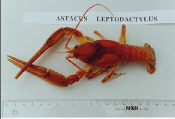

---
aliases:
  - Astacus
title: Astacus
---

# [[Astacus]] 
) 
copyright ::   © 1995 University of Kuopio and Ari Mannonen

## #has_/text_of_/abstract 

> **Astacus** (from the Greek αστακός, astacós, meaning "lobster" or "crayfish") 
> is a genus of crayfish found in Europe, comprising three extant (living) species 
> and three somewhat contested extinct species. 
> 
> These crayfish are found across Europe and live exclusively in freshwater, 
> mostly inhabiting the bottom of lakes, ponds, and streams.
>
> Due to the crayfish plague, crayfish of this genus have declined in many European regions, 
> being replaced by the invasive North American signal crayfish, 
> which carries the plague but is unaffected by it.
>
> [Wikipedia](https://en.wikipedia.org/wiki/Astacus) 

## Phylogeny 

-   « Ancestral Groups  
    -  [Astacidae](../Astacidae.md) 
    -  [Astacidea](../../Astacidea.md) 
    -  [Decapoda](../../../Decapoda.md) 
    -  [Malacostraca](../../../../Malacostraca.md) 
    -  [Crustacea](../../../../../Crustacea.md) 
    -  [Arthropoda](../../../../../../Arthropoda.md) 
    -  [Bilateria](../../../../../../../Bilateria.md) 
    -  [Animals](../../../../../../../../Animals.md) 
    -  [Eukarya](../../../../../../../../../Eukarya.md) 
    -   [Tree of Life](../../../../../../../../../Tree_of_Life.md)

-   ◊ Sibling Groups of  Astacidae
    -  [Pacifastacus](Pacifastacus.md) 
    -   Astacus

-   » Sub-Groups 
	-   *Astacus astacus*
	-   *Astacus leptodactylus*
	-   *Astacus pachypus*

## Confidential Links & Embeds: 

### #is_/same_as :: [[/_Standards/bio/bio~Domain/Eukarya/Animal/Bilateria/Arthropoda/Crustacea/Malacostraca/Decapoda/Astacidea/Astacidae/Astacus|Astacus]] 

### #is_/same_as :: [[/_public/bio/bio~Domain/Eukarya/Animal/Bilateria/Arthropoda/Crustacea/Malacostraca/Decapoda/Astacidea/Astacidae/Astacus.public|Astacus.public]] 

### #is_/same_as :: [[/_internal/bio/bio~Domain/Eukarya/Animal/Bilateria/Arthropoda/Crustacea/Malacostraca/Decapoda/Astacidea/Astacidae/Astacus.internal|Astacus.internal]] 

### #is_/same_as :: [[/_protect/bio/bio~Domain/Eukarya/Animal/Bilateria/Arthropoda/Crustacea/Malacostraca/Decapoda/Astacidea/Astacidae/Astacus.protect|Astacus.protect]] 

### #is_/same_as :: [[/_private/bio/bio~Domain/Eukarya/Animal/Bilateria/Arthropoda/Crustacea/Malacostraca/Decapoda/Astacidea/Astacidae/Astacus.private|Astacus.private]] 

### #is_/same_as :: [[/_personal/bio/bio~Domain/Eukarya/Animal/Bilateria/Arthropoda/Crustacea/Malacostraca/Decapoda/Astacidea/Astacidae/Astacus.personal|Astacus.personal]] 

### #is_/same_as :: [[/_secret/bio/bio~Domain/Eukarya/Animal/Bilateria/Arthropoda/Crustacea/Malacostraca/Decapoda/Astacidea/Astacidae/Astacus.secret|Astacus.secret]] 

