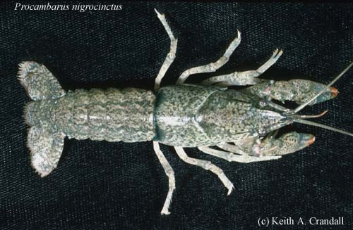

---
aliases:
  - Cambaridae
title: Cambaridae
---

# [[Cambaridae]]  
)

## #has_/text_of_/abstract 

> The **Cambaridae** are the largest of the four families of freshwater crayfish, 
> with over 400 species. 
> 
> Most of the species in the family are native to the United States east of the Great Divide 
> and Mexico, but fewer range north to Canada, and south to Guatemala and Honduras. 
> 
> Three live on the island of Cuba. 
> The species in the genus Cambaroides are only found outside North America, 
> as they are restricted to eastern Asia.
>
> A few species, including the invasive Procambarus clarkii and Faxonius rusticus, 
> have been introduced to regions far outside their native range 
> (both in North America and other continents). 
> 
> Conversely, many species have tiny ranges and are seriously threatened; a few are already extinct.
>
> A 2006 molecular study suggested that the family Cambaridae may be paraphyletic, 
> with the family Astacidae nested within it, 
> and the status of the genus Cambaroides remains unclear.
>
> The oldest fossils of the family are 
> known from the Late Jurassic Morrison Formation of western North America.
>
> [Wikipedia](https://en.wikipedia.org/wiki/Cambaridae) 

## Phylogeny 

-   « Ancestral Groups  
    -  [Astacidea](../../Astacidea.md) 
    -  [Decapoda](../../../Decapoda.md) 
    -  [Malacostraca](../../../../Malacostraca.md) 
    -  [Crustacea](../../../../../Crustacea.md) 
    -  [Arthropoda](../../../../../../Arthropoda.md) 
    -  [Bilateria](../../../../../../../Bilateria.md) 
    -  [Animals](../../../../../../../../Animals.md) 
    -  [Eukarya](../../../../../../../../../Eukarya.md) 
    -   [Tree of Life](../../../../../../../../../Tree_of_Life.md)

-   ◊ Sibling Groups of  Astacidea
    -   [Parastacidae](Parastacidae)
    -  [Astacidae](../Astacidae.md) 
    -   Cambaridae

-   » Sub-Groups
    -  [Cambarellinae](Cambaridae/Cambarellinae.md) 
    -  [Cambarinae](Cambaridae/Cambarinae.md) 
    -  [Cambaroides](Cambaridae/Cambaroides.md) 

## Title Illustrations

------------------------------------------------------------------------------
*Procambarus nigrocinctus*
Photo copyright © Keith A. Crandall)
Copyright ::   © [Keith A. Crandall](http://inbio.byu.edu/Faculty/kac/crandall%5Flab/) 

## Confidential Links & Embeds: 

### #is_/same_as :: [[/_Standards/bio/bio~Domain/Eukarya/Animal/Bilateria/Arthropoda/Crustacea/Malacostraca/Decapoda/Astacidea/Astacidae/Cambaridae|Cambaridae]] 

### #is_/same_as :: [[/_public/bio/bio~Domain/Eukarya/Animal/Bilateria/Arthropoda/Crustacea/Malacostraca/Decapoda/Astacidea/Astacidae/Cambaridae.public|Cambaridae.public]] 

### #is_/same_as :: [[/_internal/bio/bio~Domain/Eukarya/Animal/Bilateria/Arthropoda/Crustacea/Malacostraca/Decapoda/Astacidea/Astacidae/Cambaridae.internal|Cambaridae.internal]] 

### #is_/same_as :: [[/_protect/bio/bio~Domain/Eukarya/Animal/Bilateria/Arthropoda/Crustacea/Malacostraca/Decapoda/Astacidea/Astacidae/Cambaridae.protect|Cambaridae.protect]] 

### #is_/same_as :: [[/_private/bio/bio~Domain/Eukarya/Animal/Bilateria/Arthropoda/Crustacea/Malacostraca/Decapoda/Astacidea/Astacidae/Cambaridae.private|Cambaridae.private]] 

### #is_/same_as :: [[/_personal/bio/bio~Domain/Eukarya/Animal/Bilateria/Arthropoda/Crustacea/Malacostraca/Decapoda/Astacidea/Astacidae/Cambaridae.personal|Cambaridae.personal]] 

### #is_/same_as :: [[/_secret/bio/bio~Domain/Eukarya/Animal/Bilateria/Arthropoda/Crustacea/Malacostraca/Decapoda/Astacidea/Astacidae/Cambaridae.secret|Cambaridae.secret]] 

