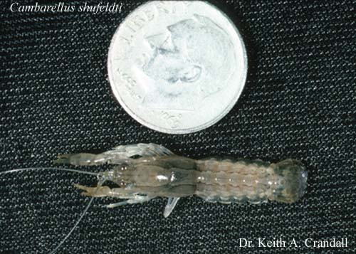

---
aliases:
  - Cambarellinae
title: Cambarellinae
---

# [[Cambarellinae]] 

 
Copyright ::   © [Keith A. Crandall](http://inbio.byu.edu/Faculty/kac/crandall%5Flab/) 

## Phylogeny 

-   « Ancestral Groups  
    -  [Cambaridae](../Cambaridae.md) 
    -  [Astacidea](../../../Astacidea.md) 
    -  [Decapoda](../../../../Decapoda.md) 
    -  [Malacostraca](../../../../../Malacostraca.md) 
    -  [Crustacea](../../../../../../Crustacea.md) 
    -  [Arthropoda](../../../../../../../Arthropoda.md) 
    -  [Bilateria](../../../../../../../../Bilateria.md) 
    -  [Animals](../../../../../../../../../Animals.md) 
    -  [Eukarya](../../../../../../../../../../Eukarya.md) 
    -   [Tree of Life](../../../../../../../../../../Tree_of_Life.md)

-   ◊ Sibling Groups of  Cambaridae
    -   Cambarellinae
    -  [Cambarinae](Cambarinae.md) 
    -  [Cambaroides](Cambaroides.md) 

-   » Sub-Groups
    -   [Cambarellus (Dirigicambarus)         shufeldtii](Cambarellus_%28Dirigicambarus%29_shufeldtii)
    -   [Cambarellus         (Pandicambarus)](Cambarellus_%28Pandicambarus%29)
    -   [Cambarellus         (Cambarellus)](Cambarellus_%28Cambarellus%29)

## Confidential Links & Embeds: 

### #is_/same_as :: [[/_Standards/bio/bio~Domain/Eukarya/Animal/Bilateria/Arthropoda/Crustacea/Malacostraca/Decapoda/Astacidea/Astacidae/Cambaridae/Cambarellinae|Cambarellinae]] 

### #is_/same_as :: [[/_public/bio/bio~Domain/Eukarya/Animal/Bilateria/Arthropoda/Crustacea/Malacostraca/Decapoda/Astacidea/Astacidae/Cambaridae/Cambarellinae.public|Cambarellinae.public]] 

### #is_/same_as :: [[/_internal/bio/bio~Domain/Eukarya/Animal/Bilateria/Arthropoda/Crustacea/Malacostraca/Decapoda/Astacidea/Astacidae/Cambaridae/Cambarellinae.internal|Cambarellinae.internal]] 

### #is_/same_as :: [[/_protect/bio/bio~Domain/Eukarya/Animal/Bilateria/Arthropoda/Crustacea/Malacostraca/Decapoda/Astacidea/Astacidae/Cambaridae/Cambarellinae.protect|Cambarellinae.protect]] 

### #is_/same_as :: [[/_private/bio/bio~Domain/Eukarya/Animal/Bilateria/Arthropoda/Crustacea/Malacostraca/Decapoda/Astacidea/Astacidae/Cambaridae/Cambarellinae.private|Cambarellinae.private]] 

### #is_/same_as :: [[/_personal/bio/bio~Domain/Eukarya/Animal/Bilateria/Arthropoda/Crustacea/Malacostraca/Decapoda/Astacidea/Astacidae/Cambaridae/Cambarellinae.personal|Cambarellinae.personal]] 

### #is_/same_as :: [[/_secret/bio/bio~Domain/Eukarya/Animal/Bilateria/Arthropoda/Crustacea/Malacostraca/Decapoda/Astacidea/Astacidae/Cambaridae/Cambarellinae.secret|Cambarellinae.secret]] 

