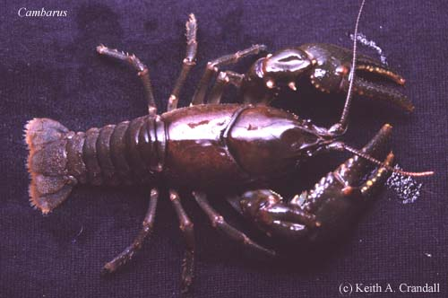

---
aliases:
- Cambaridae
- Cambarinae
- Инçет Хĕвелтухаç юханшыв ракĕ
- كركنديات المياة العذبه
- كركنديات المياه العذبة
- アメリカザリガニ科
- 蝲蛄科
- 미국가재과
title: Cambarinae
has_id_wikidata: Q138415
dv_has_:
  name_:
    an: Cambaridae
    ar: كركنديات المياه العذبة
    arz: كركنديات المياة العذبه
    ast: Cambaridae
    bg: Cambaridae
    ca: Cambaridae
    ceb: Cambaridae
    cv: Инçет Хĕвелтухаç юханшыв ракĕ
    da: Cambaridae
    de: Cambaridae
    en: Cambaridae
    eo: Cambaridae
    es: Cambaridae
    eu: Cambaridae
    ext: Cambaridae
    fi: Cambaridae
    fr: Cambaridae
    ga: Cambaridae
    gl: Cambaridae
    ia: Cambaridae
    ie: Cambaridae
    io: Cambaridae
    is: Cambaridae
    it: Cambaridae
    ja: アメリカザリガニ科
    ko: 미국가재과
    la: Cambaridae
    mul: Cambaridae
    nb: Cambaridae
    nl: Cambaridae
    nn: Cambaridae
    oc: Cambaridae
    pl: Cambaridae
    pt: Cambaridae
    pt_br: Cambaridae
    ro: Cambaridae
    ru: Cambaridae
    sq: Cambaridae
    sv: Cambaridae
    tr: Cambaridae
    uk: Cambaridae
    vi: Cambaridae
    vo: Cambaridae
    war: Cambaridae
    zh: 蝲蛄科
    zh_cn: 蝲蛄科
    zh_hans: 蝲蛄科
    zh_hant: 蝲蛄科
    zh_hk: 蝲蛄科
    zh_sg: 蝲蛄科
    zh_tw: 蝲蛄科
---
## Phylogeny 

-   « Ancestral Groups  
    -  [Cambaridae](../Cambaridae.md) 
    -  [Astacidea](../../../Astacidea.md) 
    -  [Decapoda](../../../../Decapoda.md) 
    -  [Malacostraca](../../../../../Malacostraca.md) 
    -  [Crustacea](../../../../../../Crustacea.md) 
    -  [Arthropoda](../../../../../../../Arthropoda.md) 
    -  [Bilateria](../../../../../../../../Bilateria.md) 
    -  [Animals](../../../../../../../../../Animals.md) 
    -  [Eukarya](../../../../../../../../../../Eukarya.md) 
    -   [Tree of Life](../../../../../../../../../../Tree_of_Life.md)

-   ◊ Sibling Groups of  Cambaridae
    -  [Cambarellinae](Cambarellinae.md) 
    -   Cambarinae
    -  [Cambaroides](Cambaroides.md) 

-   » Sub-Groups
    -   [Fallicambarus](Fallicambarus)
    -   [Barbicambarus cornutus](Barbicambarus_cornutus)
    -   [Cambarus](Cambarus)
    -   [Hobbseus](Hobbseus)
    -   [Bouchardina robisoni](Bouchardina_robisoni)
    -   [Faxonella](Faxonella)
    -   [Orconectes](Orconectes)
    -   [Procambarus](Procambarus)
    -   [Troglocambarus maclanei](Troglocambarus_maclanei)
    -   [Distocambarus](Distocambarus)

# [[Cambarinae]] 

[Keith A. Crandall, James W. Fetzner, Jr., and Horton H. Hobbs, Jr.](http://www.tolweb.org/)

 
Photo copyright © Keith A. Crandall

## #has_/text_of_/abstract 

> The Cambaridae are the largest of the four families of freshwater crayfish, with over 400 species. Most of the species in the family are native to the United States east of the Great Divide and Mexico, but fewer range north to Canada, and south to Guatemala and Honduras. Three live on the island of Cuba. The species in the genus Cambaroides are only found outside North America, as they are restricted to eastern Asia.
>
> A few species, including the invasive Procambarus clarkii and Faxonius rusticus, have been introduced to regions far outside their native range (both in North America and other continents). Conversely, many species have tiny ranges and are seriously threatened; a few are already extinct.
>
> A 2006 molecular study suggested that the family Cambaridae may be paraphyletic, with the family Astacidae nested within it, and the status of the genus Cambaroides remains unclear.
>
> The oldest fossils of the family are known from the Late Jurassic Morrison Formation of western North America.
>
> [Wikipedia](https://en.wikipedia.org/wiki/Cambaridae) 

## Confidential Links & Embeds: 

### #is_/same_as :: [[/_Standards/bio/bio~Domain/Eukarya/Animal/Bilateria/Arthropoda/Crustacea/Malacostraca/Decapoda/Astacidea/Astacidae/Cambaridae/Cambarinae|Cambarinae]] 

### #is_/same_as :: [[/_public/bio/bio~Domain/Eukarya/Animal/Bilateria/Arthropoda/Crustacea/Malacostraca/Decapoda/Astacidea/Astacidae/Cambaridae/Cambarinae.public|Cambarinae.public]] 

### #is_/same_as :: [[/_internal/bio/bio~Domain/Eukarya/Animal/Bilateria/Arthropoda/Crustacea/Malacostraca/Decapoda/Astacidea/Astacidae/Cambaridae/Cambarinae.internal|Cambarinae.internal]] 

### #is_/same_as :: [[/_protect/bio/bio~Domain/Eukarya/Animal/Bilateria/Arthropoda/Crustacea/Malacostraca/Decapoda/Astacidea/Astacidae/Cambaridae/Cambarinae.protect|Cambarinae.protect]] 

### #is_/same_as :: [[/_private/bio/bio~Domain/Eukarya/Animal/Bilateria/Arthropoda/Crustacea/Malacostraca/Decapoda/Astacidea/Astacidae/Cambaridae/Cambarinae.private|Cambarinae.private]] 

### #is_/same_as :: [[/_personal/bio/bio~Domain/Eukarya/Animal/Bilateria/Arthropoda/Crustacea/Malacostraca/Decapoda/Astacidea/Astacidae/Cambaridae/Cambarinae.personal|Cambarinae.personal]] 

### #is_/same_as :: [[/_secret/bio/bio~Domain/Eukarya/Animal/Bilateria/Arthropoda/Crustacea/Malacostraca/Decapoda/Astacidea/Astacidae/Cambaridae/Cambarinae.secret|Cambarinae.secret]] 

