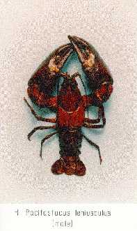

---
aliases:
  - Pacifastacus
title: Pacifastacus
---

# [[Pacifastacus]]  

 

## #has_/text_of_/abstract 

> **Pacifastacus** is a genus of crayfish native to western North America (USA and Canada), containing six species, two of which are extinct:
> - †Pacifastacus chenoderma (fossil: Miocene – Pliocene)
> - Pacifastacus connectens
> - Pacifastacus fortis – Shasta crayfish
> - Pacifastacus gambelii
> - Pacifastacus leniusculus – signal crayfish
> - †Pacifastacus nigrescens – Sooty crayfish
>
> [Wikipedia](https://en.wikipedia.org/wiki/Pacifastacus) 

## Phylogeny 

-   « Ancestral Groups  
    -  [Astacidae](../Astacidae.md) 
    -  [Astacidea](../../Astacidea.md) 
    -  [Decapoda](../../../Decapoda.md) 
    -  [Malacostraca](../../../../Malacostraca.md) 
    -  [Crustacea](../../../../../Crustacea.md) 
    -  [Arthropoda](../../../../../../Arthropoda.md) 
    -  [Bilateria](../../../../../../../Bilateria.md) 
    -  [Animals](../../../../../../../../Animals.md) 
    -  [Eukarya](../../../../../../../../../Eukarya.md) 
    -   [Tree of Life](../../../../../../../../../Tree_of_Life.md)

-   ◊ Sibling Groups of  Astacidae
    -   Pacifastacus
    -  [Astacus](Astacus.md) 

-   » Sub-Groups
    -   [Pacifastacus         (Hobbsastacus)](Pacifastacus_%28Hobbsastacus%29)
    -   [Pacifastacus         (Pacifastacus)](Pacifastacus_%28Pacifastacus%29)

## Title Illustrations

------------------------------------------------------------------------------
Pacifastacus leniusculus klamathensis.)
copyright ::   © [Keith A. Crandall](http://inbio.byu.edu/Faculty/kac/crandall%5Flab/) 

## Confidential Links & Embeds: 

### #is_/same_as :: [[/_Standards/bio/bio~Domain/Eukarya/Animal/Bilateria/Arthropoda/Crustacea/Malacostraca/Decapoda/Astacidea/Astacidae/Pacifastacus|Pacifastacus]] 

### #is_/same_as :: [[/_public/bio/bio~Domain/Eukarya/Animal/Bilateria/Arthropoda/Crustacea/Malacostraca/Decapoda/Astacidea/Astacidae/Pacifastacus.public|Pacifastacus.public]] 

### #is_/same_as :: [[/_internal/bio/bio~Domain/Eukarya/Animal/Bilateria/Arthropoda/Crustacea/Malacostraca/Decapoda/Astacidea/Astacidae/Pacifastacus.internal|Pacifastacus.internal]] 

### #is_/same_as :: [[/_protect/bio/bio~Domain/Eukarya/Animal/Bilateria/Arthropoda/Crustacea/Malacostraca/Decapoda/Astacidea/Astacidae/Pacifastacus.protect|Pacifastacus.protect]] 

### #is_/same_as :: [[/_private/bio/bio~Domain/Eukarya/Animal/Bilateria/Arthropoda/Crustacea/Malacostraca/Decapoda/Astacidea/Astacidae/Pacifastacus.private|Pacifastacus.private]] 

### #is_/same_as :: [[/_personal/bio/bio~Domain/Eukarya/Animal/Bilateria/Arthropoda/Crustacea/Malacostraca/Decapoda/Astacidea/Astacidae/Pacifastacus.personal|Pacifastacus.personal]] 

### #is_/same_as :: [[/_secret/bio/bio~Domain/Eukarya/Animal/Bilateria/Arthropoda/Crustacea/Malacostraca/Decapoda/Astacidea/Astacidae/Pacifastacus.secret|Pacifastacus.secret]] 

