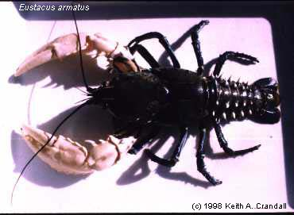
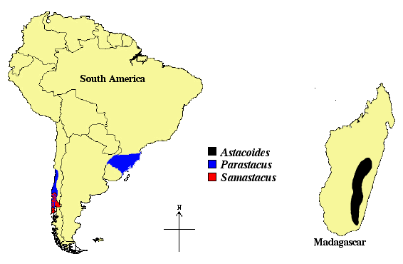

---
aliases:
  - Parastacoidea
  - Parastacidae
title: Parastacidae
---

## [[Parastacoidea]] 

Parastacidae 

 

## #has_/text_of_/abstract 

> The **Parastacidae** are the family of freshwater crayfish found in the Southern Hemisphere. 
> The family is a classic Gondwana-distributed taxon, with extant members in South America, 
> Madagascar, Australia, New Zealand, and New Guinea, and extinct taxa also in Antarctica.
>
> [Wikipedia](https://en.wikipedia.org/wiki/Parastacidae) 

## Introduction

[Keith A. Crandall]() 

The family Parastacidae contains all freshwater crayfish found naturally
occurring in the southern hemisphere. Although widespread, with
representatives occurring in South America, Madagascar (Fig. 2), and New
Zealand, the family achieves by far its greatest diversity within
Australia (Fig. 1). Over 85% of the known species of parastacid crayfish
are from Australia. Similarly, nine of the 14 genera presently
recognized within the Parastacidae are restricted to the Australian
continent and nearby islands (including southern New Guinea) (Hobbs,
1988; Hobbs, 1991). The Australian freshwater crayfish fauna is unique
and highly diverse, both in terms of species richness and in ecological
and morphological diversity. This fauna contains the largest known
freshwater invertebrate ([*Astacopsis gouldi*](http://www.smithton.tco.asn.au/wildlife/lobster/lobster.html)
\[Clark\]) and the highly evolved \"land crayfishes\" (e.g. Engaeus)
which are able to complete their entire life cycle independent of
surface water. In terms of the number of species, morphological
variability, and ecological diversity, Australia\'s freshwater crayfish
fauna is rivalled only by that found in the south east of the USA (for
examples of Australian crayfish diversity, see Merrick, 1993).
 

Figure 2. Distributions of the remaining Parastacid genera. Note that
there is an overlap of Parastacus and Samastacus in central Chile that
is not depicted very well in the graphic.
### Discussion of Phylogenetic Relationships

Studies of phylogenetic relationships among genera of parastacid
crayfish to date have been of limited scope (Riek, 1969; Riek, 1972;
Patak & Baldwin, 1984; Patak et al., 1989; Austin, 1995; Crandall et al.
1995) and have produced conflicting results using a variety of
approaches and data sets. Riek (1969) presented the first systematic
hypothesis for the relationships among the Australian genera (presented
here). This hypothesis was based on features of the male genitalia,
cephalothorax, and chelae as well as body shape (Riek, 1969). Subsequent
to this study, Riek (1972) proposed an alternative interpretation with
the additional characters associated with the cephalothoracic grooves
and orientation of the chelae. This latter hypothesis added the genera
Gramastacus and Paranephrops to the phylogeny and shifted the
association of Parastacoides from the Euastacus-Astacopsis clade to the
Cherax clade.\
The two major clades proposed by Riek (1972) form two ecologically
distinct groups; Engaeus, Engaewa, and Tenuibranchiurus form the first
group, representing strong burrowers in which the fingers of the chelae
move in a vertical plane; Euastacus, Astacopsis, Gramastacus, Geocharax,
Parastacoides, Paranephrops, and Cherax comprise the second group of
moderate burrowers in which the fingers of the chelae move largely or
completely in a horizontal plane.

Patak and Baldwin (1984) applied electrophoretic and immunochemical
comparisons of haemocyanins to infer phylogenetic relationships among a
subset of the Australian genera. These biochemical techniques generated
a hypothesis that differed from that of Riek (1972) in that the
Geocharax-Gramastacus clade was clustered with the genus Engaeus instead
of within Riek\'s ecological group two. Patak et al. (1989) later added
two additional genera to their study (Parastacoides and Paranephrops)
resulting in a phylogeny that differed in the placement of Cherax and
Euastacus. Using a goodness of fit test in association with the
immunochemical data, Patak et al. (1989) rejected their previous tree as
well as the hypothesis of Riek (1972), concluding these were
incompatible with their new data set.

Austin (1995) proposed a sister relationship between Cherax and
Geocharax based on allozyme data (24 enzymatic loci) and morphological
data (55 characters, including most traits previously emphasized by Riek
\[1969, 1972\] and Hobbs \[1989\]). Treating the morphological data and
allozyme data as independent data sets, Austin (1995) obtained support
for the clustering of Cherax with Geocharax in both cases. Finally,
Crandall et al. (1995) reconstructed phylogenetic relationships for
representatives of various Australian genera using nucleotide sequence
data from the 16S mitochondrial genome. The resulting tree was
statistically incompatible with the hypotheses proposed by Riek and the
Patak and Baldwin hypothesis. However, the results were compatible with
the Patak et al. (1989) and the Austin (1995) hypotheses. For a summary
of these alternative hypotheses see Crandall et al. (1995). Because none
of these studies have included all the genera found in Australia (not to
mention in the family Parastacidae) the tree shown is Riek\'s (1969)
with the additional southern hemisphere genera included with
relationships suggested by Hobbs (1988;1991).

## Phylogeny 

-   « Ancestral Groups  
    -  [Astacidea](../Astacidea.md) 
    -  [Decapoda](../../Decapoda.md) 
    -  [Malacostraca](../../../Malacostraca.md) 
    -  [Crustacea](../../../../Crustacea.md) 
    -  [Arthropoda](../../../../../Arthropoda.md) 
    -  [Bilateria](../../../../../../Bilateria.md) 
    -  [Animals](../../../../../../../Animals.md) 
    -  [Eukarya](../../../../../../../../Eukarya.md) 
    -   [Tree of Life](../../../../../../../../Tree_of_Life.md)

-   ◊ Sibling Groups of  Astacidea
    -   Parastacidae
    -  [Astacidae](Astacidae.md) 
    -  [Cambaridae](Astacidae/Cambaridae.md) 

-   » Sub-Groups
    -   [Astacoides](Astacoides)
    -   [Astacopsis](Astacopsis)
    -   [Euastacus](Euastacus)
    -   [Gramastacus insolitus](Gramastacus_insolitus)
    -   [Geocharax falcata](Geocharax_falcata)
    -   [Virilastacus araucanius](Virilastacus_araucanius)
    -   [Samastacus](Samastacus)
    -   [Cherax](Cherax)
    -   [Paranephrops planifrons](Paranephrops_planifrons)
    -   [Parastacoides](Parastacoides)
    -   [Tennuibranchiurus glypt](Tennuibranchiurus_glypt)
    -   [Engaewa](Engaewa)
    -   [Engaeus](Engaeus)
    -   [Parastacus](Parastacus)

## Title Illustrations

------------------------------------------------------------------------------
*Euastacus armatus* (von Martens) 
Photo copyright © 1998 Keith A. Crandall

Copyright ::   © [Keith A. Crandall](http://inbio.byu.edu/Faculty/kac/crandall%5Flab/) 

## Confidential Links & Embeds: 

### #is_/same_as :: [[/_Standards/bio/bio~Domain/Eukarya/Animal/Bilateria/Arthropoda/Crustacea/Malacostraca/Decapoda/Astacidea/Parastacoidea|Parastacoidea]] 

### #is_/same_as :: [[/_public/bio/bio~Domain/Eukarya/Animal/Bilateria/Arthropoda/Crustacea/Malacostraca/Decapoda/Astacidea/Parastacoidea.public|Parastacoidea.public]] 

### #is_/same_as :: [[/_internal/bio/bio~Domain/Eukarya/Animal/Bilateria/Arthropoda/Crustacea/Malacostraca/Decapoda/Astacidea/Parastacoidea.internal|Parastacoidea.internal]] 

### #is_/same_as :: [[/_protect/bio/bio~Domain/Eukarya/Animal/Bilateria/Arthropoda/Crustacea/Malacostraca/Decapoda/Astacidea/Parastacoidea.protect|Parastacoidea.protect]] 

### #is_/same_as :: [[/_private/bio/bio~Domain/Eukarya/Animal/Bilateria/Arthropoda/Crustacea/Malacostraca/Decapoda/Astacidea/Parastacoidea.private|Parastacoidea.private]] 

### #is_/same_as :: [[/_personal/bio/bio~Domain/Eukarya/Animal/Bilateria/Arthropoda/Crustacea/Malacostraca/Decapoda/Astacidea/Parastacoidea.personal|Parastacoidea.personal]] 

### #is_/same_as :: [[/_secret/bio/bio~Domain/Eukarya/Animal/Bilateria/Arthropoda/Crustacea/Malacostraca/Decapoda/Astacidea/Parastacoidea.secret|Parastacoidea.secret]] 

