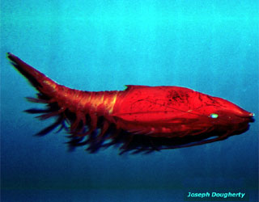
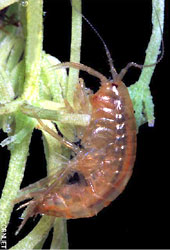

---
aliases:
  - Peracarida
title: Peracarida
---

# [[Peracarida]]  

   ) 

## #has_/text_of_/abstract 

> The superorder **Peracarida** is a large group of malacostracan crustaceans, 
> having members in marine, freshwater, and terrestrial habitats. 
> 
> They are chiefly defined by the presence of a brood pouch, or marsupium, 
> formed from thin flattened plates (oostegites) borne on the basalmost segments of the legs. 
> 
> Peracarida is one of the largest crustacean taxa and includes about 12,000 species. 
> Most members are less than 2 cm (0.8 in) in length, 
> but the largest is probably the giant isopod (Bathynomus giganteus) 
> which can reach 76 cm (30 in). 
> 
> The earliest known perecaridian was Oxyuropoda ligioides, 
> a fossil of which has been found dating to the Late Devonian (more than 360 mya) of Ireland.
>
> [Wikipedia](https://en.wikipedia.org/wiki/Peracarida) 

## Phylogeny 

-   « Ancestral Groups  
    -  [Malacostraca](../Malacostraca.md) 
    -  [Crustacea](../../Crustacea.md) 
    -  [Arthropoda](../../../Arthropoda.md) 
    -  [Bilateria](../../../../Bilateria.md) 
    -  [Animals](../../../../../Animals.md) 
    -  [Eukarya](../../../../../../Eukarya.md) 
    -   [Tree of Life](../../../../../../Tree_of_Life.md)

-   ◊ Sibling Groups of  Malacostraca
    -   [Leptostraca](Leptostraca)
    -  [Stomatopoda](Stomatopoda.md) 
    -  [Decapoda](Decapoda.md) 
    -   Peracarida

-   » Sub-Groups
    -  [Isopoda](Peracarida/Isopoda.md) 

## Title Illustrations

------------------------------------------------------------------------------
 
Scientific Name ::     Idotea
Specimen Condition   Live Specimen
Identified By        Rick Brusca
Copyright ::            © 1999 [California Academy of Sciences](http://www.calacademy.org/) 

-------------------------------------------------------------------------

Scientific Name ::    Gnathophausia ingens
Location ::          Monterey Bay Aquarium (Monterey County, California, US)
Comments            Deep water giant red mysid.
Source Collection   [CalPhotos](http://calphotos.berkeley.edu/)
Copyright ::           © 2000 [Joseph Dougherty](http://www.ecology.org/) 

-------------------------------------------------------------------------- 
)
Scientific Name ::  Gammarus pulex
Creator           Photograph by Jean-François Cornuet
Copyright ::         © [BIODIDAC](http://biodidac.bio.uottawa.ca/index.htm) 

## Confidential Links & Embeds: 

### #is_/same_as :: [[/_Standards/bio/bio~Domain/Eukarya/Animal/Bilateria/Arthropoda/Crustacea/Malacostraca/Peracarida|Peracarida]] 

### #is_/same_as :: [[/_public/bio/bio~Domain/Eukarya/Animal/Bilateria/Arthropoda/Crustacea/Malacostraca/Peracarida.public|Peracarida.public]] 

### #is_/same_as :: [[/_internal/bio/bio~Domain/Eukarya/Animal/Bilateria/Arthropoda/Crustacea/Malacostraca/Peracarida.internal|Peracarida.internal]] 

### #is_/same_as :: [[/_protect/bio/bio~Domain/Eukarya/Animal/Bilateria/Arthropoda/Crustacea/Malacostraca/Peracarida.protect|Peracarida.protect]] 

### #is_/same_as :: [[/_private/bio/bio~Domain/Eukarya/Animal/Bilateria/Arthropoda/Crustacea/Malacostraca/Peracarida.private|Peracarida.private]] 

### #is_/same_as :: [[/_personal/bio/bio~Domain/Eukarya/Animal/Bilateria/Arthropoda/Crustacea/Malacostraca/Peracarida.personal|Peracarida.personal]] 

### #is_/same_as :: [[/_secret/bio/bio~Domain/Eukarya/Animal/Bilateria/Arthropoda/Crustacea/Malacostraca/Peracarida.secret|Peracarida.secret]] 

