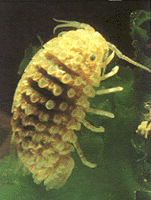
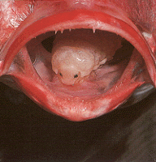
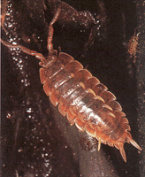
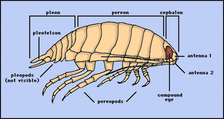

---
aliases:
  - Isopoda
title: Isopoda
---

## Phylogeny 

-   « Ancestral Groups  
    -  [Peracarida](../Peracarida.md) 
    -  [Malacostraca](../../Malacostraca.md) 
    -  [Crustacea](../../../Crustacea.md) 
    -  [Arthropoda](../../../../Arthropoda.md) 
    -  [Bilateria](../../../../../Bilateria.md) 
    -  [Animals](../../../../../../Animals.md) 
    -  [Eukarya](../../../../../../../Eukarya.md) 
    -   [Tree of Life](../../../../../../../Tree_of_Life.md)

-   ◊ Sibling Groups of  Peracarida
    -   Isopoda

-   » Sub-Groups 

# [[Isopoda]] 

     

## #has_/text_of_/abstract 

> **Isopoda** is an order of crustaceans. Members of this group are called isopods and include both aquatic species and terrestrial species such as woodlice. All have rigid, segmented exoskeletons, two pairs of antennae, seven pairs of jointed limbs on the thorax, and five pairs of branching appendages on the abdomen that are used in respiration. Females brood their young in a pouch under their thorax called the marsupium. 
>
> Isopods have various feeding methods: some eat dead or decaying plant and animal matter, others are grazers or filter feeders, a few are predators, and some are internal or external parasites, mostly of fish. Aquatic species mostly live on the seabed or the bottom of freshwater bodies of water, but some taxa can swim for short distance. Terrestrial forms move around by crawling and tend to be found in cool, moist places. Some species are able to roll themselves into a ball as a defense mechanism or to conserve moisture like species in the family Armadillididae, the pillbugs. 
>
> There are over 10,000 identified species of isopod worldwide, with around 4,500 species found in marine environments, mostly on the seabed, 500 species in fresh water, and another 5,000 species on land. The order is divided into eleven suborders. The fossil record of isopods dates back to the Carboniferous period (in the Pennsylvanian epoch), at least 300 million years ago, when isopods lived in shallow seas. The name Isopoda is derived from the Greek roots iso- (from ἴσος ísos, meaning "equal") and -pod (from ποδ-, the stem of πούς poús, meaning "foot").
>
> [Wikipedia](https://en.wikipedia.org/wiki/Isopoda) 

### Information on the Internet

-   The Smithsonian\'s [World Isopod     List](http://www.nmnh.si.edu/iz/isopod/) includes a listing of all marine and terrestrial isopod species as well as a bibliography of the species descriptions.
-   The Museum of Victoria\'s page on [the Isopods of Southern     Australia](http://www.mov.vic.gov.au/crust/isopogal.html).
-   Page on the parasitic [epicaridean     isopods](http://www.vims.edu/%7Ejeff/isopod.htm#Epicaridea).

## Introduction

[Richard Brusca]()

Isopods are the most diverse in form and the most species-rich crustaceans of the superorder Peracarida 
(isopods, amphipods, tanaids, and their kin). 

Isopods are common inhabitants of nearly all environments, 
and they are unusual among the Crustacea for their ubiquity. 

The familiar sowbugs and pillbugs are members of this group,
along with their marine relatives (gribbles, slatters, etc.). 

The Isopoda include approximatly 10,000 described species, in 10 suborders.

These animals range in length from 0.5 mm to 500 mm (*Bathynomus giganteus*). 

Phylogenetic analyses and the fossil record (limited though it is) suggest 
that the group dates to at least the Carboniferous Period of the Paleozoic, approximately 300 million years ago.

### Characteristics

As in most crustaceans, the isopod body is divided into three distinct
regions: **head** (= **cephalon**), **thorax**, and **abdomen** (=
**pleon**). In isopods, the first segment of the thorax is fused to the
head. The remaining seven free segments (**pereonites**) of the thorax
comprise the **pereon**; each normally bears a pair of uniramous legs,
or **pereopods**. The pereopods are modified for locomotion and for
latching onto prey. In isopods, the abdomen primitively consists of 5
free segments (**pleonites**) plus a fused 6th pleonite+telson (the
**pleotelson**). Each pleonite bears a pair of biramous **pleopods**,
which are used for swimming and for respiration. Isopods have compound
eyes, two pairs of antennae, and four sets of jaws. The first antennae
are typically chemosensory; the second antennae are typically tactile
structures. The jaws are (anterior to posterior): **mandibles**,
**maxillae 1**, **maxillae 2**, **maxillipeds**. As the name implies,
the maxillipeds are actually the highly modified appendages of the fused
first thoracic segment.
 

Drawing copyright © 1997 R. Brusca.

The Isopoda are a monophyletic clade defined by 13 synapomorphies
(shared, derived characters):

1.  sessile eyes (i.e. not on a stalk)
2.  carapace reduced to a cephalic shield
3.  thoracopods entirely uniramous
4.  second antennae uniramous
5.  pleomere 6 fused to telson, forming a pleotelson
6.  biphasic molting
7.  heart thoraco-abdominal
8.  principal gas exchange structures are pleopods
9.  gut tube entirely ectodermally derived, without an endodermal midgut
    region
10. striated muscles with unique myofibril ultrastructure
11. loss of the maxillulary palp
12. first antennae (antennules) uniramous, without a scale (scales
    secondarily reappear in the cirolanid genus Bathynomus, in the
    family Limnoriidae, and perhaps in the suborder Epicaridea)
13. uropodal rami always uniarticulate.

Synapomorphies 1-4 appear to be convergent in isopods and amphipods;
synapomorphy 5 may be convergent to the condition in many tanaidaceans
(or may be a synapomorphy uniting isopods and tanaids).

### Habitats

Approximately 4,500 marine species are known from all regions of the
world\'s ocean, living most abundantly on the sea bottom from the abyss
to the intertidal zone, and with only a few representatives in the
pelagic zone. The group also has successfully colonized freshwater
habitats (about 500 species) including lakes, rivers, streams,
underground waters, thermal springs, the water held in certain tropical
plants, and anchialine/cave habitats, where they often display
associated specializations. All marine shorelines in the world are
inhabited by species of the three very common families Idoteidae
(Valvifera), Sphaeromatidae (Flabellifera), and Cirolanidae
(Flabellifera). In offshore, soft-bottom, marine environments species of
the suborders Asellota, Anthuridea, and Gnathiidea are very common. In
the deep sea asellotans predominate almost to the complete exclusion of
all other isopod taxa and, in fact, have undergone a massive
evolutionary radiation in this environment (Wilson & Hessler 1987).
Members of the suborder Anthuridea are slender, tubular forms that
inhabit both shallow-water and shelf environments, and they are
especially diverse in tropical reef habitats. Members of the suborder
Oniscidea (about 5,000 species) are fully terrestrial (sowbugs and
pillbugs), and they are by far the most successful group of crustaceans
to invade land.

### Feeding

Isopod feeding habits are extremely diverse. Within specific habitats,
the isopods frequently constitute a major component of the energy cycle,
fulfilling roles of micrograzers, micropredators, parasites, and
detritivores. In general, the primitive suborders (e.g. Phreatoicidea,
Asellota, Microcerberidea, Calabozoidea, Oniscidea, Valvifera) are
herbivores or herbivorous scavengers, whereas the more derived suborders
(e.g. Flabellifera, Epicaridea, Gnathiidea) are carnivores, predators,
and parasites. Herbivores typically have grinding mandibles (with flat
molars), whereas carnivores typically have cutting mandibles (with
bladelike molars). When present in moderate to high numbers, herbivorous
isopods probably have a significant impact on vegetation. For example,
Perry & Brusca (1989) found that root-boring isopods significantly
affect mangrove growth and prop root formation. Some groups are
exclusively (suborder Epicaridea) or partly (suborder Flabellifera)
parasitic. In some areas of the world, isopods emerge from the benthos
in large numbers at night to prey on (and frequently kill) diseased or
injured fishes, as well as attacking fishes caught in commercial traps
or nets (Stepien & Brusca 1985).

### Development

As with all the Peracarid crustaceans, isopod embryos undergo direct
development within the female brood pouch (marsupium), from which they
emerge as juveniles, known as manca. These manca are essentially
replicas of adults but lack the last pair of thoracic legs. There is no
pelagic larval stage among the isopods. Dispersal appears to be limited
to the crawling ability of these forms, and this attribute has resulted
in most species having highly restricted distributions and patterns of
high endemism.

### Discussion of Phylogenetic Relationships

The only parsimony-based explicit phylogenetic analysis of higher-level
isopod phylogeny was that of Brusca & Wilson (1991, data matrix
available from [TreeBase](http://treebase.org/)). While they concluded
that the Isopoda comprise a monophyletic group (a true evolutionary
group descending from a single ancestor), they found that one of the ten
suborders of isopods, Flabellifera, was not monophyletic. The families
of this suborder are therefore presented separately in the phylogeny
shown above. The paraphyly of the Flabellifera is clearly evidenced by
the scattered locations of the families within the tree. This is an
example of a currently used classification that does not accurately
reflect the estimated phylogeny of the group in question.

The phylogeny of Brusca and Wilson shows the isopods originating in a
\"short-tailed\" morphology similar to that of modern tanaids, in which
the pleotelson is highly reduced and the styliform uropods and anus are
terminal. The derived \"long-tailed morphology,\" with a broad elongate
pleotelson, flat laterally-placed uropods, and subterminal anus,
distinguishes a transition from sedentary and infaunal lifestyles
(typical of the short-tailed taxa) to a more active lifestyle typical of
the advanced orders and families.

### Biogeographical history

Isopods apparently evolved in shallow marine environments by at least
the early or mid-Paleozoic. The first isopods were \"short-tailed\" -
with short pleotelsons and terminal styliform uropods. Phylogenetic
analyses and the fossil record agree that the earliest isopods (and the
most primitive living species) are members of the short-tailed suborder
Phreatoicidea. Today, phreatoicids have a strictly freshwater Gondwanan
distribution, with most species occurring in the rivers and lakes of
Tasmania. The earliest fossil records of isopods are phreatoicids dating
from the Pennsylvanian (the Carboniferous Period of the Paleozoic Era),
300 million year ago. However, Paleozoic phreatoicids were marine forms
and they had a cosmopolitan distribution; their fossils have been found
in marine deposits from Europe and North America. Thus, the present-day
Gondwanan freshwater distribution of these primitive crustaceans
represents a relic, or refugial biogeographic pattern.

In fact, virtually all of the short-tailed isopod taxa occupy what could
be regarded as biogeographical refugia. Primitive Asellota are largely
fresh-water or ground-water inhabitants. Higher Asellota live primarily
in the deep-sea, an environment nearly uninhabited altogether by other
isopod taxa. Microcerberidea inhabit coastal ground waters or are
interstitial. Calabozoidea are so far known only from freshwater springs
in Venezuela. And Oniscidea have escaped the aquatic world altogether
and are the only fully terrestrial crustaceans. In all these cases, it
seems that the primitive isopod lineages have found environments that
allowed them to escape the challenges of predation by shallow-water
marine fishes, their principal predators, which began their major
radiation at about the same time the isopods were beginning theirs (in
the middle Paleozoic). It may be that the evolution and radiation of the
more advanced \"long-tailed\" isopods, which probably began in the late
Triassic (Mesozoic), also helped drive the short-tailed forms into
refugia by competition. Unlike short-tailed taxa, species of long-tailed
isopods are highly mobile and frequently leave their benthic shelter to
swim short distances through the water. Their elongate pleotelsons and
broad, laterally-positioned uropods provide hydrodynamic planar surfaces
to assist in swimming.

The profound shift from a relatively sedentary, short-tailed morphology
to the active, long-tailed form appears to have coincided with the
fragmentation of Pangaea. Since the majority of the long-tailed higher
taxa are endemic to the Southern Hemisphere, this suggests that they
originated on Gondwanan shores shortly after its separation from
Laurasia.

Studies of isopod biogeography have been largely restricted to two
suborders, the Valvifera and the Asellota. Among the suborder Valvifera,
the family Idoteidae is thought to have co-evolved with large brown
algae (Phaeophyta; Laminariales) in temperate latitudes (Brusca and
Wallerstein 1979). Idoteids are primarily temperate in distribution and
closely associated with the cold-water seaweeds upon which they feed and
live. The southern range limits of temperate idoteid isopods may be
controlled today primarily by biotic factors, such as absence of
suitable substrate/food (e.g. laminarians) or predation pressure from
tropical shallow-water fishes. Wallerstein and Brusca (1982) documented
patterns of idoteid morphology and behavior indicating that when these
isopods evolve in warmer waters they are smaller, their bodies are more
spinose, their swimming behaviors differ from their temperate cousins,
and they also reproduce at smaller sizes; all possible adaptations to
avoid increased predation pressure in the tropics. A phylogenetic
analysis of the Valvifera suggested that the suborder originated in the
temperate Southern Hemisphere, at least by Permian/Triassic times
(Brusca 1984); global distribution patterns of some genera can be
ascribed to vicariance processes, others to dispersal, ecological
phenomena, or a combination of processes.

Of the 10 isopod suborders, 4 have representatives in the deep sea.
However, one of these 4 suborders, the Asellota is far and away the
predominant deep-sea isopod taxon, and about 90 percent of all described
isopods from this environment are asellotans. Wilson (1980) and Wilson
and Hessler (1987) argued that the deep sea has been invaded numerous
times by asellotans of several families. Here, the Asellota have
radiated widely. In polar regions, various asellotan lineages have
re-emerged into shallower waters.

Hessler and Wilson (1983) calculated that 32-51% of all benthic species
taken in all deep-sea samples, anywhere in the world have been
peracarids, and of the peracarids the isopods are by far the most
abundant and speciose deep-sea group. Research has shown that most
deep-sea genera are cosmopolitan, whereas deep-sea species may be either
widespread or highly restricted in their distribution.

## Title Illustrations

-------------------------------------------------------------------

Scientific Name ::     Sphaeromene polytylotos
Comments             The button isopod is found amongst mussels and barnacles on rocky shores and reefs along the coast of western South Africa. It is herbivorous, feeding on filamentous algae and on simple green algae.
Reference            G. M. Branch, C. L. Griffiths, M. L. Branch, and L. E. Beckley. 1994. Two Oceans, a Guide to the Marine Life of Southern Africa. David Philip Publishers, South Africa.
Specimen Condition   Live Specimen
Copyright ::            © 1994 G. M. Branch

----------------------------------------------------------------------------------------------------------------------------------------------------------------------------------------------
 
Scientific Name ::     Cymothoa exigua
Comments             The tongue-eating isopod causes degeneration of the tongue of its host fish, the rose snapper, Lutjanus guttatus, 
and it then attaches to the remaining tongue stub and floor of the fish\'s mouth by hook-like pereopods. 
In this position the isopod superficially resembles its host\'s missing tongue. 

Brusca & Gilligan (1983) hypothesize that these isopods serve as a mechanical replacement for the fish\'s tongue 
and represent the first known case in animals of functional replacement of a host structure by a parasite. 
This relationship is so-far known only from the Gulf of California.
Reference            Alex Kerstitch. 1989. Sea of Cortez Marine Invertebrates. Sea Challengers, Monteray, California.
Specimen Condition   Live Specimen
Copyright ::            © 1989 Matthew Gilligan, Savannah State College, Savannah, GA

-----------------------------------------------------------------------------------------------------------------------------------------

Scientific Name ::     Deto echinata
Comments             As the name suggests, the horned isopod is easily recognized by the pairs of \"horns\" arising on the back of each thoracic segment. It is often confused with the similar looking Ligia, to which it is only distantly related. It is an air breathing isopod found associated with kelp and other drift algae washed up on rocky shores of western South Africa. It feeds mainly on this algae as well as live prey and carrion.
Reference            G. M. Branch, C. L. Griffiths, M. L. Branch, and L. E. Beckley. 1994. Two Oceans, a Guide to the Marine Life of Southern Africa. David Philip Publishers, South Africa.
Specimen Condition   Live Specimen
Copyright ::            © 1994 G. M. Branch

## Confidential Links & Embeds: 

### #is_/same_as :: [[/_Standards/bio/bio~Domain/Eukarya/Animal/Bilateria/Arthropoda/Crustacea/Malacostraca/Peracarida/Isopoda|Isopoda]] 

### #is_/same_as :: [[/_public/bio/bio~Domain/Eukarya/Animal/Bilateria/Arthropoda/Crustacea/Malacostraca/Peracarida/Isopoda.public|Isopoda.public]] 

### #is_/same_as :: [[/_internal/bio/bio~Domain/Eukarya/Animal/Bilateria/Arthropoda/Crustacea/Malacostraca/Peracarida/Isopoda.internal|Isopoda.internal]] 

### #is_/same_as :: [[/_protect/bio/bio~Domain/Eukarya/Animal/Bilateria/Arthropoda/Crustacea/Malacostraca/Peracarida/Isopoda.protect|Isopoda.protect]] 

### #is_/same_as :: [[/_private/bio/bio~Domain/Eukarya/Animal/Bilateria/Arthropoda/Crustacea/Malacostraca/Peracarida/Isopoda.private|Isopoda.private]] 

### #is_/same_as :: [[/_personal/bio/bio~Domain/Eukarya/Animal/Bilateria/Arthropoda/Crustacea/Malacostraca/Peracarida/Isopoda.personal|Isopoda.personal]] 

### #is_/same_as :: [[/_secret/bio/bio~Domain/Eukarya/Animal/Bilateria/Arthropoda/Crustacea/Malacostraca/Peracarida/Isopoda.secret|Isopoda.secret]] 

