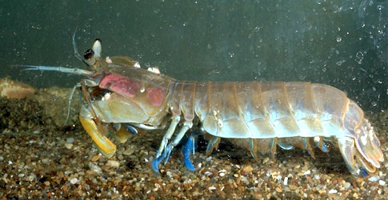

---
aliases:
  - Stomatopoda
title: Stomatopoda
---

# [[Stomatopoda]] 

Mantis shrimps 

 

## #has_/text_of_/abstract 

> Mantis shrimp are carnivorous marine crustaceans of the order **Stomatopoda** (from Ancient Greek  στόμα (stóma) 'mouth' and  ποδός (podós) 'foot'). Stomatopods branched off from other members of the class Malacostraca around 400 million years ago, with more than 520 extant species of mantis shrimp known. All living species are in the suborder Unipeltata, which arose around 250 million years ago. They are among the most important predators in many shallow, tropical and subtropical marine habitats. Despite being common in their habitats, they are poorly understood, as many species spend most of their lives sheltering in burrows and holes.
>
> Dubbed "sea locusts" by ancient Assyrians, "prawn killers" in Australia, and now sometimes referred to as "thumb splitters" due to their ability to inflict painful wounds if handled incautiously, mantis shrimp possess powerful raptorial appendages that are used to attack and kill prey either by spearing, stunning, or dismembering; the shape of these appendages are often used to classify them into groups: extant mantis shrimp either have appendages which form heavily mineralized "clubs" that can strike with great power, or they have sharp, grasping forelimbs used to swiftly seize prey (similar to those of praying mantis, hence their common name).
>
> [Wikipedia](https://en.wikipedia.org/wiki/Mantis%20shrimp) 

### Information on the Internet

-   [Stomatopoda:     Families](http://www.crustacea.net/crustace/stomatopoda/index.htm). S. T. Ahyong & J. K. Lowry.
-   [The Lurker\'s Guide to     Stomatopods](http://www.blueboard.com/mantis/). Alan San Juan.
-   [Secrets of the Stomatopod](http://www.ucmp.berkeley.edu/aquarius/).
    An underwater adventure. Roy Caldwell, a biologist at UC Berkeley.
-   [Mantis shrimp shoulder their evolutionary baggage and     bluff](http://evolution.berkeley.edu/evolibrary/article/mantisshrimp_01).
    From the [Understanding     Evolution](http://evolution.berkeley.edu/evolibrary/home.php) web site.
-   [Stomatopod     Larva](http://www.imagequest3d.com/pages/current/pictureoftheweek/stomatopod/stomatopod.htm). Image Quest 3-D.

## Phylogeny 

-   « Ancestral Groups  
    -  [Malacostraca](../Malacostraca.md) 
    -  [Crustacea](../../Crustacea.md) 
    -  [Arthropoda](../../../Arthropoda.md) 
    -  [Bilateria](../../../../Bilateria.md) 
    -  [Animals](../../../../../Animals.md) 
    -  [Eukarya](../../../../../../Eukarya.md) 
    -   [Tree of Life](../../../../../../Tree_of_Life.md)

-   ◊ Sibling Groups of  Malacostraca
    -   [Leptostraca](Leptostraca)
    -   Stomatopoda
    -  [Decapoda](Decapoda.md) 
    -  [Peracarida](Peracarida.md) 

-   » Sub-Groups 

## Title Illustrations

------------------------------------------------------------------------------ 
)
Scientific Name ::     Hemisquilla californiensis (Gonodactylidae)
Comments             Mantis shrimp
Creator              Photograph by Alden M. Johnson
Specimen Condition   Live Specimen
Source Collection    [CalPhotos](http://calphotos.berkeley.edu/)
Copyright ::            © 2001 [California Academy of Sciences](http://www.calacademy.org/) 

## Confidential Links & Embeds: 

### #is_/same_as :: [Stomatopoda](/_Standards/bio/bio~Domain/Eukarya/Animal/Bilateria/Arthropoda/Crustacea/Malacostraca/Stomatopoda.md) 

### #is_/same_as :: [Stomatopoda.public](/_public/bio/bio~Domain/Eukarya/Animal/Bilateria/Arthropoda/Crustacea/Malacostraca/Stomatopoda.public.md) 

### #is_/same_as :: [Stomatopoda.internal](/_internal/bio/bio~Domain/Eukarya/Animal/Bilateria/Arthropoda/Crustacea/Malacostraca/Stomatopoda.internal.md) 

### #is_/same_as :: [Stomatopoda.protect](/_protect/bio/bio~Domain/Eukarya/Animal/Bilateria/Arthropoda/Crustacea/Malacostraca/Stomatopoda.protect.md) 

### #is_/same_as :: [Stomatopoda.private](/_private/bio/bio~Domain/Eukarya/Animal/Bilateria/Arthropoda/Crustacea/Malacostraca/Stomatopoda.private.md) 

### #is_/same_as :: [Stomatopoda.personal](/_personal/bio/bio~Domain/Eukarya/Animal/Bilateria/Arthropoda/Crustacea/Malacostraca/Stomatopoda.personal.md) 

### #is_/same_as :: [Stomatopoda.secret](/_secret/bio/bio~Domain/Eukarya/Animal/Bilateria/Arthropoda/Crustacea/Malacostraca/Stomatopoda.secret.md)

