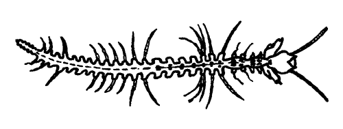

---
aliases:
- airojalkaiset
- Daraqayaqlılar
- gályarákok
- Kirmėliniai vėžiagyviai
- Oearpuuetige
- Remipedi
- Remipedia
- Remipedios
- Remipēdijas
- Yeenaʼałkǫ́ʼíłániichilí
- årefotkreps
- Łopatonogi
- ρεμίποδα
- Ремипедии
- متشعبات الأرجل
- متشعبات الارجل
- گوشپایان
- แรมิพีเดีย
- ムカデエビ
- 桨足纲
- 槳足綱
- 요지강
title: Remipedia
has_id_wikidata: Q490800
dv_has_:
  name_:
    an: Remipedia
    ar: متشعبات الأرجل
    arz: متشعبات الارجل
    ast: Remipedia
    az: Daraqayaqlılar
    bg: Ремипедии
    ca: Remipedi
    ceb: Remipedia
    de: Remipedia
    el: ρεμίποδα
    en: Remipedia
    eo: Remipedia
    es: Remipedia
    eu: Remipedia
    ext: Remipedia
    fa: گوشپایان
    fi: airojalkaiset
    fr: Remipedia
    ga: Remipedia
    gl: Remipedios
    hr: Remipedia
    hu: gályarákok
    ia: Remipedia
    ie: Remipedia
    io: Remipedia
    it: Remipedia
    ja: ムカデエビ
    ko: 요지강
    la: Remipedia
    li: Oearpuuetige
    lt: Kirmėliniai vėžiagyviai
    lv: Remipēdijas
    mul: Remipedia
    nb: årefotkreps
    nl: Remipedia
    nn: Remipedia
    nv: Yeenaʼałkǫ́ʼíłániichilí
    oc: Remipedia
    pl: Łopatonogi
    pt: Remipedia
    pt-br: Remipedia
    ro: Remipedia
    ru: Ремипедии
    sl: Remipedia
    sq: Remipedia
    sv: Remipedia
    th: แรมิพีเดีย
    tr: Remipedia
    uk: Remipedia
    vi: Remipedia
    vo: Remipedia
    war: Remipedia
    zh: 槳足綱
    zh-cn: 桨足纲
    zh-tw: 槳足綱
---
# [[Remipedia]] 
 
## #has_/text_of_/abstract 

> **Remipedia** is a class of blind crustaceans, closely related to hexapods, found in coastal aquifers which contain saline groundwater, with populations identified in almost every ocean basin so far explored, including in Australia, the Caribbean Sea, and the Atlantic Ocean. The first described remipede was the fossil Tesnusocaris goldichi (Lower Pennsylvanian). Since 1979, at least seventeen living species have been identified in subtropical regions around the world.
>
> [Wikipedia](https://en.wikipedia.org/wiki/Remipedia) 

### Information on the Internet

-   [Remipedia:     Species](http://www.crustacea.net/crustace/remipedia/). J. K. Lowry & M. Yerman, Australian Museum.
-   [Anchialine Caves and Cave Fauna of the     World](http://www.cavebiology.com/)

## Phylogeny 

-   « Ancestral Groups  
    -  [Crustacea](../Crustacea.md) 
    -  [Arthropoda](../../Arthropoda.md) 
    -  [Bilateria](../../../Bilateria.md) 
    -  [Animals](../../../../Animals.md) 
    -  [Eukarya](../../../../../Eukarya.md) 
    -   [Tree of Life](../../../../../Tree_of_Life.md)

-   ◊ Sibling Groups of  Crustacea
    -  [Branchiopoda](Branchiopoda.md) 
    -   Remipedia
    -  [Cephalocarida](Cephalocarida.md) 
    -  [Copepoda](Copepoda.md) 
    -  [Ostracoda](Ostracoda.md) 
    -  [Branchiura](Branchiura.md) 
    -  [Thecostraca](Thecostraca.md) 
    -  [Malacostraca](Malacostraca.md) 

-   » Sub-Groups 

## Title Illustrations

Speleonectes ondinae (Speleonectidae).\
Drawing by Josée Soucie. Copyright © [BIODIDAC](http://biodidac.bio.uottawa.ca/index.htm).)

## Confidential Links & Embeds: 

### #is_/same_as :: [[/_Standards/bio/bio~Domain/Eukarya/Animal/Bilateria/Arthropoda/Crustacea/Remipedia|Remipedia]] 

### #is_/same_as :: [[/_public/bio/bio~Domain/Eukarya/Animal/Bilateria/Arthropoda/Crustacea/Remipedia.public|Remipedia.public]] 

### #is_/same_as :: [[/_internal/bio/bio~Domain/Eukarya/Animal/Bilateria/Arthropoda/Crustacea/Remipedia.internal|Remipedia.internal]] 

### #is_/same_as :: [[/_protect/bio/bio~Domain/Eukarya/Animal/Bilateria/Arthropoda/Crustacea/Remipedia.protect|Remipedia.protect]] 

### #is_/same_as :: [[/_private/bio/bio~Domain/Eukarya/Animal/Bilateria/Arthropoda/Crustacea/Remipedia.private|Remipedia.private]] 

### #is_/same_as :: [[/_personal/bio/bio~Domain/Eukarya/Animal/Bilateria/Arthropoda/Crustacea/Remipedia.personal|Remipedia.personal]] 

### #is_/same_as :: [[/_secret/bio/bio~Domain/Eukarya/Animal/Bilateria/Arthropoda/Crustacea/Remipedia.secret|Remipedia.secret]] 

