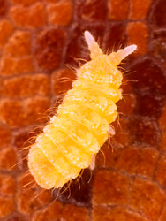
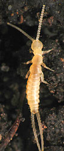
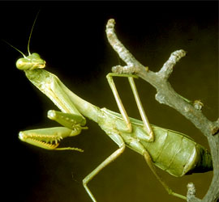

---
aliases:
- Altı bacaklılar
- Altıayaqlılar
- Artikopodo
- Esapodi
- Esapudi
- Hatlábúak
- Heksapoda
- heksapodi
- Heksapodoj
- Hexapoda
- Hexapodes
- hexapods
- Hexàpodes
- Hexápodes
- hexápodos
- kuuejalgsed
- Kuusijalkaiset
- kuuđâjuálgásiih
- Loài sáu chân
- Miiljahee (Heksaapoodaa)
- Mymba ipy poteĩ
- Sechsfießer
- Sechsfüsser
- Sechsfüßer
- Seksbenede leddyr
- Seksfotingar
- Sessfööt
- sexfotingar
- Sexfætlur
- Seškāji
- Sześcionogi
- Zespotigen
- šesteronožni členonožci
- šestinozí
- Šešiakojai
- Εξάποδα
- алтыаяклылар
- котопильгень
- Хеxапода
- Шасціногія
- шасьціногія
- шестиногі
- Шестиногие
- Шесткраки
- шестноги
- шестокраки
- Шестоноги
- վեցոտանիներ
- שש-רגלים
- آلتی باجاکلیلار
- سداسيات الأرجل
- سداسيات الارجل
- ششپایان
- شپږ پښې لرونکی ژوي
- ھيڪساپوڊا
- षटपाद
- হেক্সাপোডা
- அறுகாலி
- அறுகாலி (arukaali)
- ഷഡ്പദം
- 六脚亜門 (ろっきゃくあもん)
- 六脚類
- 六足亚门
- 六足亞門
- 육각류
- 육각아문(六脚亞門)
has_id_wikidata: Q105146
title: Hexapoda
described_by_source:
- '[[_Standards/WikiData/WD~Encyclopædia_Britannica_11th_edition,867541]]'
- '[[_Standards/WikiData/WD~Meyers_Konversations_Lexikon,_4th_edition_(1885_1890),19219752]]'
parent_taxon: '[[_Standards/WikiData/WD~Allotriocarida,81196012]]'
start_time: -440000000-06
instance_of: '[[_Standards/WikiData/WD~taxon,16521]]'
taxon_rank: '[[_Standards/WikiData/WD~class,37517]]'
Commons_category: Hexapoda
taxon_name: Hexapoda
ITIS_TSN: 563886
taxon_common_name:
- hexápodos
- Sechsfüßer
- سداسيات الأرجل
- Altıayaqlılar
- Шасціногія
- Шесткраки
- Hexàpodes
- šestinozí
- Εξάποδα
- hexapods
- Kuusijalkaiset
- Hexapodes
- Sechsfießer
- Hatlábúak
- Artikopodo
- Sexfætlur
- Esapodi
- 六脚亜門 (ろっきゃくあもん)
- 육각아문(六脚亞門)
- Шестоноги
- Sessfööt
- Zespotigen
- Seksfotingar
- Sześcionogi
- Hexápodes
- Шестиногие
- šesteronožni členonožci
- அறுகாலி (arukaali)
- Altı bacaklılar
- Loài sáu chân
- 六足亞門
montage_image: http://commons.wikimedia.org/wiki/Special:FilePath/Collage%20of%20Entognatha.jpg
image:
- http://commons.wikimedia.org/wiki/Special:FilePath/Common%20blue%20damselfly02.jpg
- http://commons.wikimedia.org/wiki/Special:FilePath/Diptera%2001gg.jpg
IPA_transcription: ˈhɛksəˈpɑdə
EPPO_Code: 1HEXAQ
NBN_System_Key: NHMSYS0020191879
dv_has_:
  name_:
    af: Hexapoda
    an: Hexapoda
    ar: سداسيات الأرجل
    arz: سداسيات الارجل
    ast: Hexapoda
    az: Altıayaqlılar
    azb: آلتی باجاکلیلار
    be: шасціногія
    be-tarask: шасьціногія
    bg: шестокраки
    bn: হেক্সাপোডা
    br: Hexapoda
    ca: hexàpodes
    ceb: Hexapoda
    co: Hexapoda
    cs: šestinozí
    da: Seksbenede leddyr
    de: Sechsfüßer
    de-ch: Sechsfüsser
    el: Εξάποδα
    en: Hexapoda
    eo: Heksapodoj
    es: Hexapoda
    et: kuuejalgsed
    eu: Hexapoda
    ext: Hexapoda
    fa: ششپایان
    fi: kuusijalkaiset
    fr: Hexapoda
    ga: Hexapoda
    gl: Hexápodos
    gn: Mymba ipy poteĩ
    gsw: Sechsfießer
    he: שש-רגלים
    hi: षटपाद
    hr: heksapodi
    hu: hatlábúak
    hy: վեցոտանիներ
    ia: Hexapoda
    id: Heksapoda
    ie: Hexapoda
    io: Artikopodo
    is: Sexfætlur
    it: Hexapoda
    ja: 六脚類
    ko: 육각류
    kw: Hexapoda
    la: Hexapoda
    lad: Hexapoda
    li: Hexapoda
    lmo: Hexapoda
    lt: Šešiakojai
    lv: Seškāji
    mk: шестноги
    ml: ഷഡ്പദം
    ms: Heksapoda
    mul: Hexapoda
    myv: котопильгень
    nb: Hexapoda
    nds: Sessfööt
    nl: zespotigen
    nn: Seksfotingar
    nov: Hexapoda
    nrm: Hexapoda
    oc: Hexapoda
    om: Miiljahee (Heksaapoodaa)
    pl: sześcionogi
    ps: شپږ پښې لرونکی ژوي
    pt: Hexapoda
    pt-br: Hexapoda
    rm: Hexapoda
    ro: Hexapoda
    ru: шестиногие
    rup: Hexapoda
    scn: Esapudi
    sco: Hexapoda
    sd: ھيڪساپوڊا
    sh: Hexapoda
    sk: Hexapoda
    sl: šesteronožni členonožci
    smn: kuuđâjuálgásiih
    sq: Hexapoda
    sr: Hexapoda
    sr-ec: Хеxапода
    sr-el: Hexapoda
    sv: sexfotingar
    ta: அறுகாலி
    tl: Hexapoda
    tr: Altı bacaklılar
    tt: алтыаяклылар
    uk: шестиногі
    vi: Hexapoda
    vo: Hexapoda
    war: Hexapoda
    wuu: 六足亚门
    yue: 六足亞門
    zh: 六足亞門
    zh-cn: 六足亚门
    zh-hans: 六足亚门
    zh-hant: 六足亞門
    zh-hk: 六足亞門
    zh-sg: 六足亚门
    zh-tw: 六足亞門
---
# [[Hexapoda]] 

Insects, springtails, diplurans, and proturans 

   ) 

#is_/same_as  [[../../../../../../WikiData/WD~Hexapoda,105146|WD~Hexapoda,105146]]  

## #has_/text_of_/abstract 

> The subphylum **Hexapoda** (from Greek for 'six legs') or hexapods 
> comprises the largest clade of arthropods and includes most of the extant arthropod species. 
> 
> It includes the crown group class Insecta (true insects), as well as the much smaller clade Entognatha, 
> which includes three classes of wingless arthropods that were once considered insects: 
> Collembola (springtails), Protura (coneheads) and Diplura (two-pronged bristletails). 
> The insects and springtails are very abundant and are some of the most important pollinators, 
> basal consumers, scavengers/detritivores and micropredators in terrestrial environments.
>
> Hexapods are named for their most distinctive feature: a three-part body plan 
> with a consolidated thorax and three pairs of legs. 
> Most other arthropods have more than three pairs of legs. 
> Most recent studies have recovered Hexapoda as a subgroup of Pancrustacea.
>
> [Wikipedia](https://en.wikipedia.org/wiki/Hexapoda) 

### Information on the Internet

-   [Biodiversity Explorer:     Hexapoda](http://www.museums.org.za/bio/insects/)

## Introduction

While crustaceans are the dominant group of arthropods in marine
environments, hexapods, including insects, rule the land. Their
dominance among animals is evident in their numbers of species, with
over 750,000 described (Wilson, 1988), as well as biomass (e.g. Fittkau
and Klinge, 1973).

Hexapods include three orders of wingless arthropods (Collembola,
Protura, Diplura), as well as the insects. The former orders are soil or
litter dwellers. Collembola (springtails) are perhaps the most abundant
arthropods on earth. Proturans are very small, pale arthropods that are
rarely encountered. Diplurans include a few families of larger, pale
arthropods that are frequently found in moist soils. The majority of
hexapod species are insects, many of which are winged as adults.

### Characteristics

The most distinctive feature of the hexapods is the reduction in walking
appendages to six, with three body segments consolidating to form the
thorax, which provides much of the locomotory ability of the animals.
(This is in contrast to other arthropods, most of which have more than
three pairs of legs.)

### Discussion of Phylogenetic Relationships

The position of Diplura in the hexapods is unclear. Traditionally, it
has been placed with the Collembola and Protura in a group called
\"Entognatha\",

                         === Collembola
                      ===|
         ==Entognatha=|  === Protura
    =====|            |
         |            ====== Diplura
         |
         =================== Insecta

so named because members of these three orders all have the base of the
mouthparts internallized, so that the mandible and maxilla are partly
contained within the head capsule. In addition to this derived
similarity in mouth structure, these three orders share reduced
Malpighian tubules and compound eyes. However, there is some evidence
that diplurans may instead be the sister group of insects:

            === Collembola
         ===|
         |  === Protura
    =====|
         |  === Diplura
         ===|
            === Insecta

Derived characteristics linking diplurans with insects include the
presence of filiform cerci, and an extra set of nine single tubules in
the axoneme of the sperm. For a more detailed discussion of the
evidence, with additional references, see Kristensen (1991).

## Title Illustrations

------------------------------------------------------------------------ 
 
scientific_name ::     Monobella grassei
specimen_condition ::  Live Specimen
copyright ::            © [Steve Hopkin](http://www.stevehopkin.co.uk/) 

---------------------------------------------------------------------------

scientific_name ::     Campodeid (Diplura)
location ::           San Francisco, California, USA.
specimen_condition ::  Live Specimen
copyright ::            © 2002 [David R. Maddison](http://david.bembidion.org/) 

------------------------------------------------------------------------------ 
 
scientific_name ::     Mantis religiosa
Comments             Praying mantis
Creator              Photograph by Robert Potts
specimen_condition ::  Live Specimen
Source Collection    [CalPhotos](http://calphotos.berkeley.edu/)
copyright ::            © 2002 [California Academy of Sciences](http://www.calacademy.org/) 

## Phylogeny 

-   « Ancestral Groups  
    -  [Arthropoda](../Arthropoda.md) 
    -  [Bilateria](../../Bilateria.md) 
    -  [Animals](../../../Animals.md) 
    -  [Eukarya](../../../../Eukarya.md) 
    -   [Tree of Life](../../../../Tree_of_Life.md)

-   ◊ Sibling Groups of  Arthropoda
    -   Hexapoda
    -  [Crustacea](Crustacea.md) 
    -  [Pauropoda](Myriapoda/Pauropoda.md) 
    -  [Diplopoda](Myriapoda/Diplopoda.md) 
    -  [Centipede](Myriapoda/Centipede.md) 
    -  [Symphyla](Myriapoda/Symphyla.md) 
    -  [Arachnida](Chelicerata/Arachnida.md) 
    -   [[Sea_Scorpion](Chelicerata/Sea_Scorpion.md)    -   [Horseshoe_Crab](Chelicerata/Horseshoe_Crab.md)
    -   [Sea_Spider](Chelicerata/Sea_Spider.md)
    -  [Trilobites](Trilobites.md) 

-   » Sub-Groups
    -   [Springtail](Hexapoda/Springtail.md)
    -  [Protura](Hexapoda/Protura.md) 
    -  [Diplura](Hexapoda/Diplura.md) 
    -   [Insecta](Insecta.md)

## Confidential Links & Embeds: 

### #is_/same_as :: [[/_Standards/bio/bio~Domain/Eukarya/Animal/Bilateria/Arthropoda/Hexapoda|Hexapoda]] 

### #is_/same_as :: [[/_public/bio/bio~Domain/Eukarya/Animal/Bilateria/Arthropoda/Hexapoda.public|Hexapoda.public]] 

### #is_/same_as :: [[/_internal/bio/bio~Domain/Eukarya/Animal/Bilateria/Arthropoda/Hexapoda.internal|Hexapoda.internal]] 

### #is_/same_as :: [[/_protect/bio/bio~Domain/Eukarya/Animal/Bilateria/Arthropoda/Hexapoda.protect|Hexapoda.protect]] 

### #is_/same_as :: [[/_private/bio/bio~Domain/Eukarya/Animal/Bilateria/Arthropoda/Hexapoda.private|Hexapoda.private]] 

### #is_/same_as :: [[/_personal/bio/bio~Domain/Eukarya/Animal/Bilateria/Arthropoda/Hexapoda.personal|Hexapoda.personal]] 

### #is_/same_as :: [[/_secret/bio/bio~Domain/Eukarya/Animal/Bilateria/Arthropoda/Hexapoda.secret|Hexapoda.secret]] 

