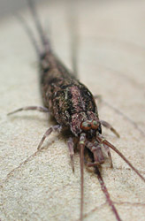
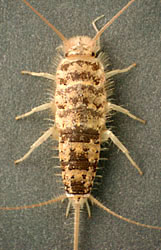
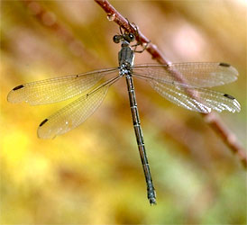

---
aliases:
  - Insect
  - Insecta
  - Insects
  - Inseuto
  - Inseutu
  - Насекоми
  - Amprevan
  - Insekti
  - Insecte
  - Pryf
  - Έντομα
  - Insekto
  - Hyönteiset
  - Insekten
  - Ynsekten
  - Feithid
  - Insectos
  - Insekte
  - חרקים
  - Rovarok
  - Միջատներ
  - Skordyr
  - 昆虫綱 (こんちゅうこう)
  - 곤충강
  - Vabzdys
  - Kukaiņi
  - Инсекти
  - Hmyz
  - حشرة
  - Serangga
  - Насекомые
  - பூச்சி
  - Kukci
  - Insekt
  - Bai
  - Insetti
  - แมลง
  - Owady
  - Wadudu
  - Комахи
  - Baùti
  - 昆虫纲
  - 昆蟲綱
  - žuželke
  - Böcek
  - Côn trùng
  - Insecten
  - Insekter
  - Insecto
  - Inseto
  - insects
  - insekter
  - Insectes
  - hmyz
has_id_wikidata: Q1390
code_of_nomenclature: '[[_Standards/WikiData/WD~International_Code_of_Zoological_Nomenclature,13011]]'
Colon_Classification: K86
Commons_category: Insecta
Commons_gallery: Insecta
described_by_source:
  - '[[../../../../../../../WikiData/WD~Brockhaus_and_Efron_Encyclopedic_Dictionary,602358]]'
  - '[[_Standards/WikiData/WD~Encyclopædia_Britannica_11th_edition,867541]]'
  - '[[_Standards/WikiData/WD~Granat_Encyclopedic_Dictionary,4532138]]'
  - '[[_Standards/WikiData/WD~Small_Brockhaus_and_Efron_Encyclopedic_Dictionary,19180675]]'
  - '[[_Standards/WikiData/WD~New_Encyclopedic_Dictionary,19190511]]'
  - '[[_Standards/WikiData/WD~Metropolitan_Museum_of_Art_Tagging_Vocabulary,106727050]]'
disjoint_union_of: '[[_Standards/WikiData/WD~list_of_values_as_qualifiers,23766486]]'
EPPO_Code: 1INSEC
equivalent_class: http://dbpedia.org/ontology/Insect
GS1_GPC_code: 10005446
has_characteristic: '[[_Standards/WikiData/WD~insect_biodiversity,6037215]]'
has_use:
  - '[[_Standards/WikiData/WD~entomophagy,1046284]]'
  - '[[_Standards/WikiData/WD~insect_farming,1351959]]'
  - '[[_Standards/WikiData/WD~insect_trade,121888623]]'
Iconclass_notation: 25F711
image: http://commons.wikimedia.org/wiki/Special:FilePath/Insekter.jpg
instance_of: '[[_Standards/WikiData/WD~taxon,16521]]'
IPA_transcription: ɪnˈsɛktə
ITIS_TSN: 99208
Krugosvet_article: nauka_i_tehnika/biologiya/NASEKOMIE.html
MeSH_tree_code: B01.050.500.131.617
montage_image: http://commons.wikimedia.org/wiki/Special:FilePath/Insects%20collage.jpg
OmegaWiki_Defined_Meaning: 1959
pronunciation_audio: http://commons.wikimedia.org/wiki/Special:FilePath/LL-Q9610%20%28ben%29-Tahmid-%E0%A6%AA%E0%A6%A4%E0%A6%99%E0%A7%8D%E0%A6%97.wav
spoken_text_audio: http://commons.wikimedia.org/wiki/Special:FilePath/WP%20en%20Insect%20Intro%2030%20Oct%202010.ogg
start_time: -400000000-01-01
studied_in: '[[_Standards/WikiData/WD~entomology,39286]]'
subreddit: insects
taxon_common_name:
  - Inseuto
  - Inseutu
  - Насекоми
  - Amprevan
  - Insekti
  - Insecte
  - Pryf
  - Έντομα
  - Insekto
  - Hyönteiset
  - Insekten
  - Ynsekten
  - Feithid
  - Insectos
  - Insekte
  - חרקים
  - Rovarok
  - Միջատներ
  - Skordyr
  - 昆虫綱 (こんちゅうこう)
  - 곤충강
  - Vabzdys
  - Kukaiņi
  - Инсекти
  - Insecte
  - Hmyz
  - Инсекти
  - حشرة
  - Serangga
  - Насекомые
  - பூச்சி
  - Kukci
  - Insekt
  - Bai
  - Insekten
  - Insetti
  - แมลง
  - Owady
  - Wadudu
  - Комахи
  - Baùti
  - 昆虫纲
  - 昆蟲綱
  - žuželke
  - Böcek
  - Côn trùng
  - Insecten
  - Insekter
  - Insecto
  - Serangga
  - Inseto
  - insects
  - insekter
  - Insectes
  - hmyz
taxon_name: Insecta
taxon_rank: '[[_Standards/WikiData/WD~class,37517]]'
this_taxon_is_source_of: '[[_Standards/WikiData/WD~insect_as_food,38117921]]'
title: Insecta
topic_s_main_template: '[[_Standards/WikiData/WD~Template_Orders_of_Insects,14337328]]'
topic_s_main_Wikimedia_portal: '[[_Standards/WikiData/WD~Portal_Insects,10564223]]'
UMLS_CUI: C0021585
union_of: '[[_Standards/WikiData/WD~list_of_values_as_qualifiers,23766486]]'
U_S_National_Archives_Identifier: 10640332
---

# [[Insecta]] 

Insects 

     

## #has_/text_of_/abstract 

> **Insect**s (from Latin insectum) are hexapod invertebrates of the class Insecta. 
> They are the largest group within the arthropod phylum. 
> 
> Insects have 
> - a chitinous exoskeleton, 
> - a three-part body (head, thorax and abdomen), 
> - three pairs of jointed legs, 
> - compound eyes, and 
> - a pair of antennae. 
> 
> Insects are the most diverse group of animals, with more than a million described species; 
> they represent more than half of all animal species. 
>
> The insect nervous system consists of a brain and a ventral nerve cord. 
> 
> Most insects reproduce by laying eggs. 
> 
> Insects breathe air through a system of paired openings along their sides, 
> connected to small tubes that take air directly to the tissues. 
> 
> The blood therefore does not carry oxygen; 
> it is only partly contained in vessels, and some circulates in an open hemocoel. 
> Insect vision is mainly through their compound eyes, with additional small ocelli. 
> Many insects can hear, using tympanal organs, which may be on the legs or other parts of the body. 
> Their sense of smell is via receptors, usually on the antennae and the mouthparts. 
>
> Nearly all insects hatch from eggs. Insect growth is constrained by the inelastic exoskeleton, 
> so development involves a series of molts. 
> 
> The immature stages often differ from the adults in structure, habit and habitat. 
> Groups that undergo four-stage metamorphosis often have a nearly immobile pupa. 
> Insects that undergo three-stage metamorphosis lack a pupa, 
> developing through a series of increasingly adult-like nymphal stages. 
> 
> The higher level relationship of the insects is unclear. 
> Fossilized insects of enormous size have been found from the Paleozoic Era, 
> including giant dragonfly-like insects with wingspans of 55 to 70 cm (22 to 28 in). 
> The most diverse insect groups appear to have coevolved with flowering plants.
>
> Adult insects typically move about by walking and flying; some can swim. 
> Insects are the only invertebrates that can achieve sustained powered flight; insect flight evolved just once. 
> 
> Many insects are at least partly aquatic, and have larvae with gills; in some species, the adults too are aquatic. 
> Some species, such as water striders, can walk on the surface of water. 
> 
> Insects are mostly solitary, but some, such as bees, ants and termites, 
> are social and live in large, well-organized colonies. 
> 
> Others, such as earwigs, provide maternal care, guarding their eggs and young. 
> 
> Insects can communicate with each other in a variety of ways. 
> Male moths can sense the pheromones of female moths over great distances. 
> Other species communicate with sounds: crickets stridulate, or rub their wings together, 
> to attract a mate and repel other males. 
> Lampyrid beetles communicate with light.
>
> Humans regard many insects as pests, especially those that damage crops, 
> and attempt to control them using insecticides and other techniques. 
> 
> Others are parasitic, and may act as vectors of diseases. 
> Insect pollinators are essential to the reproduction of many flowering plants and so to their ecosystems. 
> Many insects are ecologically beneficial as predators of pest insects, while a few provide direct economic benefit. 
> 
> Two species in particular are economically important and were domesticated many centuries ago: 
> silkworms for silk and honey bees for honey. 
> 
> Insects are consumed as food in 80% of the world's nations, by people in roughly 3,000 ethnic groups. 
> 
> Human activities are having serious effects on insect biodiversity.
>
> [Wikipedia](https://en.wikipedia.org/wiki/Insect)

### Information on the Internet

-   [Smithsonian Institution Department of     Entomology](http://entomology.si.edu/).
    -   [Entomology         Databases](http://entomology.si.edu/Entomology/data.lasso).
-   [Entomology Department of Harvard\'s Museum of Comparative     Zoology](http://www.mcz.harvard.edu/Departments/Entomology/)
    -   [MCZ Entomology Primary Type Specimen         Database](http://mcz-28168.oeb.harvard.edu/mcztypedb.htm).
-   [Entomology     Department](http://www.calacademy.org/research/entomology/).
    California Academy of Sciences.
-   [The Essig Museum of     Entomology](http://www.mip.berkeley.edu/essig/). Berkeley,
    California.
-   [Insect Division](http://insects.ummz.lsa.umich.edu/). University of
    Michigan Museum of Zoology.
-   [Bishop Museum Hawaii Entomology     Home](http://www.bishopmuseum.org/research/natsci/ento/ento.html)
    -   [Insect Ecology in New         Guinea](http://www.bishopmuseum.org/research/natsci/ng/ngecol.html).
-   [Introduction to Insect Biology &     Classification](http://www.uq.edu.au/entomology/entonet/outlines/toc/et201/et201aframe.html).
    The University of Queensland.
-   [Virtual Exhibit on Canada\'s Biodiversity:     Insects](http://collections.ic.gc.ca/biodiversity/index.html).
-   [Entomological Data Information System     (EDIS)](http://www.insects-online.de/). Staatliches Museum für
    Naturkunde Stuttgart, Germany.
-   [Compendium of Hexapod Classes and     Orders.](http://www.cals.ncsu.edu:8050/course/ent425/compendium/index.html)
    North Carolina State University.
-   [Nomina Insecta     Nearctica](http://www.nearctica.com/nomina/main.htm). A Checklist of
    the Insects of North America.
-   [Common Names of Insects in Canada](http://esc-sec.org/menu.htm).
    Entomological Society of Canada.
-   [The Canadian National Collection (CNC) of Insects, Arachnids and     Nematodes](http://res2.agr.gc.ca/ecorc/cnc/index_e.htm).
-   [Singing Insects of North     America](http://buzz.ifas.ufl.edu/index.htm). By Thomas J. Walker
    (crickets and katydids) and Thomas E. Moore (cicadas).
-   [Entomology Database     KONCHU](http://konchudb.agr.agr.kyushu-u.ac.jp/). Species
    Information Database on Japanese, East Asian and Pacific Insects,
    Spiders and Mites.
-   [A Catalogue of the Insects of South     Africa](http://www.ru.ac.za/academic/departments/zooento/Martin/Insects.html).
-   [CSIRO Entomology Home Page](http://www.ento.csiro.au/).
-   General Entomology Resources from Scientific Reference Resources:
    -   [Entomology Events         Calendar](http://www.sciref.org/links/EntEvent/index.htm).
    -   [Directory of Entomology Departments and Institutes         (DEDI)](http://www.sciref.org/links/EntDept/index.htm).
    -   [Directory of Entomological         Societies](http://www.sciref.org/links/EntSoc/index.htm).
-   [Entomological Society of America](http://www.entsoc.org/).
-   [Chemical Ecology of     Insects](http://www.wcrl.ars.usda.gov/cec/h.htm). John A. Byers,
    USDA-ARS.
-   [elin](http://www.nhm.ac.uk/hosted_sites/elin/). Entomology
    Libraries and Information Networks.
-   [Entomological     Glossary](http://www.earthlife.net/insects/glossary.html).
-   [Popular Classics in     Entomology](http://www.colostate.edu/Depts/Entomology/readings.html).
    Colorado State University.
-   [Forensic Entomology Pages,     International](http://folk.uio.no/mostarke/forens_ent/forensic_entomology.html).
-   [Book of Insect Records](http://ufbir.ifas.ufl.edu/). University of
    Florida.
-   [Alien Empire](http://www.pbs.org/wnet/nature/alienempire/).
    Companion piece to a PBS Nature program.

#### Internet directories:

-   [Entomology Index of Internet     Resources](http://www.ent.iastate.edu/List/). Iowa State University.
-   [Entomology on the     WWW](http://www.colostate.edu/Depts/Entomology/links.html). Colorado
    State University.
-   [Entomology on the     WWW](http://www.ent.msu.edu/dept/docs/wwwent.html). Michigan State
    University.
-   [BIOSIS BiologyBrowser:     Insecta](http://www.biologybrowser.org/bb/Organism/Invertebrata/Arthropoda/Insect/index.shtml).

#### Images and Other Media:

-   [BugGuide.Net](http://bugguide.net/). An online community of
    naturalists who enjoy learning about and sharing observations of
    insects, spiders, and other related creatures.
-   [Hawaiian Insect Image     Galleries](http://www.bishopmuseum.org/research/natsci/ento/ento3.html).
    Bishop Museum.
-   [Entomology Image     Gallery](http://www.ent.iastate.edu/imagegallery/). Iowa State
    University.
-   [Very Cool Bugs](http://www.bugbios.com/entophiles/index.html).
-   [Dennis Kunkel\'s Microscopy](http://www.denniskunkel.com/).
-   [The Virtual Insectary](http://www.virtualinsectary.com/).
-   [Thais in 2000:     Entomology](http://www.thais.it/entomologia/default_uk.htm).
-   [Reference Library of Digitized Insect     Sounds](http://cmave.usda.ufl.edu/%7Ermankin/soundlibrary.html).
    Richard Mankin, Center for Medical, Agricultural and Veterinary
    Entomology, Gainesville, Florida.

#### Fossil Insects:

-   [Meganeura](http://www.ub.es/dpep/meganeura/meganeura.htm).
    Palaeoentomological Newsletter.
-   [Eocene     Fossils](http://www.coloradomtn.edu/campus_rfl/staff_rfl/kohls/eocene.html).
-   [Fossil insects from Florissant     (Colorado)](http://www.yale.edu/ypmip/locations/florissant/index.html).
    Peabody Museum of Natural History.
-   [Stewart Valley Fossil     Insects](http://www.calacademy.org/research/entomology/Entomology_Resources/fossils/index.html).
    California Academy of Sciences.
-   [Amber and Copal: Their Significance in the Fossil     Record](http://www.carleton.ca/Museum/amber/web1.htm). Hooper
    Virtual Natural History Museum.
-   [The Natural History of     Amber](http://www.3dotstudio.com/amberhome.html). 3 Dot Studio.
-   [Frozen     Dramas](http://www.brost.se/eng/exhibitions/frozendramas/index.html).
    Swedish Amber Museum.
-   [Nature\'s Preservative\--Organic Flypaper: Amber Gives a Green     Light to Study of Ancient Life](http://whyfiles.org/008amber/). The
    Why files. University of Wisconsin.
-   [Amber Home](http://www.gplatt.demon.co.uk/). Gary Platt.
-   [Baltic Amber     Inclusions](http://alf.zfn.uni-bremen.de/%7Ei18m/amber.html).
    Wolfgang Wiggers.
-   [Dominican Amber     Fossils](http://www.espd.com/amber/fossils/fosildir.htm). ESP
    Designs.
-   [The Amber Room](http://www.espd.com/amber/). Steve Kurth.

#### Famous entomologists:

-   [Thomas Say (1787-1834), father of American     entomology](http://faculty.evansville.edu/ck6/bstud/say.html).
-   [Charles Darwin (1809-1882),     AboutDarwin.com](http://www.aboutdarwin.com/index.html).
-   [Jean-Henri Fabre (1823-1915) e-museum](http://www.e-fabre.com/).
-   [Famous Entomologists on Postage     Stamps](http://www.cals.ncsu.edu:8050/course/ent591k/stamps/entframeset.html).

#### For young entomologists:

-   [bugbios](http://www.insects.org/index.html). Shameless promotion of
    insect appreciation by Dexter Sear.
-   [O. Orkin Insect     Zoo](http://www.mnh.si.edu/museum/VirtualTour/Tour/Second/InsectZoo/).
    National Museum of Natural History. Smithsonian Institution.
-   [Bug     Camp](http://www.fmnh.org/research_collections/zoology/zoo_sites/bugcamp_web).
    Field Museum of Natural History, Chicago.
-   [Insectclopedia](http://www.pedagonet.com/other/insct.html). Links
    to websites about insects.
-   [Bugscope](http://bugscope.beckman.uiuc.edu/). Educational outreach
    project of the World Wide Laboratory.
-   [The Bug Club for Young     Entomologists](http://www.ex.ac.uk/bugclub/). UK Amateur
    Entomologists\' Society.
-   [The Wonderful World of Insects](http://earthlife.net/insects/).
-   [Class: Insecta](http://www.insecta.com/). Spencer Entomological
    Museum at the University of British Columbia, Vancouver, Canada.

### Characteristics

Insects have a large number of unique, derived characteristics, although
none of these are externally obvious in most species. These include
(Kristensen, 1991):

-   lack of musculature beyond the first segment of antenna.
-   Johnston\'s organ in pedicel (second segment) of antenna. 
  This organ is a collection of sensory cells that detect movement of the flagellum.
-   a transverse bar forming the posterior tentorium inside the head
-   tarsi subsegmented
-   females with ovipositor formed by gonapophyses from segments 8 and 9
-   annulated, terminal filament extending out from end of segment 11 of
    abdomen (subsequently lost in most groups of insects)

### Discussion of Phylogenetic Relationships

The relationships of primitively wingless insects to each other and to
winged insects (pterygotes) is well established, with a few exceptions.

One notable feature linking Thysanura + Pterygota is the presence of two
articulations on each mandible. Archaeognathans have only one mandibular
condyle or articulation point; they are \"monocondylic\". Thysanura +
Pterygota, with their two mandibular condyles, are sometimes called
Dicondylia. The many other apomorphies linking Dicondylia are described
in Kristensen (1991).

It is possible that the thysanurans are not themselves monophyletic;
Thysanura (exclusive of the family Lepidothricidae) plus pterygotes may
be monophyletic, with lepidothricids sister to this complex (Kristensen,
1991).

## Phylogeny 

-   « Ancestral Groups  
    -  [Hexapoda](../Hexapoda.md))
    -  [Arthropoda](../../Arthropoda.md))
    -  [Bilateria](../../../Bilateria.md))
    -  [Animals](../../../../Animals.md))
    -  [Eukarya](../../../../../Eukarya.md))
    -   [Tree of Life](../../../../../Tree_of_Life.md)

-   ◊ Sibling Groups of  Hexapoda
    -   [Springtail](Springtail.md)
    -  [Protura](Protura.md))
    -  [Diplura](Diplura.md))
    -   Insecta

-   » Sub-Groups
    -  [Archaeognatha](Insect/Archaeognatha.md))
    -  [Thysanura](Insect/Thysanura.md))
    -  [Pterygota](Insect/Pterygota.md))

## Title Illustrations

---------------------------------------------------------------------------

Scientific Name ::     Machilidae
Location ::           USA: North Carolina: Durham
Comments             Bristletail (Archaeognatha)
Specimen Condition   Live Specimen
Copyright ::            © 2004 [David R. Maddison](http://david.bembidion.org/) 

--------------------------------------------------------------------------

Scientific Name ::  Thermobia domestica
Location ::        Tucson, Arizona, USA
Comments          Silverfish (Thysanura)
Copyright ::         © 2003 [David R. Maddison](http://david.bembidion.org/) 

-----------------------------------------------------------------------------

Scientific Name ::     Zygoptera
Location ::           Zion National Park (Utah, USA)
Comments             Narrow-winged damsel fly (Pterygota)
Creator              Photograph by Robert Potts
Specimen Condition   Live Specimen
Source Collection    [CalPhotos](http://calphotos.berkeley.edu/)
Copyright ::            © [California Academy of Sciences](http://www.calacademy.org/) 

## Confidential Links & Embeds: 

### #is_/same_as :: [Insect](/_Standards/bio/bio~Domain/Eukarya/Animal/Bilateria/Arthropoda/Hexapoda/Insect.md) 

### #is_/same_as :: [Insect.public](/_public/bio/bio~Domain/Eukarya/Animal/Bilateria/Arthropoda/Hexapoda/Insect.public.md) 

### #is_/same_as :: [Insect.internal](/_internal/bio/bio~Domain/Eukarya/Animal/Bilateria/Arthropoda/Hexapoda/Insect.internal.md) 

### #is_/same_as :: [Insect.protect](/_protect/bio/bio~Domain/Eukarya/Animal/Bilateria/Arthropoda/Hexapoda/Insect.protect.md) 

### #is_/same_as :: [Insect.private](/_private/bio/bio~Domain/Eukarya/Animal/Bilateria/Arthropoda/Hexapoda/Insect.private.md) 

### #is_/same_as :: [Insect.personal](/_personal/bio/bio~Domain/Eukarya/Animal/Bilateria/Arthropoda/Hexapoda/Insect.personal.md) 

### #is_/same_as :: [Insect.secret](/_secret/bio/bio~Domain/Eukarya/Animal/Bilateria/Arthropoda/Hexapoda/Insect.secret.md)

