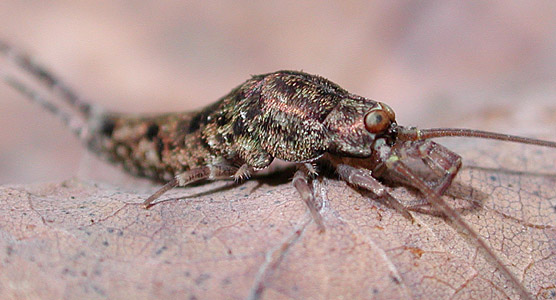
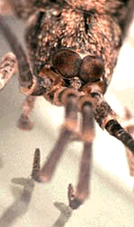
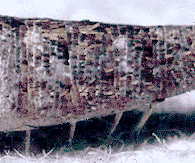

---
aliases:
- Archaeognatha
- Bristetail
title: Archaeognatha
---

# [[Archaeognatha]] 

Bristetails 

 

## #has_/text_of_/abstract 

> The **Archaeognatha** are an order of apterygotes, 
> known by various common names such as jumping bristletails. 
> 
> Among extant insect taxa they are some of the most evolutionarily primitive; 
> they appeared in the Middle Devonian period at about the same time as the arachnids. 
> 
> Specimens that closely resemble extant species have been found as 
> both body and trace fossils (the latter including body imprints and trackways) 
> in strata from the remainder of the Paleozoic Era and more recent periods. 
> For historical reasons an alternative name for the order is Microcoryphia.
>
> Until the late 20th century the suborders Zygentoma and Archaeognatha 
> comprised the order Thysanura; 
> both orders possess three-pronged tails comprising two lateral cerci 
> and a medial epiproct or appendix dorsalis. 
> 
> Of the three organs, the appendix dorsalis is considerably longer than the two cerci; 
> in this the Archaeognatha differ from the Zygentoma, 
> in which the three organs are subequal in length. 
> 
> In the late 20th century, it was recognized that the order Thysanura was paraphyletic, 
> thus the two suborders were 
> each raised to the status of an independent monophyletic order, 
> with Archaeognatha sister taxon to the Dicondylia, including the Zygentoma.
>
> The order Archaeognatha is cosmopolitan; it includes roughly 500 species in two families. 
> No species is currently evaluated as being at conservation risk.
>
> [Wikipedia](https://en.wikipedia.org/wiki/Archaeognatha) 

### Information on the Internet

-   [Archaeognatha](http://www.ento.csiro.au/Ecowatch/Insects_Invertebrates/archaeognatha.htm).
    CSIRO.
-   [The Bristletails (Archaeognatha) of South     Africa](http://www.ru.ac.za/academic/departments/zooento/Martin/archaeognatha.html).
    Compiled by John Irish, National Museum, Bloemfontein, South Africa.
-   [Nomina -     Archaeognatha](http://www.nearctica.com/nomina/oddbugs/archaeo.htm).
    nearctica.
-   [California Academy of Sciences Archaeognatha Type     Collection](http://www.calacademy.org/research/entomology/types/archafam.htm).

## Introduction

This order of wingless insects consists of about 350 known species. They
hide under bark, in litter, and in rock crevices, and feed on algae,
lichens, and vegetable debris.

Oldest fossil considered as Archaeognatha is from the Devonian (390
million years old) from Gaspé, Québec (Labandeira et al., 1988).
However, there is little evidence that this fossil is a member of
Archaeognatha; it may instead be a member of the stem-group of insects
or of stem-Dicondylia.

### Characteristics

Recent archaeognathans share two notable derived features:

-   Compound eyes enlarged, medially contiguous

   )
-   Specialized musculature of abdomen, which allows them to jump by a
    rapid downward bending

Archaeognathans also share a number of primitive features. Their
mandibles are monocondylic, that is, with only one condyle (the joint or
socket-like attachement point to the head capsule), whereas other
insects have two condyles (\"dicondylic\"). This primitive mouthpart
feature gives the order its name (Arche - beginning, gnathos - jaw).

Their abdominal segments bear styles, which are small appendages
moveable by muscles. They can be seen underneath the abdomen in the
following picture:
)

Styli may be remnants of ancestral limbs.

## Phylogeny 

-   « Ancestral Groups  
    -  [Insect](../Insect.md))
    -  [Hexapoda](../../Hexapoda.md))
    -  [Arthropoda](../../../Arthropoda.md))
    -  [Bilateria](../../../../Bilateria.md))
    -  [Animals](../../../../../Animals.md))
    -  [Eukarya](../../../../../../Eukarya.md))
    -   [Tree of Life](../../../../../../Tree_of_Life.md)

-   ◊ Sibling Groups of  Insecta
    -   Archaeognatha
    -  [Thysanura](Thysanura.md))
    -  [Pterygota](Pterygota.md))

-   » Sub-Groups 

## Title Illustrations

---------------------------------------------------------------------------)
Scientific Name ::     Archaeognatha
Location ::           USA: North Carolina: Durham
Specimen Condition   Live Specimen
Copyright ::            © 2004 [David R. Maddison](http://david.bembidion.org/) 

## Confidential Links & Embeds: 

### #is_/same_as :: [Archaeognatha](/_Standards/bio/bio~Domain/Eukarya/Animal/Bilateria/Arthropoda/Hexapoda/Insect/Archaeognatha.md) 

### #is_/same_as :: [Archaeognatha.public](/_public/bio/bio~Domain/Eukarya/Animal/Bilateria/Arthropoda/Hexapoda/Insect/Archaeognatha.public.md) 

### #is_/same_as :: [Archaeognatha.internal](/_internal/bio/bio~Domain/Eukarya/Animal/Bilateria/Arthropoda/Hexapoda/Insect/Archaeognatha.internal.md) 

### #is_/same_as :: [Archaeognatha.protect](/_protect/bio/bio~Domain/Eukarya/Animal/Bilateria/Arthropoda/Hexapoda/Insect/Archaeognatha.protect.md) 

### #is_/same_as :: [Archaeognatha.private](/_private/bio/bio~Domain/Eukarya/Animal/Bilateria/Arthropoda/Hexapoda/Insect/Archaeognatha.private.md) 

### #is_/same_as :: [Archaeognatha.personal](/_personal/bio/bio~Domain/Eukarya/Animal/Bilateria/Arthropoda/Hexapoda/Insect/Archaeognatha.personal.md) 

### #is_/same_as :: [Archaeognatha.secret](/_secret/bio/bio~Domain/Eukarya/Animal/Bilateria/Arthropoda/Hexapoda/Insect/Archaeognatha.secret.md)

