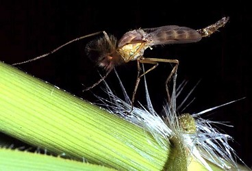
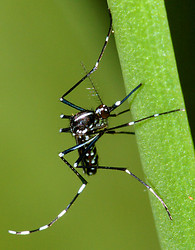

---
aliases:
- Agas
- Ageyet
- Amuk
- Ağcaqanadlar
- Báng
- Ch'uspi
- Chivinlar
- Culicida
- Culicidae
- Culicidi
- culícids
- Doŋaa
- Duunga
- Dzēlējodi
- eltxo
- Gösn
- Humhutu
- hyttyset
- Hŭng-muòng
- Izi
- Kaneeco
- Kantana
- Kiktuġiaq
- Komarac
- Komarci
- komarji
- komarowate
- komárovití
- Kopruchowate
- kuy'
- Kōsis
- Lamok
- Lamu'o
- Legu
- Lemud
- likes
- Machchharr
- Mbu
- Midge
- Mixmixk
- Mkpuk
- Moissal
- Moschgieder
- Moskito
- Moskítóflugur
- Mosquito
- Moustik
- muiscít
- Mushkonja
- Mustiken
- muỗi
- Mëga
- Mûn-é
- Mōyōtl
- Namok
- Ngungi
- Ngungu
- Nondui
- Ntontom
- nyamuk
- Nyimbo
- Nyungz
- Picron
- Pin'oit
- Pistesääsklased
- Poothammel
- Qhiti
- Rangit
- Rengngè'
- Reungit
- Sauro
- Schnaken
- Schnoog
- Sginsała
- Sikimew
- Sinsàla
- Sivrisinek
- Stechmücken
- Steegmagen
- steekmuggen
- Stickmyggor
- stikkmygg
- stikmyg
- szúnyogfélék
- Säs'k
- süyrüsenek
- Tikrieji uodai
- Tsʼíʼii daʼaneezí
- Tzintzula
- Umubu
- vùrúdnà
- waeroa
- ñamu
- Ñati'ũ
- țânțar
- Κουνούπι
- Боргооһон
- Бырдах
- Вăрăмтунасем
- ЗIокмоза
- Камары
- Комарі
- комарац
- Комарец
- комари
- кровососущие комары
- Къогъо
- Маса
- Ном
- озынборыннар
- Серәкәйҙәр
- Хомӯшак
- чибиньёс
- Чиркейлер
- Чуьрк
- Шыҥа
- Ыргак-сээктер
- մոծակ
- כולכיתיים
- קאמאר
- آغجاقانادلار
- بعوضيات
- لل
- مچھر
- مڇر
- مۆہ
- مێشوولە
- ناموس
- پشه
- ڽاموق
- ܒܩܐ
- डास
- दोम मण्डल, रंगारेड्डी जिल्ला
- मच्छर
- लामखुट्टे
- মশা
- মহ
- ਮੱਛਰ
- கொசு
- దోమ
- ಉಮಿಲಿ
- ಸೊಳ್ಳೆ
- കൊതുക്
- මදුරු ගණය
- ยุง
- ຍຸງ
- ခြင်
- ယုင်း
- კოღოები
- ትንኝ
- ᑭᒃᑐᕆᐊᖅ
- មូស
- ᡤᠠᠯᠮᠠᠨ
- ᥕᥧᥒᥰ
- ᱥᱤᱠᱬᱤᱡ
- Ẹ̀fọn
- カ
- カ科
- 蚊
- 蚊科
- ꠝꠡꠣ
- ꯀꯥꯡ
- 모기
has_id_wikidata: Q7367
title: Culicidae
described by source:
- '[[../../../../../../../../../../../../WikiData/WD~Brockhaus_and_Efron_Encyclopedic_Dictionary,602358]]'
- '[[_Standards/WikiData/WD~Encyclopædia_Britannica_11th_edition,867541]]'
- '[[_Standards/WikiData/WD~Gujin_Tushu_Jicheng,1768721]]'
- '[[_Standards/WikiData/WD~Small_Brockhaus_and_Efron_Encyclopedic_Dictionary,19180675]]'
- '[[_Standards/WikiData/WD~Checklist_of_Diptera_of_the_Czech_Republic_and_Slovakia,110655761]]'
parent taxon:
- '[[_Standards/WikiData/WD~Culicomorpha,950698]]'
- '[[_Standards/WikiData/WD~Culicoidea,2737578]]'
permanent duplicated item: '[[_Standards/WikiData/WD~Q4801985,4801985]]'
on focus list of Wikimedia project: '[[_Standards/WikiData/WD~WikiProject_Zika_Corpus,54439832]]'
maintained by WikiProject: '[[_Standards/WikiData/WD~WikiProject_Invasion_Biology,56241615]]'
has part(s): '[[_Standards/WikiData/WD~invertebrate_proboscis,96739248]]'
start time: -99000000-06
UMLS CUI: C0026584
taxon common name:
- komarji
- Mosquitoes
- Stechmücken
- mosquitoes
- moustiques
- maringouin
- Mustiken
- stikkmygg
- steekmuggen
instance of: '[[_Standards/WikiData/WD~taxon,16521]]'
taxon rank: '[[_Standards/WikiData/WD~family,35409]]'
ITIS TSN: 125930
OmegaWiki Defined Meaning: 630453
Commons gallery: Culicidae
Commons category: Culicidae
taxon name: Culicidae
U.S. National Archives Identifier: 10640927
pronunciation audio: http://commons.wikimedia.org/wiki/Special:FilePath/LL-Q33070%20%28ban%29-Carma%20citrawati-Legu.wav
image: http://commons.wikimedia.org/wiki/Special:FilePath/Mosquito%20on%20human%20skin.jpg
EPPO Code: 1CULIF
MeSH tree code: B01.050.500.131.617.720.500.500.750.712.500.875
Krugosvet article: biologiya/komary
NBN System Key: NBNSYS0000040182
Unicode character: "\U0001F99F"
dv_has_:
  name_:
    af: Culicidae
    am: ትንኝ
    an: Culicidae
    ann: Mkpuk
    ar: بعوضيات
    arc: ܒܩܐ
    ary: ناموس
    arz: بعوضيات
    as: মহ
    ast: Culicidae
    atj: Sikimew
    ay: Ch'uspi
    az: Ağcaqanadlar
    azb: آغجاقانادلار
    ba: Серәкәйҙәр
    ban: Legu
    bar: Gösn
    bcl: Namok
    be: камары
    be_tarask: Камары
    bg: комари
    bho: मच्छर
    bjn: Rangit
    bn: মশা
    br: Culicidae
    bs: Komarac
    bxr: Боргооһон
    ca: culícids
    cdo: Hŭng-muòng
    ce: Чуьрк
    ceb: Culicidae
    ch: ñamu
    ckb: مێشوولە
    co: Culicidae
    crh: süyrüsenek
    cs: komárovití
    csb: Mëga
    cv: Вăрăмтунасем
    cy: Culicidae
    da: stikmyg
    dag: Duunga
    de: Stechmücken
    de-at: Culicidae
    de_ch: Schnaken
    dga: Doŋaa
    dtp: Nondui
    el: Κουνούπι
    eml: Sinsàla
    en: Culicidae
    en_ca: Mosquito
    en_gb: mosquito
    eo: Moskito
    es: Culicidae
    et: Pistesääsklased
    eu: eltxo
    ext: Culicidae
    fa: پشه
    fi: hyttyset
    fr: Culicidae
    frp: Culicidae
    frr: Steegmagen
    fur: Culicidae
    ga: muiscít
    gd: Culicidae
    gl: Mosquito
    gn: Ñati'ũ
    gor: Lamu'o
    gsw: Schnoog
    ha: Sauro
    hak: Mûn-é
    he: כולכיתיים
    hi: मच्छर
    hif: Machchharr
    hr: Komarci
    ht: Moustik
    hu: szúnyogfélék
    hy: մոծակ
    ia: Culicidae
    id: nyamuk
    ie: Culicidae
    ik: Kiktuġiaq
    ilo: lamok
    inh: ЗIокмоза
    io: Moskito
    is: Moskítóflugur
    it: Culicidae
    iu: ᑭᒃᑐᕆᐊᖅ
    ja: カ科
    jv: Lemud
    ka: კოღოები
    kab: Izi
    kg: Ngungu
    kge: Agas
    kk: Маса
    km: មូស
    kn: ಸೊಳ್ಳೆ
    knc: Kantana
    ko: 모기
    ks: مۆہ
    ku: Mixmixk
    kv: Ном
    kw: Moskito
    ky: Чиркейлер
    la: Culicidae
    lad: Culicidae
    lb: Mustiken
    li: Culicidae
    lij: Culicidae
    lmo: Culicidae
    ln: Ngungi
    lo: ຍຸງ
    lt: Tikrieji uodai
    lv: Dzēlējodi
    lzh: 蚊
    mad: Rengngè'
    mcn: vùrúdnà
    mg: カ
    mhr: Шыҥа
    mi: waeroa
    min: Culicidae
    mk: Комарец
    ml: കൊതുക്
    mnc: ᡤᠠᠯᠮᠠᠨ
    mni: ꯀꯥꯡ
    mr: डास
    ms: nyamuk
    ms_arab: ڽاموق
    mul: Culicidae
    my: ခြင်
    mzn: لل
    nah: Mōyōtl
    nan: Báng
    nap: Culicidae
    nb: stikkmygg
    nds: Culicidae
    nds_nl: Culicidae
    ne: लामखुट्टे
    new: दोम मण्डल, रंगारेड्डी जिल्ला
    nl: steekmuggen
    nn: stikkmygg
    nov: Culicidae
    nrm: Culicidae
    nv: Tsʼíʼii daʼaneezí
    nys: Culicidae
    oc: Moissal
    olo: Pin'oit
    os: Къогъо
    pa: ਮੱਛਰ
    pag: Ageyet
    pam: Amuk
    pcd: Culicidae
    pdc: Moschgieder
    pfl: Poothammel
    pl: komarowate
    pms: Culicidae
    pnb: مچھر
    pt: Culicidae
    pt_br: Mosquito
    qu: Qhiti
    rm: Culicidae
    ro: țânțar
    ru: кровососущие комары
    rup: Culicidae
    rw: Umubu
    sah: Бырдах
    sat: ᱥᱤᱠᱬᱤᱡ
    sc: Tzintzula
    scn: Culicidi
    sco: Midge
    sd: مڇر
    sgs: Kōsis
    sh: Komarci
    shn: ယုင်း
    si: මදුරු ගණය
    sk: Culicidae
    sl: komarji
    sn: Humhutu
    so: Kaneeco
    sq: Mushkonja
    sr: комарац
    su: Reungit
    sv: Stickmyggor
    sw: Mbu
    syl: ꠝꠡꠣ
    szl: Kopruchowate
    szy: likes
    ta: கொசு
    tay: kuy'
    tcy: ಉಮಿಲಿ
    tdd: ᥕᥧᥒᥰ
    te: దోమ
    tg: Хомӯшак
    th: ยุง
    tl: Lamok
    tr: Sivrisinek
    tt: озынборыннар
    tum: Nyimbo
    tw: Ntontom
    tyv: Ыргак-сээктер
    udm: чибиньёс
    uk: Комарі
    ur: مچھر
    uz: Chivinlar
    vec: Sginsała
    vep: Säs'k
    vi: muỗi
    vls: Culicidae
    vo: Culicidae
    wa: Picron
    war: Lamok
    wo: Culicidae
    wuu: 蚊
    yi: קאמאר
    yo: Ẹ̀fọn
    yue: 蚊
    za: Nyungz
    zh: 蚊科
    zh_cn: 蚊科
    zh_hans: 蚊科
    zh_tw: 蚊科
    zu: Culicidae
---
# [[Mosquito]] (Culicomorpha) 🦟 

## #has_/text_of_/abstract 

> **Mosquito**es, the Culicidae, are a family of small flies consisting of 3,600 species. The word mosquito (formed by mosca and diminutive -ito) is Spanish and Portuguese for little fly. Mosquitoes have a slender segmented body, one pair of wings, three pairs of long hair-like legs, and specialized, highly elongated, piercing-sucking mouthparts. All mosquitoes drink nectar from flowers; females of some species have in addition adapted to drink blood. The group diversified during the Cretaceous period. Evolutionary biologists view mosquitoes as micropredators, small animals that parasitise larger ones by drinking their blood without immediately killing them. Medical parasitologists view mosquitoes instead as vectors of disease, carrying protozoan parasites or bacterial or viral pathogens from one host to another.
>
> The mosquito life cycle consists of four stages: egg, larva, pupa, and adult. Eggs are laid on the water surface; they hatch into motile larvae that feed on aquatic algae and organic material. These larvae are important food sources for many freshwater animals, such as dragonfly nymphs, many fish, and some birds. Adult females of many species have mouthparts adapted to pierce the skin of a host and feed on blood of a wide range of vertebrate hosts, and some invertebrates, primarily other arthropods. Some species only produce eggs after a blood meal.
>
> The mosquito's saliva is transferred to the host during the bite, and can cause an itchy rash. In addition, blood-feeding species can ingest pathogens while biting, and transmit them to other hosts. Those species include vectors of parasitic diseases such as malaria and filariasis, and arboviral diseases such as yellow fever and dengue fever. By transmitting diseases, mosquitoes cause the deaths of over 725,000 people each year.
>
> [Wikipedia](https://en.wikipedia.org/wiki/Mosquito) 

## Phylogeny 

Tree from Wood and Borkent (1989)

Containing group: [Fly](Fly.md)

-   « Ancestral Groups 
    -   [Fly](Fly.md)
    -   [Endopterygota](Endopterygota)
    -   [Neoptera](../../../Pterygota/Metapterygota/Neoptera.md)
    -   [Pterygota](Pterygota)
    -   [Insect](Insect)
    -   [Hexapoda](Hexapoda)
    -   [Arthropoda](Arthropoda)
    -   [Bilateria](Bilateria)
    -   [Animals](Animals)
    -   [Eukaryotes](Eukaryotes)
    -   [Tree of Life](../../../../../../../../../Tree_of_Life.md)

-   ◊ Sibling Groups of  Diptera
    -   [Psychodidae](Psychodidae.md)
    -   [Brachycera](Brachycera.md)
    -   [Tipulomorpha](Tipulomorpha.md)
    -   [Psychodomorpha (in         part)](Psychodomorpha_%28in_part%29)
    -   [Bibionomorpha](Bibionomorpha.md)
    -   [Blephariceromorpha](Blephariceromorpha.md)
    -   Culicomorpha
    -   [Ptychopteromorpha](Ptychopteromorpha.md)

-   » Sub-Groups 

### Information on the Internet

-   [Mosquito Genomics WWW     Server](http://mosquito.colostate.edu/tikiwiki/tiki-index.php)
-   [The Chironomid Home     Page](http://insects.ummz.lsa.umich.edu:16080/%7Eethanbr/chiro/)
-   [Simuliidae](http://www.biology.ualberta.ca/craig.hp/simuliid/simul.hp)

## Title Illustrations

  ----------------------------------------------------------------------------
  scientific_name ::     Diptera:Chironomidae: Chironomus plumosus
  location ::           Pieve di Cento, Bologna Province, Emilia Romagna, Italy
  specimen_condition ::  Live Specimen
  Sex ::                Male
  Image Use ::    [Attribution-NonCommercial 2.0 Creative Commons License](http://creativecommons.org/licenses/by-nc/2.0/).
  copyright ::            © 2005 [Cesare Brizio](http://xoomer.virgilio.it/cebrizio/) 
 
  ----------------------------------------------------------------------------

  --------------------------
  scientific_name ::     Aedes albopictus
  location ::           New Jersey, United States
  Comments             Asian tiger mosquito
  Acknowledgements     Courtesy [InsectImages.org](http://www.insectimages.org/) (#1366026)
  specimen_condition ::  Live Specimen
  Life Cycle Stage ::     adult
  Source Collection    [InsectImages.org](http://www.insectimages.org/)
  copyright ::            © Susan Ellis
  --------------------------

## Confidential Links & Embeds: 

### #is_/same_as :: [[/_Standards/bio/bio~Domain/Eukarya/Animal/Bilateria/Arthropoda/Hexapoda/Insect/Diptera/Nematocera/Culicomorpha/Mosquito|Mosquito]] 

### #is_/same_as :: [[/_public/bio/bio~Domain/Eukarya/Animal/Bilateria/Arthropoda/Hexapoda/Insect/Diptera/Nematocera/Culicomorpha/Mosquito.public|Mosquito.public]] 

### #is_/same_as :: [[/_internal/bio/bio~Domain/Eukarya/Animal/Bilateria/Arthropoda/Hexapoda/Insect/Diptera/Nematocera/Culicomorpha/Mosquito.internal|Mosquito.internal]] 

### #is_/same_as :: [[/_protect/bio/bio~Domain/Eukarya/Animal/Bilateria/Arthropoda/Hexapoda/Insect/Diptera/Nematocera/Culicomorpha/Mosquito.protect|Mosquito.protect]] 

### #is_/same_as :: [[/_private/bio/bio~Domain/Eukarya/Animal/Bilateria/Arthropoda/Hexapoda/Insect/Diptera/Nematocera/Culicomorpha/Mosquito.private|Mosquito.private]] 

### #is_/same_as :: [[/_personal/bio/bio~Domain/Eukarya/Animal/Bilateria/Arthropoda/Hexapoda/Insect/Diptera/Nematocera/Culicomorpha/Mosquito.personal|Mosquito.personal]] 

### #is_/same_as :: [[/_secret/bio/bio~Domain/Eukarya/Animal/Bilateria/Arthropoda/Hexapoda/Insect/Diptera/Nematocera/Culicomorpha/Mosquito.secret|Mosquito.secret]] 

