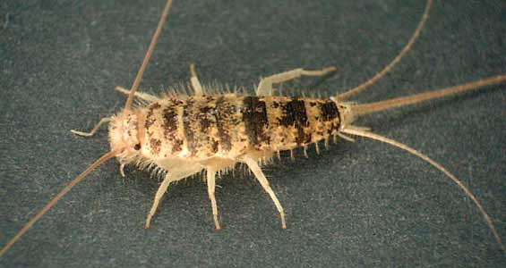

---
aliases:
  - Thysanura
title: Thysanura
---

# [[Thysanura]] 

Silverfish and Firebrats 

 

## #has_/text_of_/abstract 

> **Thysanura** is the now deprecated name of what was, for over a century, recognised as an order in the class Insecta. The two constituent groups within the former order, the Archaeognatha (jumping bristletails) and the Zygentoma (silverfish and firebrats), share several characteristics, such as of having three long caudal filaments, the lateral ones being the cerci, while the one between (telson) is a medial cerciform appendage, specifically an epiproct. They are also both wingless, and have bodies covered with fine scales, rather like the scales of the practically unrelated Lepidoptera. In the late 20th century, it was recognized that the two suborders were not sister taxa, therefore Thysanura was paraphyletic, and the two suborders were each raised to the status of an independent monophyletic order, with Archaeognatha sister taxon to the Dicondylia, including the Zygentoma.
>
> 
>
> Although the group Thysanura is no longer recognized, the name still appears in some published material. Another name used to separate the two groups from winged insects is Apterygota.
>
> [Wikipedia](https://en.wikipedia.org/wiki/Thysanura) 

### Information on the Internet

[Checklist of the Thysanura of South Africa](http://www.ru.ac.za/academic/departments/zooento/Martin/thysanura.html)

[Nomina Insecta Nearctica - Thysanura](http://www.nearctica.com/nomina/oddbugs/thysanur.htm)

## Introduction 

Under bark, litter, caves, ant nests, deserts, etc. Omnivorous. 4
Families (3 in North America), 370 Species (in North America)

Oligocene to Recent. Lepidotrichidae more widespread in early deposits
than currently.

### Characteristics

Characteristics:

-   body flattened
-   long cerci and median filament
-   compound eyes separate

## Phylogeny 

-   « Ancestral Groups  
    -  [Insect](../Insect.md) 
    -  [Hexapoda](../../Hexapoda.md) 
    -  [Arthropoda](../../../Arthropoda.md) 
    -  [Bilateria](../../../../Bilateria.md) 
    -  [Animals](../../../../../Animals.md) 
    -  [Eukarya](../../../../../../Eukarya.md) 
    -   [Tree of Life](../../../../../../Tree_of_Life.md)

-   ◊ Sibling Groups of  Insecta
    -  [Archaeognatha](Archaeognatha.md) 
    -   Thysanura
    -  [Pterygota](Pterygota.md) 

-   » Sub-Groups 

## Title Illustrations

---------------------------------------------------------------------------

scientific_name ::     Thermobia domestica
location ::           Tucson, Arizona, USA
specimen_condition ::  Live Specimen
copyright ::            © 2003 [David R. Maddison](http://david.bembidion.org/) 

## Confidential Links & Embeds: 

### #is_/same_as :: [[/_Standards/bio/bio~Domain/Eukarya/Animal/Bilateria/Arthropoda/Hexapoda/Insect/Thysanura|Thysanura]] 

### #is_/same_as :: [[/_public/bio/bio~Domain/Eukarya/Animal/Bilateria/Arthropoda/Hexapoda/Insect/Thysanura.public|Thysanura.public]] 

### #is_/same_as :: [[/_internal/bio/bio~Domain/Eukarya/Animal/Bilateria/Arthropoda/Hexapoda/Insect/Thysanura.internal|Thysanura.internal]] 

### #is_/same_as :: [[/_protect/bio/bio~Domain/Eukarya/Animal/Bilateria/Arthropoda/Hexapoda/Insect/Thysanura.protect|Thysanura.protect]] 

### #is_/same_as :: [[/_private/bio/bio~Domain/Eukarya/Animal/Bilateria/Arthropoda/Hexapoda/Insect/Thysanura.private|Thysanura.private]] 

### #is_/same_as :: [[/_personal/bio/bio~Domain/Eukarya/Animal/Bilateria/Arthropoda/Hexapoda/Insect/Thysanura.personal|Thysanura.personal]] 

### #is_/same_as :: [[/_secret/bio/bio~Domain/Eukarya/Animal/Bilateria/Arthropoda/Hexapoda/Insect/Thysanura.secret|Thysanura.secret]] 

