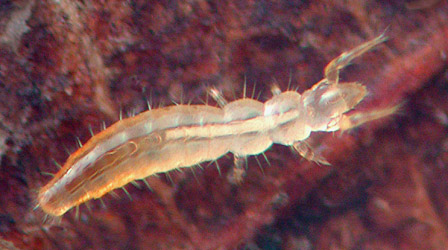

---
aliases:
  - Protura
title: Protura
---

# [[Protura]] 
 

## #has_/text_of_/abstract 

> The **Protura**, or proturans, and sometimes nicknamed coneheads, 
> are very small (0.6–1.5mm long), soil-dwelling animals, 
> so inconspicuous they were not noticed until the 20th century. 
> 
> The Protura constitute an order of hexapods that were previously regarded as insects, 
> and sometimes treated as a class in their own right.
>
> Some evidence indicates the Protura are basal to all other hexapods, although not all researchers consider them Hexapoda, rendering the monophyly of Hexapoda unsettled. Uniquely among hexapods, proturans show anamorphic development, whereby body segments are added during moults.
>
> There are close to 800 species, described in seven families. Nearly 300 species are contained in a single genus, Eosentomon.
>
> [Wikipedia](https://en.wikipedia.org/wiki/Protura) 

### Information on the Internet

-   [Checklist of the World     Protura](http://www.isez.pan.krakow.pl/catalogues/protura_main.htm).
    Andrzej Szeptycki.
-   [Protura](http://www.ento.csiro.au/education/hexapods/protura.html).
    CSIRO.
-   [Monologue of a     Proturologist](http://www.ne.jp/asahi/nakamura/osami/english/list_title_e.htm).
    Japanese proturans.
-   [List of Japanese     Protura](http://www.ne.jp/asahi/nakamura/osami/english/list_e.htm)
    and [Key to Japanese     Protura](http://www.ne.jp/asahi/nakamura/osami/english/kensaku1_e.htm).
-   [Featured Creatures at the University of Florida:     Proturans](http://creatures.ifas.ufl.edu/misc/proturans.htm)
-   [Nomina -     Protura](http://www.nearctica.com/nomina/oddbugs/protura.htm).
    nearctica.
-   [The Protura of South     Africa](http://www.ru.ac.za/academic/departments/zooento/Martin/protura.html).

## Introduction

Especially common in woodland humus, found to over 10 inches deep in the
soil. Densities have been measured at over 90,000 specimens per square
meter in a German forest (Krauss and Funke, 1999). May feed on fungi.
4-8 Families (3-5 in North America), 500 Species (20 in North America)

protos - first , oura- tail.

### Characteristics

Derived characteristics:

-   eyeless
-   antennae absent
-   tentorium absent
-   fore legs enlarged, with many sensilla; front legs serve role of
    antennae

Other characteristics:

-   very small, less than 2 mm long
-   abdomen with 12 segments as adult
-   Mouth parts entognathous
-   cerci absent
-   legs 5-segmented
-   anamorphic development (segments added at moults) vs. epimorphic in
    all other hexapods

## Phylogeny 

-   « Ancestral Groups  
    -  [Hexapoda](../Hexapoda.md) 
    -  [Arthropoda](../../Arthropoda.md) 
    -  [Bilateria](../../../Bilateria.md) 
    -  [Animals](../../../../Animals.md) 
    -  [Eukarya](../../../../../Eukarya.md) 
    -   [Tree of Life](../../../../../Tree_of_Life.md)

-   ◊ Sibling Groups of  Hexapoda
    -   [Springtail](Springtail.md)
    -   Protura
    -  [Diplura](Diplura.md) 
    -  [Insect](Insect.md) 

-   » Sub-Groups
    -  [Sinentomata](Protura/Sinentomata.md) 
    -  [Acerentomata](Protura/Acerentomata.md) 
    -  [Eosentomata](Protura/Eosentomata.md) 

## Title Illustrations

--------------------------------------------------------------------------- 
 
scientific_name ::     Protura
location ::           USA: North Carolina: Durham
specimen_condition ::  Live Specimen
copyright ::            © 2004 [David R. Maddison](http://david.bembidion.org/) 

## Confidential Links & Embeds: 

### #is_/same_as :: [[/_Standards/bio/bio~Domain/Eukarya/Animal/Bilateria/Arthropoda/Hexapoda/Protura|Protura]] 

### #is_/same_as :: [[/_public/bio/bio~Domain/Eukarya/Animal/Bilateria/Arthropoda/Hexapoda/Protura.public|Protura.public]] 

### #is_/same_as :: [[/_internal/bio/bio~Domain/Eukarya/Animal/Bilateria/Arthropoda/Hexapoda/Protura.internal|Protura.internal]] 

### #is_/same_as :: [[/_protect/bio/bio~Domain/Eukarya/Animal/Bilateria/Arthropoda/Hexapoda/Protura.protect|Protura.protect]] 

### #is_/same_as :: [[/_private/bio/bio~Domain/Eukarya/Animal/Bilateria/Arthropoda/Hexapoda/Protura.private|Protura.private]] 

### #is_/same_as :: [[/_personal/bio/bio~Domain/Eukarya/Animal/Bilateria/Arthropoda/Hexapoda/Protura.personal|Protura.personal]] 

### #is_/same_as :: [[/_secret/bio/bio~Domain/Eukarya/Animal/Bilateria/Arthropoda/Hexapoda/Protura.secret|Protura.secret]] 

