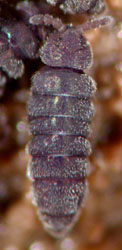
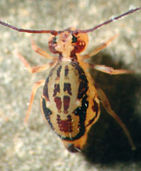
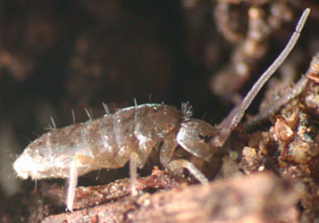

---
aliases:
- Springtail
- Springtails
- Collembola
title: Collembola
---

## Phylogeny 

-   « Ancestral Groups  
    -  [Hexapoda](../Hexapoda.md))
    -  [Arthropoda](../../Arthropoda.md))
    -  [Bilateria](../../../Bilateria.md))
    -  [Animals](../../../../Animals.md))
    -  [Eukarya](../../../../../Eukarya.md))
    -   [Tree of Life](../../../../../Tree_of_Life.md)

-   ◊ Sibling Groups of  Hexapoda
    -   Collembola
    -  [Protura](Protura.md))
    -  [Diplura](Diplura.md))
    -  [Insect](Insect.md))

-   » Sub-Groups
    -   [Poduromorpha](Springtail/Poduromorpha.md)
    -   [Symphypleona](Springtail/Symphypleona.md)
    -   [Neelidae](Neelidae)
    -   [Isotomidae](Springtail/Isotomidae.md)
    -   [Entomobryidae](Springtail/Entomobryidae.md)
    -   [Tomoceridae](Springtail/Tomoceridae.md)

# [[Springtail]]

Springtails 

     

## #has_/text_of_/abstract 

> Springtails (class **Collembola**) form the largest of the three lineages of 
> modern hexapods that are no longer considered insects. 
> 
> Although the three lineages are sometimes grouped together in a class called Entognatha 
> because they have internal mouthparts, 
> they do not appear to be any more closely related to one another 
> than they are to insects, which have external mouthparts.
>
> Springtails are omnivorous, free-living organisms that prefer moist conditions. 
> They do not directly engage in the decomposition of organic matter, 
> but contribute to it indirectly through the fragmentation of organic matter 
> and the control of soil microbial communities. 
> 
> The word Collembola is from Ancient Greek κόλλα kólla 'glue' and ἔμβολος émbolos 'peg'; 
> this name was given due to the existence of the collophore, 
> which was previously thought to stick to surfaces to stabilize the creature.
>
> Early DNA sequence studies suggested that 
> Collembola represent a separate evolutionary line from the other Hexapoda, 
> but others disagree; this seems to be caused by widely 
> divergent patterns of molecular evolution among the arthropods. 
> 
> The adjustments of traditional taxonomic rank for springtails 
> reflect the occasional incompatibility of traditional groupings with modern cladistics: 
> when they were included with the insects, they were ranked as an order; 
> as part of the Entognatha, they are ranked as a subclass. 
> 
> If they are considered a basal lineage of Hexapoda, they are elevated to full class status.
>
> [Wikipedia](https://en.wikipedia.org/wiki/Springtail) 

### Information on the Internet

-   [Collembola of the World](http://www.collembola.org/).
-   [Steve Hopkin Home Page](http://www.stevehopkin.co.uk/). Provides
    great pictures of Collembola and a number of Collembola resources
    including a list of [literature on     Collembola](http://www.stevehopkin.co.uk/collembolapapers/)
    published since 1995.
-   [The Springtails (Collembola) of South     Africa](http://www.rhodes.ac.za/academic/departments/zooento/Martin/collembola.html).
    Penelope Greenslade, Australian National University.
-   [Check-list of the Springtails (Collembola) of Puerto     Rico](http://www.life.uiuc.edu/robertson/personnel/collembolapr.html).
    Jos? A. Mari Mutt.
-   [Collembola Home     Page](http://web.missouri.edu/%7Ebioscish/coll.html). Part of the
    [Pictographic Key to Leaf Litter Arthropods from the Missouri Ozark     Forest Ecosystem Project     (MOFEP)](http://web.missouri.edu/%7Ebioscish/index.shtml).
-   [PMS Springtail Study     Group](http://www.thurlo.force9.co.uk/springtails/index.html).
    Postal Microscopical Society.
-   [Collembola of the     Netherlands](http://www.bio.vu.nl/do/EIS/COLLEMBOLA/).
-   Steve Hopkin\'s [\"The Biology of the Collembola (Springtails): The     Most Abundant Insects in the     World\"](http://www.fathom.com/feature/122603/).
-   [Provisional Atlas of the Collembola of Britain and     Ireland](http://www.ams.rdg.ac.uk/zoology/collembola/maps/).

## Introduction

Springtails have the widest distribution of any hexapod group, occuring
throughout the world, including Antarctica. They are probably the most
abundant hexapods on Earth, with up to 250,000,000 individuals per
square acre. They are found in soil, leaf litter, logs, dung, cave,
shorelines, etc. There are about 6000 known species.

Devonian-Recent. Oldest fossil is of Rhyniella praecursor Hirst and
Maulik from the Middle Devonian of Scotland.

The name \"Collembola\" is derived from \"Colle\" = glue and \"embolon\"
= piston or peg. This refers to the belief that the ventral tube has
adhesive properties, that is, that it is a \"glue-peg\". However, the
tube\'s function is primarily for excretion and maintaining water
balance.

### Characteristics

Among the prominent derived characteristics of this group are:

-   ventral tube (\"collophore\") on segment 1 of abdomen (adhesive in
    some groups, but primarily involved with excretion and water
    transport)
-   springing mechanism formed from retinaculum on segment 3, furcula on
    segment 4
-   4-segmented antennae (segments sometimes subsegmented, giving the
    appearance of more than 4 segments)
-   6 abdominal segments

Other characteristics include:

-   indirect sperm transfer with globular stalked spermatophore
-   Some Neanuridae have polytene chromosomes
-   Adults continue moulting throughout life (up to 50 moults)
-   Reproductive instars alternate with feeding instars
-   Cerci lacking

## Title Illustrations

---------------------------------------------------------------------------
 
Scientific Name ::     Collembola
Location ::           USA: Arizona: Tucson
Specimen Condition   Live Specimen
Copyright ::            © 2004 [David R. Maddison](http://david.bembidion.org/) 

---------------------------------------------------------------------------

Scientific Name ::     Symphypleona
Location ::           USA: California: Cold Creek
Specimen Condition   Live Specimen
Copyright ::            © 2004 [David R. Maddison](http://david.bembidion.org/) 

Scientific Name ::     Collembola
Location ::           USA: Arizona: Iron Springs
Specimen Condition   Live Specimen
Copyright ::            © 2004 [David R. Maddison](http://david.bembidion.org/) 

## Confidential Links & Embeds: 

### #is_/same_as :: [Springtail](/_Standards/bio/bio~Domain/Eukarya/Animal/Bilateria/Arthropoda/Hexapoda/Springtail.md) 

### #is_/same_as :: [Springtail.public](/_public/bio/bio~Domain/Eukarya/Animal/Bilateria/Arthropoda/Hexapoda/Springtail.public.md) 

### #is_/same_as :: [Springtail.internal](/_internal/bio/bio~Domain/Eukarya/Animal/Bilateria/Arthropoda/Hexapoda/Springtail.internal.md) 

### #is_/same_as :: [Springtail.protect](/_protect/bio/bio~Domain/Eukarya/Animal/Bilateria/Arthropoda/Hexapoda/Springtail.protect.md) 

### #is_/same_as :: [Springtail.private](/_private/bio/bio~Domain/Eukarya/Animal/Bilateria/Arthropoda/Hexapoda/Springtail.private.md) 

### #is_/same_as :: [Springtail.personal](/_personal/bio/bio~Domain/Eukarya/Animal/Bilateria/Arthropoda/Hexapoda/Springtail.personal.md) 

### #is_/same_as :: [Springtail.secret](/_secret/bio/bio~Domain/Eukarya/Animal/Bilateria/Arthropoda/Hexapoda/Springtail.secret.md)

