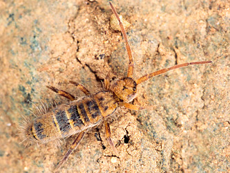

---
aliases:
  - Entomobryidae
title: Entomobryidae
---

# [[Entomobryidae]] 

 

## Phylogeny 

-   « Ancestral Groups  
    -   [Springtail](../Springtail.md)
    -  [Hexapoda](../../Hexapoda.md) 
    -  [Arthropoda](../../../Arthropoda.md) 
    -  [Bilateria](../../../../Bilateria.md) 
    -  [Animals](../../../../../Animals.md) 
    -  [Eukarya](../../../../../../Eukarya.md) 
    -   [Tree of Life](../../../../../../Tree_of_Life.md)

-   ◊ Sibling Groups of  Collembola
    -   [Poduromorpha](Poduromorpha.md)
    -   [Symphypleona](Symphypleona.md)
    -   [Neelidae](Neelidae)
    -   [Isotomidae](Isotomidae.md)
    -   Entomobryidae
    -   [Tomoceridae](Tomoceridae.md)

-   » Sub-Groups 
	-   *Orchesellinae*
	-   *Entomobryinae*
	-   *Lepidocyrtinae*
	-   *Seirinae*

## Title Illustrations

------------------------------------------------------------------------
 
Scientific Name ::     Entomobrya nicoleti
Specimen Condition   Live Specimen
Copyright ::            © [Steve Hopkin](http://www.stevehopkin.co.uk/) 

------------------------------------------------------------------------

Scientific Name ::     Orchesella alticola
Specimen Condition   Live Specimen
Copyright ::            © [Steve Hopkin](http://www.stevehopkin.co.uk/) 

## Confidential Links & Embeds: 

### #is_/same_as :: [[/_Standards/bio/bio~Domain/Eukarya/Animal/Bilateria/Arthropoda/Hexapoda/Springtail/Entomobryidae|Entomobryidae]] 

### #is_/same_as :: [[/_public/bio/bio~Domain/Eukarya/Animal/Bilateria/Arthropoda/Hexapoda/Springtail/Entomobryidae.public|Entomobryidae.public]] 

### #is_/same_as :: [[/_internal/bio/bio~Domain/Eukarya/Animal/Bilateria/Arthropoda/Hexapoda/Springtail/Entomobryidae.internal|Entomobryidae.internal]] 

### #is_/same_as :: [[/_protect/bio/bio~Domain/Eukarya/Animal/Bilateria/Arthropoda/Hexapoda/Springtail/Entomobryidae.protect|Entomobryidae.protect]] 

### #is_/same_as :: [[/_private/bio/bio~Domain/Eukarya/Animal/Bilateria/Arthropoda/Hexapoda/Springtail/Entomobryidae.private|Entomobryidae.private]] 

### #is_/same_as :: [[/_personal/bio/bio~Domain/Eukarya/Animal/Bilateria/Arthropoda/Hexapoda/Springtail/Entomobryidae.personal|Entomobryidae.personal]] 

### #is_/same_as :: [[/_secret/bio/bio~Domain/Eukarya/Animal/Bilateria/Arthropoda/Hexapoda/Springtail/Entomobryidae.secret|Entomobryidae.secret]] 

