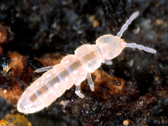
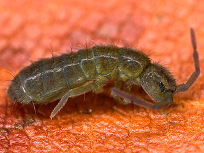

---
aliases:
- Isotomidae
- sulkahyppyhännät
- Изотомиды
- изотомови
- عستوميات
- عسطوميات
- 等节跳虫科
title: Isotomidae
has_id_wikidata: Q546017
dv_has_:
  name_:
    an: Isotomidae
    ar: عسطوميات
    arz: عستوميات
    ast: Isotomidae
    bg: изотомови
    ca: Isotomidae
    ceb: Isotomidae
    cs: Isotomidae
    de: Isotomidae
    en: Isotomidae
    eo: Isotomidae
    es: Isotomidae
    eu: Isotomidae
    ext: Isotomidae
    fi: sulkahyppyhännät
    fr: Isotomidae
    ga: Isotomidae
    gl: Isotomidae
    ia: Isotomidae
    ie: Isotomidae
    io: Isotomidae
    it: Isotomidae
    la: Isotomidae
    mul: Isotomidae
    nb: Isotomidae
    nl: Isotomidae
    oc: Isotomidae
    pl: Isotomidae
    pt: Isotomidae
    pt-br: Isotomidae
    ro: Isotomidae
    ru: Изотомиды
    sq: Isotomidae
    sv: Isotomidae
    tr: Isotomidae
    uk: Isotomidae
    vi: Isotomidae
    vo: Isotomidae
    war: Isotomidae
    zh: 等节跳虫科
    zh-cn: 等节跳虫科
    zh-hans: 等节跳虫科
    zh-tw: 等节跳虫科
---
# [[Isotomidae]]  

 

## #has_/text_of_/abstract 

> **Isotomidae** is a family of elongate-bodied springtails in the order Entomobryomorpha.
>
> [Wikipedia](https://en.wikipedia.org/wiki/Isotomidae) 

## Phylogeny 

-   « Ancestral Groups  
    -   [Springtail](../Springtail.md)
    -  [Hexapoda](../../Hexapoda.md) 
    -  [Arthropoda](../../../Arthropoda.md) 
    -  [Bilateria](../../../../Bilateria.md) 
    -  [Animals](../../../../../Animals.md) 
    -  [Eukarya](../../../../../../Eukarya.md) 
    -   [Tree of Life](../../../../../../Tree_of_Life.md)

-   ◊ Sibling Groups of  Collembola
    -   [Poduromorpha](Poduromorpha.md)
    -   [Symphypleona](Symphypleona.md)
    -   [Neelidae](Neelidae)
    -   Isotomidae
    -   [Entomobryidae](Entomobryidae.md)
    -   [Tomoceridae](Tomoceridae.md)

-   » Sub-Groups 
	-   *Anurophorinae*
	-   *Proisotominae*
	-   *Isotominae*
	-   *Pachyotominae*

Containing group: [Springtail](../Springtail.md)

## Title Illustrations

------------------------------------------------------------------------
 
scientific_name ::     Folsomia candida
specimen_condition ::  Live Specimen
copyright ::            © [Steve Hopkin](http://www.stevehopkin.co.uk/) 

------------------------------------------------------------------------
 
scientific_name ::     Isotoma viridis
specimen_condition ::  Live Specimen
copyright ::            © [Steve Hopkin](http://www.stevehopkin.co.uk/) 

## Confidential Links & Embeds: 

### #is_/same_as :: [[/_Standards/bio/bio~Domain/Eukarya/Animal/Bilateria/Arthropoda/Hexapoda/Springtail/Isotomidae|Isotomidae]] 

### #is_/same_as :: [[/_public/bio/bio~Domain/Eukarya/Animal/Bilateria/Arthropoda/Hexapoda/Springtail/Isotomidae.public|Isotomidae.public]] 

### #is_/same_as :: [[/_internal/bio/bio~Domain/Eukarya/Animal/Bilateria/Arthropoda/Hexapoda/Springtail/Isotomidae.internal|Isotomidae.internal]] 

### #is_/same_as :: [[/_protect/bio/bio~Domain/Eukarya/Animal/Bilateria/Arthropoda/Hexapoda/Springtail/Isotomidae.protect|Isotomidae.protect]] 

### #is_/same_as :: [[/_private/bio/bio~Domain/Eukarya/Animal/Bilateria/Arthropoda/Hexapoda/Springtail/Isotomidae.private|Isotomidae.private]] 

### #is_/same_as :: [[/_personal/bio/bio~Domain/Eukarya/Animal/Bilateria/Arthropoda/Hexapoda/Springtail/Isotomidae.personal|Isotomidae.personal]] 

### #is_/same_as :: [[/_secret/bio/bio~Domain/Eukarya/Animal/Bilateria/Arthropoda/Hexapoda/Springtail/Isotomidae.secret|Isotomidae.secret]] 

