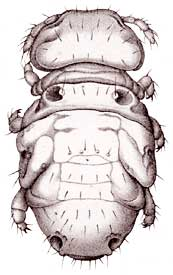
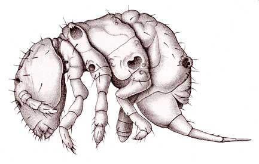

## [[Neelipleona]] 

Neelidae 

   

## #has_/text_of_/abstract 

> **Neelipleona** is a name given to some hexapods of the subclass Collembola (springtails).  
> While their taxonomic rank remains broadly settled as family Neelidae, 
> Neelipleona has been described at order or suborder rank. Eyes are absent.
>
> [Wikipedia](https://en.wikipedia.org/wiki/Neelipleona) 

## Phylogeny 

-   « Ancestral Groups  
    -   [Springtail](../Springtail.md)
    -  [Hexapoda](../../Hexapoda.md))
    -  [Arthropoda](../../../Arthropoda.md))
    -  [Bilateria](../../../../Bilateria.md))
    -  [Animals](../../../../../Animals.md))
    -  [Eukarya](../../../../../../Eukarya.md))
    -   [Tree of Life](../../../../../../Tree_of_Life.md)

-   ◊ Sibling Groups of  Collembola
    -   [Poduromorpha](Poduromorpha.md)
    -   [Symphypleona](Symphypleona.md)
    -   Neelidae
    -   [Isotomidae](Isotomidae.md)
    -   [Entomobryidae](Entomobryidae.md)
    -   [Tomoceridae](Tomoceridae.md)

-   » Sub-Groups 
	-   *Neelus*
	-   *Neelides*
	-   *Megalothorax*
	-   *Acanthothorax pratensis*
	-   *Zelandothorax novaezealandiae*

## Title Illustrations

---------------------------------------

Scientific Name ::  Megalothorax minimus
Reference         Drawing from C. Börner. 1906. Collembola. Symphypleona. Fam. Neelidae. Genera Insectorum de P. Wytsman 45:1-5.
View              dorsal

---------------------------------------

Scientific Name ::  Megalothorax minimus
Reference         Drawing from C. Börner. 1906. Collembola. Symphypleona. Fam. Neelidae. Genera Insectorum de P. Wytsman 45:1-5.
View              lateral

## Confidential Links & Embeds: 

### #is_/same_as :: [Neelipleona](/_Standards/bio/bio~Domain/Eukarya/Animal/Bilateria/Arthropoda/Hexapoda/Springtail/Neelipleona.md) 

### #is_/same_as :: [Neelipleona.public](/_public/bio/bio~Domain/Eukarya/Animal/Bilateria/Arthropoda/Hexapoda/Springtail/Neelipleona.public.md) 

### #is_/same_as :: [Neelipleona.internal](/_internal/bio/bio~Domain/Eukarya/Animal/Bilateria/Arthropoda/Hexapoda/Springtail/Neelipleona.internal.md) 

### #is_/same_as :: [Neelipleona.protect](/_protect/bio/bio~Domain/Eukarya/Animal/Bilateria/Arthropoda/Hexapoda/Springtail/Neelipleona.protect.md) 

### #is_/same_as :: [Neelipleona.private](/_private/bio/bio~Domain/Eukarya/Animal/Bilateria/Arthropoda/Hexapoda/Springtail/Neelipleona.private.md) 

### #is_/same_as :: [Neelipleona.personal](/_personal/bio/bio~Domain/Eukarya/Animal/Bilateria/Arthropoda/Hexapoda/Springtail/Neelipleona.personal.md) 

### #is_/same_as :: [Neelipleona.secret](/_secret/bio/bio~Domain/Eukarya/Animal/Bilateria/Arthropoda/Hexapoda/Springtail/Neelipleona.secret.md)

