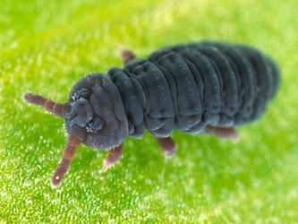
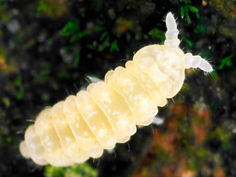

---
aliases:
- Poduromorfe
- Poduromorpha
- Łeʼesoołii bijáád ádaałtsʼíísí
- كهدليات
- پادمریختان
- 原䖴目
- 톡토기목
title: Poduromorpha
has_id_wikidata: Q1935420
dv_has_:
  name_:
    an: Poduromorpha
    ar: كهدليات
    arz: كهدليات
    ast: Poduromorpha
    bg: Poduromorpha
    ca: Poduromorpha
    ceb: Poduromorpha
    de: Poduromorpha
    en: Poduromorpha
    eo: Poduromorpha
    es: Poduromorpha
    eu: Poduromorpha
    ext: Poduromorpha
    fa: پادمریختان
    fi: Poduromorpha
    fr: Poduromorpha
    ga: Poduromorpha
    gl: Poduromorpha
    ia: Poduromorpha
    ie: Poduromorpha
    io: Poduromorpha
    it: Poduromorpha
    ko: 톡토기목
    la: Poduromorpha
    mul: Poduromorpha
    nl: Poduromorpha
    nv: Łeʼesoołii bijáád ádaałtsʼíísí
    oc: Poduromorpha
    pl: Poduromorpha
    pt: Poduromorpha
    pt-br: Poduromorpha
    ro: Poduromorfe
    ru: Poduromorpha
    sq: Poduromorpha
    uk: Poduromorpha
    vi: Poduromorpha
    vo: Poduromorpha
    war: Poduromorpha
    zh: 原䖴目
    zh-cn: 原䖴目
    zh-hans: 原䖴目
---
# [[Poduromorpha]] 

   

## #has_/text_of_/abstract 

> The order **Poduromorpha** is one of the three main groups of springtails (Collembola), tiny hexapods related to insects. This group was formerly treated as a superfamily Poduroidea.
>
> They can be best distinguished from the other springtail groups by their body shape. The Symphypleona are very round animals, almost spherical and the abdominal segments are not visible.  Both Entomobryomorpha and Poduromorpha are long springtails with six visible abdominal segments. While Entomobryomorpha have the first thorax segment reduced, Poduromorpha retain all three.  The Poduromorpha also tend to have short legs and a plump body, but more oval in shape than the Symphypleona. Their name means 'foot tail formed', deriving from their short, flat, furcula.
>
> [Wikipedia](https://en.wikipedia.org/wiki/Poduromorpha) 

## Phylogeny 

-   « Ancestral Groups  
    -   [Springtail](../Springtail.md)
    -  [Hexapoda](../../Hexapoda.md) 
    -  [Arthropoda](../../../Arthropoda.md) 
    -  [Bilateria](../../../../Bilateria.md) 
    -  [Animals](../../../../../Animals.md) 
    -  [Eukarya](../../../../../../Eukarya.md) 
    -   [Tree of Life](../../../../../../Tree_of_Life.md)

-   ◊ Sibling Groups of  Collembola
    -   Poduromorpha
    -   [Symphypleona](Symphypleona.md)
    -   [Neelidae](Neelidae)
    -   [Isotomidae](Isotomidae.md)
    -   [Entomobryidae](Entomobryidae.md)
    -   [Tomoceridae](Tomoceridae.md)

-   » Sub-Groups
    -   [Onychiuridae](Poduromorpha/Onychiuridae.md)
    -   [Neanuridae](Poduromorpha/Neanuridae.md)

	-   *Podura*
	-   *[Onychiuridae](Poduromorpha/Onychiuridae.md "go to ToL page")*
	-   *Hypogastruridae*[ (non-monophyletic) ]
	-   *Brachystomellidae*
	-   *Odontellidae*
	-   *[Neanuridae](Poduromorpha/Neanuridae.md "go to ToL page")*

## Title Illustrations

------------------------------------------------------------------------

scientific_name ::     Podura aquatica
specimen_condition ::  Live Specimen
copyright ::            © [Steve Hopkin](http://www.stevehopkin.co.uk/) 

------------------------------------------------------------------------

scientific_name ::     Anurida granaria
specimen_condition ::  Live Specimen
copyright ::            © [Steve Hopkin](http://www.stevehopkin.co.uk/) 

## Confidential Links & Embeds: 

### #is_/same_as :: [[/_Standards/bio/bio~Domain/Eukarya/Animal/Bilateria/Arthropoda/Hexapoda/Springtail/Poduromorpha|Poduromorpha]] 

### #is_/same_as :: [[/_public/bio/bio~Domain/Eukarya/Animal/Bilateria/Arthropoda/Hexapoda/Springtail/Poduromorpha.public|Poduromorpha.public]] 

### #is_/same_as :: [[/_internal/bio/bio~Domain/Eukarya/Animal/Bilateria/Arthropoda/Hexapoda/Springtail/Poduromorpha.internal|Poduromorpha.internal]] 

### #is_/same_as :: [[/_protect/bio/bio~Domain/Eukarya/Animal/Bilateria/Arthropoda/Hexapoda/Springtail/Poduromorpha.protect|Poduromorpha.protect]] 

### #is_/same_as :: [[/_private/bio/bio~Domain/Eukarya/Animal/Bilateria/Arthropoda/Hexapoda/Springtail/Poduromorpha.private|Poduromorpha.private]] 

### #is_/same_as :: [[/_personal/bio/bio~Domain/Eukarya/Animal/Bilateria/Arthropoda/Hexapoda/Springtail/Poduromorpha.personal|Poduromorpha.personal]] 

### #is_/same_as :: [[/_secret/bio/bio~Domain/Eukarya/Animal/Bilateria/Arthropoda/Hexapoda/Springtail/Poduromorpha.secret|Poduromorpha.secret]] 

