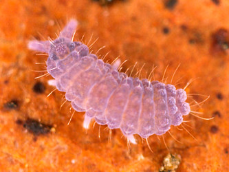
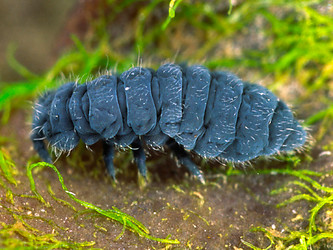

---
aliases:
  - Neanuridae
title: Neanuridae
---

## Phylogeny 

-   « Ancestral Groups  
    -   [Poduromorpha](../Poduromorpha.md)
    -   [Springtail](../../Springtail.md)
    -  [Hexapoda](../../../Hexapoda.md) 
    -  [Arthropoda](../../../../Arthropoda.md) 
    -  [Bilateria](../../../../../Bilateria.md) 
    -  [Animals](../../../../../../Animals.md) 
    -  [Eukarya](../../../../../../../Eukarya.md) 
    -   [Tree of Life](../../../../../../../Tree_of_Life.md)

-   ◊ Sibling Groups of  Poduromorpha
    -   [Onychiuridae](Onychiuridae.md)
    -   Neanuridae

-   » Sub-Groups 

# Neanuridae 

-   *Caputanurininae*
-   *Frieseinae*
-   *Morulininae*
-   *Neanurinae*
-   *Pseudachorutinae*
-   *Uchidanurinae*

Containing group: [Poduromorpha](../Poduromorpha.md)

## Title Illustrations

)

  ------------------------------------------------------------------------
  Scientific Name ::     Neanura muscorum
  Specimen Condition   Live Specimen
  Copyright ::            © [Steve Hopkin](http://www.stevehopkin.co.uk/) 
 
  ------------------------------------------------------------------------
)

  ------------------------------------------------------------------------
  Scientific Name ::     Anurida maritima
  Specimen Condition   Live Specimen
  Copyright ::            © [Steve Hopkin](http://www.stevehopkin.co.uk/) 
 
  ------------------------------------------------------------------------

## Confidential Links & Embeds: 

### #is_/same_as :: [[/_Standards/bio/bio~Domain/Eukarya/Animal/Bilateria/Arthropoda/Hexapoda/Springtail/Poduromorpha/Neanuridae|Neanuridae]] 

### #is_/same_as :: [[/_public/bio/bio~Domain/Eukarya/Animal/Bilateria/Arthropoda/Hexapoda/Springtail/Poduromorpha/Neanuridae.public|Neanuridae.public]] 

### #is_/same_as :: [[/_internal/bio/bio~Domain/Eukarya/Animal/Bilateria/Arthropoda/Hexapoda/Springtail/Poduromorpha/Neanuridae.internal|Neanuridae.internal]] 

### #is_/same_as :: [[/_protect/bio/bio~Domain/Eukarya/Animal/Bilateria/Arthropoda/Hexapoda/Springtail/Poduromorpha/Neanuridae.protect|Neanuridae.protect]] 

### #is_/same_as :: [[/_private/bio/bio~Domain/Eukarya/Animal/Bilateria/Arthropoda/Hexapoda/Springtail/Poduromorpha/Neanuridae.private|Neanuridae.private]] 

### #is_/same_as :: [[/_personal/bio/bio~Domain/Eukarya/Animal/Bilateria/Arthropoda/Hexapoda/Springtail/Poduromorpha/Neanuridae.personal|Neanuridae.personal]] 

### #is_/same_as :: [[/_secret/bio/bio~Domain/Eukarya/Animal/Bilateria/Arthropoda/Hexapoda/Springtail/Poduromorpha/Neanuridae.secret|Neanuridae.secret]] 

