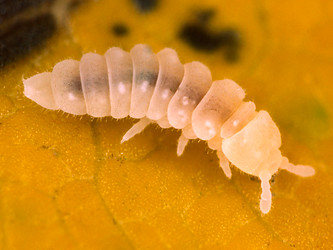
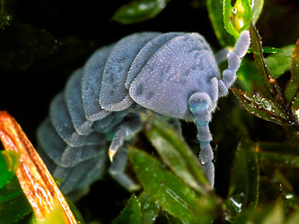

---
aliases:
  - Onychiuridae
title: Onychiuridae
---

## Phylogeny 

-   « Ancestral Groups  
    -   [Poduromorpha](../Poduromorpha.md)
    -   [Springtail](../../Springtail.md)
    -  [Hexapoda](../../../Hexapoda.md) 
    -  [Arthropoda](../../../../Arthropoda.md) 
    -  [Bilateria](../../../../../Bilateria.md) 
    -  [Animals](../../../../../../Animals.md) 
    -  [Eukarya](../../../../../../../Eukarya.md) 
    -   [Tree of Life](../../../../../../../Tree_of_Life.md)

-   ◊ Sibling Groups of  Poduromorpha
    -   Onychiuridae
    -   [Neanuridae](Neanuridae.md)

-   » Sub-Groups 

# Onychiuridae 

-   *Onychiurinae*
-   *Tetrodontophorinae*

Containing group: [Poduromorpha](../Poduromorpha.md)

## Title Illustrations

 

  ------------------------------------------------------------------------
  scientific_name ::     Kalaphorura burmeisteri
  specimen_condition ::  Live Specimen
  copyright ::            © [Steve Hopkin](http://www.stevehopkin.co.uk/) 
 
  ------------------------------------------------------------------------
 

  ------------------------------------------------------------------------
  scientific_name ::     Tetrodontophora bielanensis
  specimen_condition ::  Live Specimen
  copyright ::            © [Steve Hopkin](http://www.stevehopkin.co.uk/) 
 
  ------------------------------------------------------------------------

## Confidential Links & Embeds: 

### #is_/same_as :: [[/_Standards/bio/bio~Domain/Eukarya/Animal/Bilateria/Arthropoda/Hexapoda/Springtail/Poduromorpha/Onychiuridae|Onychiuridae]] 

### #is_/same_as :: [[/_public/bio/bio~Domain/Eukarya/Animal/Bilateria/Arthropoda/Hexapoda/Springtail/Poduromorpha/Onychiuridae.public|Onychiuridae.public]] 

### #is_/same_as :: [[/_internal/bio/bio~Domain/Eukarya/Animal/Bilateria/Arthropoda/Hexapoda/Springtail/Poduromorpha/Onychiuridae.internal|Onychiuridae.internal]] 

### #is_/same_as :: [[/_protect/bio/bio~Domain/Eukarya/Animal/Bilateria/Arthropoda/Hexapoda/Springtail/Poduromorpha/Onychiuridae.protect|Onychiuridae.protect]] 

### #is_/same_as :: [[/_private/bio/bio~Domain/Eukarya/Animal/Bilateria/Arthropoda/Hexapoda/Springtail/Poduromorpha/Onychiuridae.private|Onychiuridae.private]] 

### #is_/same_as :: [[/_personal/bio/bio~Domain/Eukarya/Animal/Bilateria/Arthropoda/Hexapoda/Springtail/Poduromorpha/Onychiuridae.personal|Onychiuridae.personal]] 

### #is_/same_as :: [[/_secret/bio/bio~Domain/Eukarya/Animal/Bilateria/Arthropoda/Hexapoda/Springtail/Poduromorpha/Onychiuridae.secret|Onychiuridae.secret]] 

