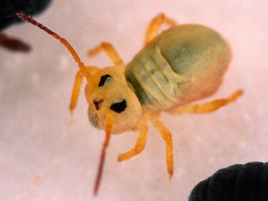

---
aliases:
  - Symphypleona
title: Symphypleona
---

# [[Symphypleona]] 

 
 

## #has_/text_of_/abstract 

> The order **Symphypleona**, also known as the globular springtails, 
> is one of the three main groups of springtails (Collembola), tiny hexapods related to insects. 
> When the springtails were still believed to be an order of insects, 
> the Symphypleona were ranked as a suborder.
>
> They can be best distinguished from the other springtail groups by their body shape. 
> The Symphypleona are very round animals, almost spherical, and usually have long antennae. 
> The Poduromorpha, by contrast, always have short legs and a plump body, 
> but more oval in shape than the Symphypleona. 
> 
> The Entomobryomorpha are the slimmest springtails, 
> some with long and some with short legs and antennae, but always with a very slender body.
>
> [Wikipedia](https://en.wikipedia.org/wiki/Symphypleona) 

## Phylogeny 

-   « Ancestral Groups  
    -   [Springtail](../Springtail.md)
    -  [Hexapoda](../../Hexapoda.md) 
    -  [Arthropoda](../../../Arthropoda.md) 
    -  [Bilateria](../../../../Bilateria.md) 
    -  [Animals](../../../../../Animals.md) 
    -  [Eukarya](../../../../../../Eukarya.md) 
    -   [Tree of Life](../../../../../../Tree_of_Life.md)

-   ◊ Sibling Groups of  Collembola
    -   [Poduromorpha](Poduromorpha.md)
    -   Symphypleona
    -   [Neelidae](Neelidae)
    -   [Isotomidae](Isotomidae.md)
    -   [Entomobryidae](Entomobryidae.md)
    -   [Tomoceridae](Tomoceridae.md)

-   » Sub-Groups
    -   [Dicyrtomidae](Symphypleona/Dicyrtomidae.md)
	-   *Katiannidae*
	-   *Spinothecidae*
	-   *Bourletiellidae*
	-   *Mackenziella psocoides*
	-   *[Dicyrtomidae](Symphypleona/Dicyrtomidae.md "go to ToL page")*
	-   *Sminthuridae*
	-   *Sminthurididae*
	-   *Sturmius*
	-   *Arrhopalitidae*

## Title Illustrations

------------------------------------------------------------------------

scientific_name ::     Dicyrtoma fusca
specimen_condition ::  Live Specimen
copyright ::            © [Steve Hopkin](http://www.stevehopkin.co.uk/) 

------------------------------------------------------------------------

scientific_name ::     Sminthurides aquaticus
specimen_condition ::  Live Specimen
copyright ::            © [Steve Hopkin](http://www.stevehopkin.co.uk/) 

## Confidential Links & Embeds: 

### #is_/same_as :: [[/_Standards/bio/bio~Domain/Eukarya/Animal/Bilateria/Arthropoda/Hexapoda/Springtail/Symphypleona|Symphypleona]] 

### #is_/same_as :: [[/_public/bio/bio~Domain/Eukarya/Animal/Bilateria/Arthropoda/Hexapoda/Springtail/Symphypleona.public|Symphypleona.public]] 

### #is_/same_as :: [[/_internal/bio/bio~Domain/Eukarya/Animal/Bilateria/Arthropoda/Hexapoda/Springtail/Symphypleona.internal|Symphypleona.internal]] 

### #is_/same_as :: [[/_protect/bio/bio~Domain/Eukarya/Animal/Bilateria/Arthropoda/Hexapoda/Springtail/Symphypleona.protect|Symphypleona.protect]] 

### #is_/same_as :: [[/_private/bio/bio~Domain/Eukarya/Animal/Bilateria/Arthropoda/Hexapoda/Springtail/Symphypleona.private|Symphypleona.private]] 

### #is_/same_as :: [[/_personal/bio/bio~Domain/Eukarya/Animal/Bilateria/Arthropoda/Hexapoda/Springtail/Symphypleona.personal|Symphypleona.personal]] 

### #is_/same_as :: [[/_secret/bio/bio~Domain/Eukarya/Animal/Bilateria/Arthropoda/Hexapoda/Springtail/Symphypleona.secret|Symphypleona.secret]] 

