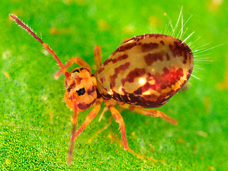
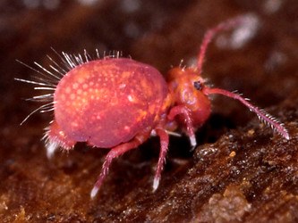

---
title: Dicyrtomidae
---

## Phylogeny 

-   « Ancestral Groups  
    -   [Symphypleona](../Symphypleona.md)
    -   [Springtail](../../Springtail.md)
    -  [Hexapoda](../../../Hexapoda.md))
    -  [Arthropoda](../../../../Arthropoda.md))
    -  [Bilateria](../../../../../Bilateria.md))
    -  [Animals](../../../../../../Animals.md))
    -  [Eukarya](../../../../../../../Eukarya.md))
    -   [Tree of Life](../../../../../../../Tree_of_Life.md)

-   ◊ Sibling Groups of  Symphypleona
    -   Dicyrtomidae

-   » Sub-Groups 

# Dicyrtomidae 

-   *Bothriovulsus*
-   *Calvatomina*
-   *Dicyrtoma*
-   *Dicyrtomina*
-   *Gibberathrix*
-   *Jordanathrix*
-   *Papirioides*
-   *Ptenothrix*

Containing group: [Symphypleona](../Symphypleona.md)

### References

Snider, R. J. 1990. A contribution to the Dicyrtomidae (Collembola) of
Hawaii. Zoologica Scripta 19(1):73-99.

## Title Illustrations

)

  ------------------------------------------------------------------------
  Scientific Name ::     Dicyrtomina saundersi
  Specimen Condition   Live Specimen
  Copyright ::            © [Steve Hopkin](http://www.stevehopkin.co.uk/) 
  ------------------------------------------------------------------------
)

  ------------------------------------------------------------------------
  Scientific Name ::     Dicyrtoma fusca
  Specimen Condition   Live Specimen
  Copyright ::            © [Steve Hopkin](http://www.stevehopkin.co.uk/) 
  ------------------------------------------------------------------------

## Confidential Links & Embeds: 

### #is_/same_as ::[Dicyrtomidae](Dicyrtomidae.md)) 

### #is_/same_as :: [Dicyrtomidae.public](/_public/bio/bio~Domain/Eukarya/Animal/Bilateria/Arthropoda/Hexapoda/Springtail/Symphypleona/Dicyrtomidae.public.md) 

### #is_/same_as :: [Dicyrtomidae.internal](/_internal/bio/bio~Domain/Eukarya/Animal/Bilateria/Arthropoda/Hexapoda/Springtail/Symphypleona/Dicyrtomidae.internal.md) 

### #is_/same_as :: [Dicyrtomidae.protect](/_protect/bio/bio~Domain/Eukarya/Animal/Bilateria/Arthropoda/Hexapoda/Springtail/Symphypleona/Dicyrtomidae.protect.md) 

### #is_/same_as :: [Dicyrtomidae.private](/_private/bio/bio~Domain/Eukarya/Animal/Bilateria/Arthropoda/Hexapoda/Springtail/Symphypleona/Dicyrtomidae.private.md) 

### #is_/same_as :: [Dicyrtomidae.personal](/_personal/bio/bio~Domain/Eukarya/Animal/Bilateria/Arthropoda/Hexapoda/Springtail/Symphypleona/Dicyrtomidae.personal.md) 

### #is_/same_as :: [Dicyrtomidae.secret](/_secret/bio/bio~Domain/Eukarya/Animal/Bilateria/Arthropoda/Hexapoda/Springtail/Symphypleona/Dicyrtomidae.secret.md)

