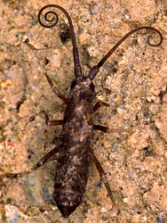
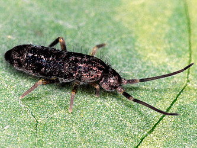

---
aliases:
- Entomobryomorpha
- Tomoceridae
- Łeʼesoołii łibáhígíí
- Ентомобрийоморфа
- أشباه الأشينيات
- اشباة الاشينيات
- 長角目
- 长角䖴目
- 톡토기목
title: Tomoceridae
has_id_wikidata: Q1045208
dv_has_:
  name_:
    an: Entomobryomorpha
    ar: أشباه الأشينيات
    arz: اشباة الاشينيات
    ast: Entomobryomorpha
    bg: Entomobryomorpha
    ca: Entomobryomorpha
    ceb: Entomobryomorpha
    de: Entomobryomorpha
    en: Entomobryomorpha
    eo: Entomobryomorpha
    es: Entomobryomorpha
    eu: Entomobryomorpha
    ext: Entomobryomorpha
    fi: Entomobryomorpha
    fr: Entomobryomorpha
    ga: Entomobryomorpha
    gl: Entomobryomorpha
    ia: Entomobryomorpha
    ie: Entomobryomorpha
    io: Entomobryomorpha
    it: Entomobryomorpha
    ko: 톡토기목
    la: Entomobryomorpha
    mul: Entomobryomorpha
    nl: Entomobryomorpha
    nv: Łeʼesoołii łibáhígíí
    oc: Entomobryomorpha
    pl: Entomobryomorpha
    pt: Entomobryomorpha
    pt_br: Entomobryomorpha
    ro: Entomobryomorpha
    ru: Ентомобрийоморфа
    sq: Entomobryomorpha
    uk: Entomobryomorpha
    vi: Entomobryomorpha
    vo: Entomobryomorpha
    war: Entomobryomorpha
    zh: 长角䖴目
    zh_cn: 长角䖴目
    zh_hans: 长角䖴目
    zh_tw: 長角目
---

# [[Tomoceridae]] 

   

## #has_/text_of_/abstract 

> The Entomobryomorpha are one of the three main groups (order) of springtails (Collembola), tiny hexapods related to insects. This group was formerly treated as a superfamily, the Entomobryoidea.
>
> They can be best distinguished from the other springtail groups by their body shape. The Symphypleona are very round animals, almost spherical. The Poduromorpha are also very plump but have a more oval shape. The Entomobryomorpha, by contrast, contain the slimmest springtails. They either have short legs and antennae, but their long bodies set them apart, or long legs and antennae, as well as well-developed furculae; these are the most characteristic members of the order.
>
> [Wikipedia](https://en.wikipedia.org/wiki/Entomobryomorpha) 

## Phylogeny 

-   « Ancestral Groups  
    -   [Springtail](../Springtail.md)
    -  [Hexapoda](../../Hexapoda.md) 
    -  [Arthropoda](../../../Arthropoda.md) 
    -  [Bilateria](../../../../Bilateria.md) 
    -  [Animals](../../../../../Animals.md) 
    -  [Eukarya](../../../../../../Eukarya.md) 
    -   [Tree of Life](../../../../../../Tree_of_Life.md)

-   ◊ Sibling Groups of  Collembola
    -   [Poduromorpha](Poduromorpha.md)
    -   [Symphypleona](Symphypleona.md)
    -   [Neelidae](Neelidae)
    -   [Isotomidae](Isotomidae.md)
    -   [Entomobryidae](Entomobryidae.md)
    -   Tomoceridae

-   » Sub-Groups 
	-   *Antennacyrtus*
	-   *Aphaenomurus*
	-   *Entomocerus*
	-   *Lasofinius*
	-   *Lepidophorella*
	-   *Lethemurus*
	-   *Monodontocerus*
	-   *Neophorella*
	-   *Novacerus*
	-   *Plutomurus*
	-   *Pogonognathellus*
	-   *Pseudolepidophorella*
	-   *Tomocerina*
	-   *Tomocerus*
	-   *Tomolonus*
	-   *Tritomurus*

## Title Illustrations

------------------------------------------------------------------------
 
scientific_name ::     Tomocerus longicornis
specimen_condition ::  Live Specimen
copyright ::            © [Steve Hopkin](http://www.stevehopkin.co.uk/) 

------------------------------------------------------------------------
 
scientific_name ::     Tomocerus minor
specimen_condition ::  Live Specimen
copyright ::            © [Steve Hopkin](http://www.stevehopkin.co.uk/) 

## Confidential Links & Embeds: 

### #is_/same_as :: [[/_Standards/bio/bio~Domain/Eukarya/Animal/Bilateria/Arthropoda/Hexapoda/Springtail/Tomoceridae|Tomoceridae]] 

### #is_/same_as :: [[/_public/bio/bio~Domain/Eukarya/Animal/Bilateria/Arthropoda/Hexapoda/Springtail/Tomoceridae.public|Tomoceridae.public]] 

### #is_/same_as :: [[/_internal/bio/bio~Domain/Eukarya/Animal/Bilateria/Arthropoda/Hexapoda/Springtail/Tomoceridae.internal|Tomoceridae.internal]] 

### #is_/same_as :: [[/_protect/bio/bio~Domain/Eukarya/Animal/Bilateria/Arthropoda/Hexapoda/Springtail/Tomoceridae.protect|Tomoceridae.protect]] 

### #is_/same_as :: [[/_private/bio/bio~Domain/Eukarya/Animal/Bilateria/Arthropoda/Hexapoda/Springtail/Tomoceridae.private|Tomoceridae.private]] 

### #is_/same_as :: [[/_personal/bio/bio~Domain/Eukarya/Animal/Bilateria/Arthropoda/Hexapoda/Springtail/Tomoceridae.personal|Tomoceridae.personal]] 

### #is_/same_as :: [[/_secret/bio/bio~Domain/Eukarya/Animal/Bilateria/Arthropoda/Hexapoda/Springtail/Tomoceridae.secret|Tomoceridae.secret]] 

