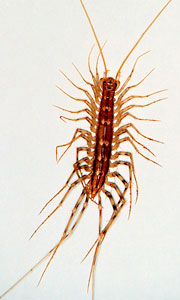
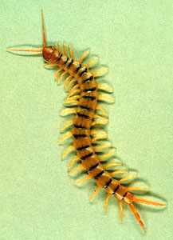
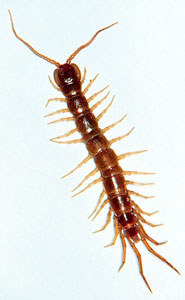

---
aliases:
- alisalap
- Aluhipan
- Alupihan
- Ambu'a
- Annipye
- Babakaur
- Centipede
- Centipedes
- Centpieduloj
- Chilopoda
- céadchosach
- Dodaqayaqlılar
- duizendpoten
- Enkelfotingar
- Farabadne
- Giâ-kang
- Halilipan
- Hundertfüsser
- Hundertfüßer
- Hunertbianer
- Háestôheóhtáhe
- Juoksujalkaiset
- Jááłánii
- Kasipa
- Klabang
- Laipan
- Lelipan
- lemayar
- lipan
- Lūpakojai
- Makonon kafa
- Margfætlur
- Molokau
- Njëqindkëmbëshi
- Pachakchaki
- Pareczniki
- Petlazolcoatl
- Quilòpode
- Quilòpodes
- Quilópode
- Quilópodos
- rết
- Sadajalgsed
- Simtkāji
- Sipndangj
- Skolopender
- skolopenderar
- skolopendere
- stonožky
- Stonôžky
- Strige
- százlábúak
- Tandu
- Tangkalamai
- tiɣirdemt yizgaren
- Trambo
- Çıyanlar
- È̤ng-ĕ̤ng
- Ńg-kûng-chhùng
- Σαρανταποδαρούσα
- аьнхъа
- Губаногія
- губоногі
- губоногие
- лабпойҳо
- стоногалка
- стоножки
- Эринбуттар
- נדלים
- دوداقایاقلیلار
- صدپایان
- لبپایان
- مئويات الأقدام
- مئويات الاقدام
- کن ہپِنؠ
- ھەزارپێ
- खजुरो
- गोजर
- न्ह्य्बि
- বিছে
- ਕੰਨਖਜੂਰਾ
- பூரான்
- శతపది
- ಜರಿ
- പഴുതാര
- ตะขาบ
- རྟ་བླ།
- ကင်းခြေများ
- မႅင်းၸလၢင်း
- ტუჩფეხიანები
- ᡤᠠᠰᡥᠠᠨ ᡠᠮᡳᠶᠠᡥᠠ
- ムカデ
- 百足
- 蜈蚣
- 순각류
has_id_wikidata: Q43447
title: Chilopoda
described_by_source:
- '[[_Standards/WikiData/WD~Encyclopædia_Britannica_11th_edition,867541]]'
- '[[_Standards/WikiData/WD~Gujin_Tushu_Jicheng,1768721]]'
topic_s_main_category: '[[_Standards/WikiData/WD~Q8919754,8919754]]'
instance_of: '[[_Standards/WikiData/WD~taxon,16521]]'
parent_taxon: '[[_Standards/WikiData/WD~Myriapoda,25823]]'
taxon_rank: '[[_Standards/WikiData/WD~class,37517]]'
ITIS_TSN: 154400
montage_image: http://commons.wikimedia.org/wiki/Special:FilePath/Chilopoda%20collage.png
image: http://commons.wikimedia.org/wiki/Special:FilePath/Lithobius%20forficatus.jpg
Commons_category: Chilopoda
taxon_name: Chilopoda
exact_match: http://wordnet-rdf.princeton.edu/wn30/01784675-n
EPPO_Code: 1CHILC
P8189: 987007284971805171
MeSH_tree_code: B01.050.500.131.266
Wolfram_Language_entity_code: Entity["Concept", "Chilopoda::gvyd6"]
taxon_common_name:
- Губаногія
- বিছে
- Quilòpodes
- stonožky
- Skolopender
- Hundertfüßer
- Σαρανταποδαρούσα
- Centipedes
- Centpieduloj
- Sadajalgsed
- Chilopoda
- لبپایان
- Juoksujalkaiset
- ムカデ
- Klabang
- ტუჩფეხიანები
- 순각류
- skolopendere
start_time: -418000000-06
NBN_System_Key: NBNSYS0000159664
dv_has_:
  name_:
    ar: مئويات الأقدام
    arz: مئويات الاقدام
    ast: Chilopoda
    az: Dodaqayaqlılar
    azb: دوداقایاقلیلار
    ban: Lelipan
    be: губаногія
    be_tarask: губаногія
    bg: стоножки
    bjn: Halilipan
    bn: বিছে
    bo: རྟ་བླ།
    ca: Quilòpode
    cdo: È̤ng-ĕ̤ng
    ceb: Aluhipan
    chy: Háestôheóhtáhe
    ckb: ھەزارپێ
    cs: stonožky
    da: Skolopender
    de: Hundertfüßer
    de_ch: Hundertfüsser
    dtp: Tangkalamai
    el: Σαρανταποδαρούσα
    en: centipede
    eo: Centpieduloj
    es: Chilopoda
    et: Sadajalgsed
    eu: Chilopoda
    fa: صدپایان
    fi: juoksujalkaiset
    fr: Chilopoda
    frr: Hunertbianer
    ga: céadchosach
    gl: Quilópodos
    gn: Ambu'a
    guc: Kasipa
    ha: Makonon kafa
    hak: Ńg-kûng-chhùng
    he: נדלים
    hi: गोजर
    hr: Strige
    ht: Annipye
    hu: százlábúak
    ia: Chilopoda
    iba: lemayar
    id: Lipan
    io: Chilopoda
    is: Margfætlur
    it: Chilopoda
    ja: ムカデ
    jv: Klabang
    ka: ტუჩფეხიანები
    kab: tiɣirdemt yizgaren
    kn: ಜರಿ
    ko: 순각류
    ks: کن ہپِنؠ
    kw: Chilopoda
    ky: Эринбуттар
    la: Chilopoda
    lbe: аьнхъа
    lt: Lūpakojai
    lv: Simtkāji
    lzh: 蜈蚣
    mg: Trambo
    mk: стоногалка
    ml: പഴുതാര
    mnc: ᡤᠠᠰᡥᠠᠨ ᡠᠮᡳᠶᠠᡥᠠ
    ms: lipan
    mul: Chilopoda
    my: ကင်းခြေများ
    nah: Petlazolcoatl
    nan: Giâ-kang
    nb: skolopendere
    ne: खजुरो
    new: न्ह्य्बि
    nl: duizendpoten
    nn: skolopenderar
    nv: Jááłánii
    oc: Chilopoda
    pa: ਕੰਨਖਜੂਰਾ
    pam: Laipan
    pl: Pareczniki
    pt: Quilópode
    qu: Pachakchaki
    ro: Chilopoda
    ru: губоногие
    sco: centipede
    sh: Strige
    shn: မႅင်းၸလၢင်း
    sk: Stonôžky
    sl: Strige
    so: Farabadne
    sq: Njëqindkëmbëshi
    sr: Chilopoda
    su: Babakaur
    sv: Enkelfotingar
    sw: Tandu
    szy: alisalap
    ta: பூரான்
    te: శతపది
    tg: лабпойҳо
    th: ตะขาบ
    tl: Alupihan
    to: Molokau
    tr: Çıyanlar
    uk: губоногі
    vi: rết
    war: Chilopoda
    wuu: 蜈蚣
    yue: 百足
    za: Sipndangj
    zh: 蜈蚣
    zh_hans: 蜈蚣
    zh_hant: 蜈蚣
---

# [[Centipede]] 

#is_/same_as :: [[../../../../../../../WikiData/WD~Centipede,43447|WD~Centipede,43447]] 

Centipedes 
   

## #has_/text_of_/abstract 

> Centipedes (from Neo-Latin centi-, "hundred", and Latin pes, pedis, "foot") 
> are predatory arthropods belonging to the class **Chilopoda** 
> (Ancient Greek χεῖλος,  kheilos, "lip", and Neo-Latin suffix -poda, "foot", describing the forcipules) 
> of the subphylum Myriapoda, an arthropod group which includes millipedes and other multi-legged animals. Centipedes are elongated segmented (metameric) animals with one pair of legs per body segment. All centipedes are venomous and can inflict painful stings, injecting their venom through pincer-like appendages known as forcipules or toxicognaths, which are actually modified legs instead of fangs. Despite the name, no species of centipede has exactly 100 legs; the number of pairs of legs is an odd number that ranges from 15 pairs to 191 pairs.
>
> Centipedes are predominantly generalist carnivorous, hunting for a variety of prey items that can be overpowered. They have a wide geographical range, which can be found in terrestrial habitats from tropical rainforests to deserts. Within these habitats, centipedes require a moist microhabitat because they lack the waxy cuticle of insects and arachnids, causing them to rapidly lose water. Accordingly, they avoid direct sunlight by staying under cover or by being active at night.
>
> [Wikipedia](https://en.wikipedia.org/wiki/Centipede) 

## Phylogeny 

-   « Ancestral Groups  
    -  [Arthropoda](../../Arthropoda.md) 
    -  [Bilateria](../../../Bilateria.md) 
    -  [Animals](../../../../Animals.md) 
    -  [Eukarya](../../../../../Eukarya.md) 
    -   [Tree of Life](../../../../../Tree_of_Life.md)

-   ◊ Sibling Groups of  Arthropoda
    -  [Hexapoda](../Hexapoda.md) 
    -  [Crustacea](../Crustacea.md) 
    -  [Pauropoda](Pauropoda.md) 
    -  [Diplopoda](Diplopoda.md) 
    -   Chilopoda
    -  [Symphyla](Symphyla.md) 
    -  [Arachnida](../Chelicerata/Arachnida.md) 
    -   [[Sea_Scorpion](../Chelicerata/Sea_Scorpion.md)    -   [Horseshoe_Crab](../Chelicerata/Horseshoe_Crab.md)
    -   [Sea_Spider](../Chelicerata/Sea_Spider.md)
    -  [Trilobites](../Trilobites.md) 

-   » Sub-Groups
    -   [Scutigeromorpha](Scutigeromorpha)
    -  [Geophilomorpha](Centipede/Geophilomorpha.md) 
    -  [Scolopendromorpha](Centipede/Scolopendromorpha.md) 

### Information on the Internet

-   [Centipedes](http://www.austmus.gov.au/invertebrates/other/index.htm) Greg Edgecombe, Australian Museum online. 
    Projects:
    -   [Evolution of centipedes based on morphology and molecular         sequence         data](http://www.austmus.gov.au/invertebrates/other/project1.htm)
    -   [Evolutionary history of         Lithobiomorpha](http://www.austmus.gov.au/invertebrates/other/project2.htm)
    -   [Systematics of Australian         Henicopidae](http://www.austmus.gov.au/invertebrates/other/project3.htm)
-   [Centre International de     Myriapodologie](http://www.mnhn.fr/assoc/myriapoda/INDEX.HTM)  International Society of Myriapodology and Onychophorology.

## Title Illustrations

------------------------------------------------------------------------------------ 
 
scientific_name ::  Scutigera coleoptrata
Comments          House centipede, Notostigmophora
copyright ::         © [Department of Entomology, University of Nebraska-Lincoln](http://entomology.unl.edu/) 

------------------------------------------------------------------------------------ 
 
scientific_name ::  Scolopendra
Comments          Desert centipede, Scolopendromorpha
copyright ::         © [Department of Entomology, University of Nebraska-Lincoln](http://entomology.unl.edu/) 

------------------------------------------------------------------------------------ 
 
scientific_name ::  Lithobius forficatus
Comments          Garden centipede, Lithobiidae
copyright ::         © [Department of Entomology, University of Nebraska-Lincoln](http://entomology.unl.edu/) 

## Confidential Links & Embeds: 

### #is_/same_as :: [[/_Standards/bio/bio~Domain/Eukarya/Animal/Bilateria/Arthropoda/Myriapoda/Centipede|Centipede]] 

### #is_/same_as :: [[/_public/bio/bio~Domain/Eukarya/Animal/Bilateria/Arthropoda/Myriapoda/Centipede.public|Centipede.public]] 

### #is_/same_as :: [[/_internal/bio/bio~Domain/Eukarya/Animal/Bilateria/Arthropoda/Myriapoda/Centipede.internal|Centipede.internal]] 

### #is_/same_as :: [[/_protect/bio/bio~Domain/Eukarya/Animal/Bilateria/Arthropoda/Myriapoda/Centipede.protect|Centipede.protect]] 

### #is_/same_as :: [[/_private/bio/bio~Domain/Eukarya/Animal/Bilateria/Arthropoda/Myriapoda/Centipede.private|Centipede.private]] 

### #is_/same_as :: [[/_personal/bio/bio~Domain/Eukarya/Animal/Bilateria/Arthropoda/Myriapoda/Centipede.personal|Centipede.personal]] 

### #is_/same_as :: [[/_secret/bio/bio~Domain/Eukarya/Animal/Bilateria/Arthropoda/Myriapoda/Centipede.secret|Centipede.secret]] 

