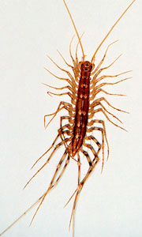
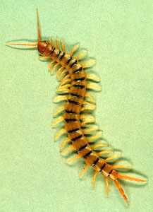
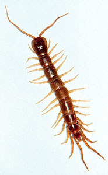

---
aliases:
- Chilopoda
- Centipede
title: Chilopoda
---

## Phylogeny 

-   « Ancestral Groups  
    -  [Arthropoda](../../Arthropoda.md))
    -  [Bilateria](../../../Bilateria.md))
    -  [Animals](../../../../Animals.md))
    -  [Eukarya](../../../../../Eukarya.md))
    -   [Tree of Life](../../../../../Tree_of_Life.md)

-   ◊ Sibling Groups of  Arthropoda
    -  [Hexapoda](../Hexapoda.md))
    -  [Crustacea](../Crustacea.md))
    -  [Pauropoda](Pauropoda.md))
    -  [Diplopoda](Diplopoda.md))
    -   Chilopoda
    -  [Symphyla](Symphyla.md))
    -  [Arachnida](../Chelicerata/Arachnida.md))
    -   [[Sea_Scorpion](../Chelicerata/Sea_Scorpion.md)    -   [Horseshoe_Crab](../Chelicerata/Horseshoe_Crab.md)
    -   [Sea_Spider](../Chelicerata/Sea_Spider.md)
    -  [Trilobites](../Trilobites.md))

-   » Sub-Groups
    -   [Scutigeromorpha](Scutigeromorpha)
    -  [Geophilomorpha](Chilopoda/Geophilomorpha.md))
    -  [Scolopendromorpha](Chilopoda/Scolopendromorpha.md))

# [[Chilopoda]] 

Centipedes 
) ) ) 

## #has_/text_of_/abstract 

> Centipedes (from Neo-Latin centi-, "hundred", and Latin pes, pedis, "foot") 
> are predatory arthropods belonging to the class **Chilopoda** 
> (Ancient Greek χεῖλος,  kheilos, "lip", and Neo-Latin suffix -poda, "foot", describing the forcipules) 
> of the subphylum Myriapoda, an arthropod group which includes millipedes and other multi-legged animals. Centipedes are elongated segmented (metameric) animals with one pair of legs per body segment. All centipedes are venomous and can inflict painful stings, injecting their venom through pincer-like appendages known as forcipules or toxicognaths, which are actually modified legs instead of fangs. Despite the name, no species of centipede has exactly 100 legs; the number of pairs of legs is an odd number that ranges from 15 pairs to 191 pairs.
>
> Centipedes are predominantly generalist carnivorous, hunting for a variety of prey items that can be overpowered. They have a wide geographical range, which can be found in terrestrial habitats from tropical rainforests to deserts. Within these habitats, centipedes require a moist microhabitat because they lack the waxy cuticle of insects and arachnids, causing them to rapidly lose water. Accordingly, they avoid direct sunlight by staying under cover or by being active at night.
>
> [Wikipedia](https://en.wikipedia.org/wiki/Centipede)

### Information on the Internet

-   [Centipedes](http://www.austmus.gov.au/invertebrates/other/index.htm) Greg Edgecombe, Australian Museum online. 
    Projects:
    -   [Evolution of centipedes based on morphology and molecular         sequence         data](http://www.austmus.gov.au/invertebrates/other/project1.htm)
    -   [Evolutionary history of         Lithobiomorpha](http://www.austmus.gov.au/invertebrates/other/project2.htm)
    -   [Systematics of Australian         Henicopidae](http://www.austmus.gov.au/invertebrates/other/project3.htm)
-   [Centre International de     Myriapodologie](http://www.mnhn.fr/assoc/myriapoda/INDEX.HTM)  International Society of Myriapodology and Onychophorology.

## Title Illustrations

------------------------------------------------------------------------------------)
Scientific Name ::  Scutigera coleoptrata
Comments          House centipede, Notostigmophora
Copyright ::         © [Department of Entomology, University of Nebraska-Lincoln](http://entomology.unl.edu/) 

------------------------------------------------------------------------------------)
Scientific Name ::  Scolopendra
Comments          Desert centipede, Scolopendromorpha
Copyright ::         © [Department of Entomology, University of Nebraska-Lincoln](http://entomology.unl.edu/) 

------------------------------------------------------------------------------------)
Scientific Name ::  Lithobius forficatus
Comments          Garden centipede, Lithobiidae
Copyright ::         © [Department of Entomology, University of Nebraska-Lincoln](http://entomology.unl.edu/) 

## Confidential Links & Embeds: 

### #is_/same_as :: [Chilopoda](/_Standards/bio/bio~Domain/Eukarya/Animal/Bilateria/Arthropoda/Myriapoda/Chilopoda.md) 

### #is_/same_as :: [Chilopoda.public](/_public/bio/bio~Domain/Eukarya/Animal/Bilateria/Arthropoda/Myriapoda/Chilopoda.public.md) 

### #is_/same_as :: [Chilopoda.internal](/_internal/bio/bio~Domain/Eukarya/Animal/Bilateria/Arthropoda/Myriapoda/Chilopoda.internal.md) 

### #is_/same_as :: [Chilopoda.protect](/_protect/bio/bio~Domain/Eukarya/Animal/Bilateria/Arthropoda/Myriapoda/Chilopoda.protect.md) 

### #is_/same_as :: [Chilopoda.private](/_private/bio/bio~Domain/Eukarya/Animal/Bilateria/Arthropoda/Myriapoda/Chilopoda.private.md) 

### #is_/same_as :: [Chilopoda.personal](/_personal/bio/bio~Domain/Eukarya/Animal/Bilateria/Arthropoda/Myriapoda/Chilopoda.personal.md) 

### #is_/same_as :: [Chilopoda.secret](/_secret/bio/bio~Domain/Eukarya/Animal/Bilateria/Arthropoda/Myriapoda/Chilopoda.secret.md)

