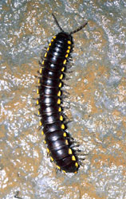
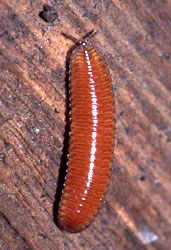
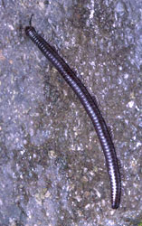

---
aliases:
  - Diplopoda
  - Millipedes
has_id_wikidata: Q167367
title: Diplopoda
described_by_source:
  - '[[_Standards/WikiData/WD~Encyclopædia_Britannica_11th_edition,867541]]'
  - '[[_Standards/WikiData/WD~Gujin_Tushu_Jicheng,1768721]]'
has_effect: '[[_Standards/WikiData/WD~millipede_burn,4331898]]'
said_to_be_the_same_as: '[[_Standards/WikiData/WD~millipede,11185669]]'
topic_has_template: '[[_Standards/WikiData/WD~Template_Millipedes,20367008]]'
start_time: -428000000-06
instance_of: '[[_Standards/WikiData/WD~taxon,16521]]'
parent_taxon: '[[_Standards/WikiData/WD~Myriapoda,25823]]'
taxon_rank: '[[_Standards/WikiData/WD~class,37517]]'
ITIS_TSN: 154409
image:
  - http://commons.wikimedia.org/wiki/Special:FilePath/Millipede.jpg
  - http://commons.wikimedia.org/wiki/Special:FilePath/Millipede%20coiled%20on%20the%20ground.jpg
video: http://commons.wikimedia.org/wiki/Special:FilePath/Millipede%20of%20Salem.ogv
EPPO_Code: 1DIPLC
Commons_gallery: Diplopoda
Commons_category: Diplopoda
taxon_name: Diplopoda
Wolfram_Language_entity_code: Entity["Concept", "ClassDiplopoda::s5463"]
taxon_common_name: Millipedes
NBN_System_Key: NBNSYS0000159868
---

# [[Diplopoda]] 

#is_/same_as :: [[../../../../../../../WikiData/WD~Diplopoda,167367|WD~Diplopoda,167367]] 

## Phylogeny 

-   « Ancestral Groups  
    -  [Arthropoda](../../Arthropoda.md) 
    -  [Bilateria](../../../Bilateria.md) 
    -  [Animals](../../../../Animals.md) 
    -  [Eukarya](../../../../../Eukarya.md) 
    -   [Tree of Life](../../../../../Tree_of_Life.md)

-   ◊ Sibling Groups of  Arthropoda
    -  [Hexapoda](../Hexapoda.md) 
    -  [Crustacea](../Crustacea.md) 
    -  [Pauropoda](Pauropoda.md) 
    -   Diplopoda
    -  [Centipede](Centipede.md) 
    -  [Symphyla](Symphyla.md) 
    -  [Arachnida](../Chelicerata/Arachnida.md) 
    -   [[Sea_Scorpion](../Chelicerata/Sea_Scorpion.md)    -   [Horseshoe_Crab](../Chelicerata/Horseshoe_Crab.md)
    -   [Sea_Spider](../Chelicerata/Sea_Spider.md)
    -  [Trilobites](../Trilobites.md) 

-   » Sub-Groups
    -   [Polyxenida](Polyxenida)
    -   [Glomeridesmus](Glomeridesmus)
    -  [Sphaerotheriida](Diplopoda/Sphaerotheriida.md) 
    -  [Glomerida](Diplopoda/Glomerida.md) 
    -   [Siphoniulus neotropicus](Siphoniulus_neotropicus)
    -  [Platydesmida](Diplopoda/Platydesmida.md) 
    -  [Siphonophorida](Diplopoda/Siphonophorida.md) 
    -  [Polyzoniida](Diplopoda/Polyzoniida.md) 
    -  [Stemmiulida](Diplopoda/Stemmiulida.md) 
    -  [Callipodida](Diplopoda/Callipodida.md) 
    -  [Chordeumatida](Diplopoda/Chordeumatida.md) 
    -  [Julida](Diplopoda/Julida.md) 
    -  [Spirobolida](Diplopoda/Spirobolida.md) 
    -  [Spirostreptida](Diplopoda/Spirostreptida.md) 
    -   [Polydesmida](Polydesmida)

# [[Diplopoda]]

Millipedes 

   ) 

## #has_/text_of_/abstract 

> Millipedes (originating from the Latin mille, "thousand", and pes, "foot") 
> are a group of arthropods that are characterised by having 
> two pairs of jointed legs on most body segments; 
> 
> they are known scientifically as the class **Diplopoda**, the name derived from this feature. 
> 
> Each double-legged segment is a result of two single segments fused together. Most millipedes have very elongated cylindrical or flattened bodies with more than 20 segments, while pill millipedes are shorter and can roll into a tight ball. Although the name "millipede" derives from Latin for "thousand feet", no species was known to have 1,000 or more until the discovery in 2020 of Eumillipes persephone, which can have over 1,300 legs. There are approximately 12,000 named species classified into 16 orders and around 140 families, making Diplopoda the largest class of myriapods, an arthropod group which also includes centipedes and other multi-legged creatures.
>
> Most millipedes are slow-moving detritivores, eating decaying leaves and other dead plant matter; however, some eat fungi or drink plant fluid. Millipedes are generally harmless to humans, although some can become household or garden pests. Millipedes can be an unwanted nuisance particularly in greenhouses where they can potentially cause severe damage to emergent seedlings. Most millipedes defend themselves with a variety of chemicals secreted from pores along the body, although the tiny bristle millipedes are covered with tufts of detachable bristles. Its primary defence mechanism is to curl into a tight coil, thereby protecting its legs and other vital delicate areas on the body behind a hard exoskeleton. Reproduction in most species is carried out by modified male legs called gonopods, which transfer packets of sperm to females.
>
> First appearing in the Silurian period, millipedes are some of the oldest known land animals. Some members of prehistoric groups, such as Arthropleura, grew to over 2 m (6+1⁄2 ft); the largest modern species reach maximum lengths of 27 to 38 cm (10+1⁄2 to 15 in). The longest extant species is the giant African millipede (Archispirostreptus gigas).
>
> Among myriapods, millipedes have traditionally been considered most closely related to the tiny pauropods, although some molecular studies challenge this relationship. Millipedes can be distinguished from the somewhat similar but only distantly related centipedes (class Chilopoda), which move rapidly, are venomous, carnivorous, and have only a single pair of legs on each body segment. 
>
> The scientific study of millipedes is known as diplopodology, and a scientist who studies them is called a diplopodologist.
>
> [Wikipedia](https://en.wikipedia.org/wiki/Millipede) 

### Information on the Internet

-   [Milli-PEET](http://www.fmnh.org/research_collections/zoology/zoo_sites/millipeet/home.html).
    Taxonomy, Systematics and Evolution of the Diplopoda.
-   [Centre International de     Myriapodologie](http://www.mnhn.fr/assoc/myriapoda/INDEX.HTM).
    International Society of Myriapodology and Onychophorology.
-   [Herper.com\'s Millipede     Pages](http://www.herper.com/myriapods/millipedes.html).

## Title Illustrations

---------------------
 
Scientific Name ::     Harpaphe haydeniana
Location ::           Kings Valley, Benton County (Oregon, US)
Comments             Flat-backed millipede
Specimen Condition   Live Specimen
Source Collection    [CalPhotos](http://calphotos.berkeley.edu/)
Copyright ::            © 2000 [William Leonard](mailto:mollusca1@attbi.com)

---------------------

Scientific Name ::     Octoglena anura
Location ::           Kennedy Creek, Mason County (Washington, US)
Specimen Condition   Live Specimen
Source Collection    [CalPhotos](http://calphotos.berkeley.edu/)
Copyright ::            © 2000 [William Leonard](mailto:mollusca1@attbi.com)

--------------------- 
 
Scientific Name ::     Californiulus euphanus
Location ::           Catherine Creek, Klickitat County (Washington, US)
Specimen Condition   Live Specimen
Source Collection    [CalPhotos](http://calphotos.berkeley.edu/)
Copyright ::            © 1999 [William Leonard](mailto:mollusca1@attbi.com)

## Confidential Links & Embeds: 

### #is_/same_as :: [[/_Standards/bio/bio~Domain/Eukarya/Animal/Bilateria/Arthropoda/Myriapoda/Diplopoda|Diplopoda]] 

### #is_/same_as :: [[/_public/bio/bio~Domain/Eukarya/Animal/Bilateria/Arthropoda/Myriapoda/Diplopoda.public|Diplopoda.public]] 

### #is_/same_as :: [[/_internal/bio/bio~Domain/Eukarya/Animal/Bilateria/Arthropoda/Myriapoda/Diplopoda.internal|Diplopoda.internal]] 

### #is_/same_as :: [[/_protect/bio/bio~Domain/Eukarya/Animal/Bilateria/Arthropoda/Myriapoda/Diplopoda.protect|Diplopoda.protect]] 

### #is_/same_as :: [[/_private/bio/bio~Domain/Eukarya/Animal/Bilateria/Arthropoda/Myriapoda/Diplopoda.private|Diplopoda.private]] 

### #is_/same_as :: [[/_personal/bio/bio~Domain/Eukarya/Animal/Bilateria/Arthropoda/Myriapoda/Diplopoda.personal|Diplopoda.personal]] 

### #is_/same_as :: [[/_secret/bio/bio~Domain/Eukarya/Animal/Bilateria/Arthropoda/Myriapoda/Diplopoda.secret|Diplopoda.secret]] 

