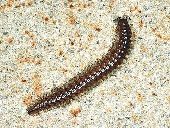

---
aliases:
- Chordeumatida
- Cordeumàtides
- sausage millipedes
- Vinterdubbelfotingar
- нитеносцы
- عصبية الظهر
- 微型馬陸目
- 索马陆目
title: Chordeumatida
has_id_wikidata: Q4300743
dv_has_:
  name_:
    an: Chordeumatida
    ar: عصبية الظهر
    arz: عصبية الظهر
    ast: Chordeumatida
    bg: Chordeumatida
    ca: Cordeumàtides
    ceb: Chordeumatida
    de: Chordeumatida
    en: Chordeumatida
    eo: Chordeumatida
    es: Chordeumatida
    eu: Chordeumatida
    ext: Chordeumatida
    fi: Chordeumatida
    fr: Chordeumatida
    ga: Chordeumatida
    gl: Chordeumatida
    ia: Chordeumatida
    ie: Chordeumatida
    io: Chordeumatida
    it: Chordeumatida
    la: Chordeumatida
    mul: Chordeumatida
    nl: Chordeumatida
    oc: Chordeumatida
    pl: Chordeumatida
    pt: Chordeumatida
    pt_br: Chordeumatida
    ro: Chordeumatida
    ru: нитеносцы
    sq: Chordeumatida
    sv: Vinterdubbelfotingar
    tr: Chordeumatida
    uk: Chordeumatida
    vi: Chordeumatida
    vo: Chordeumatida
    war: Chordeumatida
    zh: 索马陆目
    zh_cn: 索马陆目
    zh_hans: 索马陆目
    zh_tw: 微型馬陸目
---
# [[Chordeumatida]] 

## #has_/text_of_/abstract 

> **Chordeumatida** (from the Greek word for "sausage") 
> is a large order of millipedes containing more than 1,400 species.  
> 
> Also known as sausage millipedes, they are found nearly worldwide. 
> 
> Chordeumatida is the largest order in the superorder Nematophora, 
> a group also known as spinning millipedes 
> because their telsons feature spinnerets used to build nests of silk. 
> 
> These millipedes produce this silk to create chambers in which to molt or to lay their eggs.
>
> [Wikipedia](https://en.wikipedia.org/wiki/Chordeumatida) 

## Phylogeny 

-   « Ancestral Groups  
    -  [Diplopoda](../Diplopoda.md) 
    -  [Arthropoda](../../../Arthropoda.md) 
    -  [Bilateria](../../../../Bilateria.md) 
    -  [Animals](../../../../../Animals.md) 
    -  [Eukarya](../../../../../../Eukarya.md) 
    -   [Tree of Life](../../../../../../Tree_of_Life.md)

-   ◊ Sibling Groups of  Diplopoda
    -   [Polyxenida](Polyxenida)
    -   [Glomeridesmus](Glomeridesmus)
    -  [Sphaerotheriida](Sphaerotheriida.md) 
    -  [Glomerida](Glomerida.md) 
    -   [Siphoniulus neotropicus](Siphoniulus_neotropicus)
    -  [Platydesmida](Platydesmida.md) 
    -  [Siphonophorida](Siphonophorida.md) 
    -  [Polyzoniida](Polyzoniida.md) 
    -  [Stemmiulida](Stemmiulida.md) 
    -  [Callipodida](Callipodida.md) 
    -   Chordeumatida
    -  [Julida](Julida.md) 
    -  [Spirobolida](Spirobolida.md) 
    -  [Spirostreptida](Spirostreptida.md) 
    -   [Polydesmida](Polydesmida)

-   » Sub-Groups 

	-   *Adritylidae*
	-   *Altajellidae*
	-   *Anthroleucosomatidae*
	-   *Apterouridae*
	-   *Attemsiidae*
	-   *Biokoviellidae*
	-   *Brachychaeteumatidae*
	-   *Branneriidae*
	-   *Caseyidae*
	-   *Chaemosomatidae*
	-   *Chordeumatidae*
	-   *Cleidogonidae*
	-   *Conotylidae*
	-   *Craspedosomatidae*
	-   *Diplomaragnidae*
	-   *Entomobielziidae*
	-   *Eudigonidae*
	-   *Faginidae*
	-   *Golovatchiidae*
	-   *Haaseidae*
	-   *Haasiidae*
	-   *Haplobainosomatidae*
	-   *Heterochordeumatidae*
	-   *Heterolatzeliidae*
	-   *Hoffmaneumatidae*
	-   *Kashmireumatidae*
	-   *Lankasomatidae*
	-   *Lusitaniosomatidae*
	-   *Macrochaeteumatidae*
	-   *Mastigophorophyllidae*
	-   *Megalotylidae*
	-   *Metopidiotrichidae*
	-   *Neoatractosomatidae*
	-   *Niponiosomatidae*
	-   *Opisthocheiridae*
	-   *Origmatogonidae*
	-   *Peterjohionsiidae*
	-   *Pygmaeosomatidae*
	-   *Rhiscosomididae*
	-   *Speophilosomatidae*
	-   *Striariidae*
	-   *Tingupidae*
	-   *Trachygonidae*
	-   *Trichopetalidae*
	-   *Urochordeumatidae*
	-   *Vandeleumatidae*
	-   *Verhoeffiidae*

## Title Illustrations

----------------------------------------------------------------------------
 
scientific_name ::     Diplopoda:Nematophora: Polymicrodon polydesmoides
location ::           Castel d'Aiano, Bologna Province, Emilia Romagna, Italy
specimen_condition ::  Live Specimen
Image Use ::    [Attribution-NonCommercial 2.0 Creative Commons License](http://creativecommons.org/licenses/by-nc/2.0/).
copyright ::            © 2005 [Cesare Brizio](http://xoomer.virgilio.it/cebrizio/) 

## Confidential Links & Embeds: 

### #is_/same_as :: [[/_Standards/bio/bio~Domain/Eukarya/Animal/Bilateria/Arthropoda/Myriapoda/Diplopoda/Chordeumatida|Chordeumatida]] 

### #is_/same_as :: [[/_public/bio/bio~Domain/Eukarya/Animal/Bilateria/Arthropoda/Myriapoda/Diplopoda/Chordeumatida.public|Chordeumatida.public]] 

### #is_/same_as :: [[/_internal/bio/bio~Domain/Eukarya/Animal/Bilateria/Arthropoda/Myriapoda/Diplopoda/Chordeumatida.internal|Chordeumatida.internal]] 

### #is_/same_as :: [[/_protect/bio/bio~Domain/Eukarya/Animal/Bilateria/Arthropoda/Myriapoda/Diplopoda/Chordeumatida.protect|Chordeumatida.protect]] 

### #is_/same_as :: [[/_private/bio/bio~Domain/Eukarya/Animal/Bilateria/Arthropoda/Myriapoda/Diplopoda/Chordeumatida.private|Chordeumatida.private]] 

### #is_/same_as :: [[/_personal/bio/bio~Domain/Eukarya/Animal/Bilateria/Arthropoda/Myriapoda/Diplopoda/Chordeumatida.personal|Chordeumatida.personal]] 

### #is_/same_as :: [[/_secret/bio/bio~Domain/Eukarya/Animal/Bilateria/Arthropoda/Myriapoda/Diplopoda/Chordeumatida.secret|Chordeumatida.secret]] 

