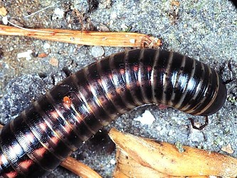

---
aliases:
- Cylinderdubbelfotingar
- da᷆rnákàytà
- Iule
- Julida
- Júlides
- Krocionogi właściwe
- Sarı qırxayaqlar
- Schnurfüßer
- vaspondrók
- кіўсякі
- ківсяки
- кивсяки
- 姬馬陸目
- 蛩目
title: Julida
has_id_wikidata: Q2663101
dv_has_:
  name_:
    an: Julida
    ast: Julida
    az: Sarı qırxayaqlar
    be: кіўсякі
    be_tarask: кіўсякі
    bg: Julida
    ca: Júlides
    ceb: Julida
    cs: Julida
    de: Schnurfüßer
    el: Julida
    en: Julida
    eo: Julida
    es: Julida
    eu: Julida
    ext: Julida
    fi: Julida
    fr: Julida
    ga: Julida
    gl: Julida
    hu: vaspondrók
    ia: Julida
    id: Julida
    ie: Julida
    io: Julida
    it: Julida
    la: Julida
    mcn: da᷆rnákàytà
    mul: Julida
    nl: Julida
    oc: Julida
    pcd: Iule
    pl: Krocionogi właściwe
    pt: Julida
    pt_br: Julida
    ro: Julida
    ru: кивсяки
    sq: Julida
    sv: Cylinderdubbelfotingar
    tr: Julida
    uk: ківсяки
    vi: Julida
    vo: Julida
    war: Julida
    zh: 蛩目
    zh_cn: 蛩目
    zh_hans: 蛩目
    zh_tw: 姬馬陸目
---
# [[Julida]]  

 

## #has_/text_of_/abstract 

> **Julida** is an order of millipedes. 
> 
> Members are mostly small and cylindrical, 
> typically ranging from 10–120 millimetres (0.39–4.72 in) in length. 
> 
> Eyes may be present or absent, and in mature males of many species, 
> the first pair of legs is modified into hook-like structures. 
> 
> Additionally, both pairs of legs on the 7th body segment of males 
> are modified into gonopods.
>
> [Wikipedia](https://en.wikipedia.org/wiki/Julida) 

## Phylogeny 

-   « Ancestral Groups  
    -  [Diplopoda](../Diplopoda.md) 
    -  [Arthropoda](../../../Arthropoda.md) 
    -  [Bilateria](../../../../Bilateria.md) 
    -  [Animals](../../../../../Animals.md) 
    -  [Eukarya](../../../../../../Eukarya.md) 
    -   [Tree of Life](../../../../../../Tree_of_Life.md)

-   ◊ Sibling Groups of  Diplopoda
    -   [Polyxenida](Polyxenida)
    -   [Glomeridesmus](Glomeridesmus)
    -  [Sphaerotheriida](Sphaerotheriida.md) 
    -  [Glomerida](Glomerida.md) 
    -   [Siphoniulus neotropicus](Siphoniulus_neotropicus)
    -  [Platydesmida](Platydesmida.md) 
    -  [Siphonophorida](Siphonophorida.md) 
    -  [Polyzoniida](Polyzoniida.md) 
    -  [Stemmiulida](Stemmiulida.md) 
    -  [Callipodida](Callipodida.md) 
    -  [Chordeumatida](Chordeumatida.md) 
    -   Julida
    -  [Spirobolida](Spirobolida.md) 
    -  [Spirostreptida](Spirostreptida.md) 
    -   [Polydesmida](Polydesmida)

-   » Sub-Groups 

	-   *Aprosphylosomatidae*
	-   *Blaniulidae*
	-   *Chelojulidae*
	-   *Galliobatidae*
	-   *Julidae*
	-   *Mongoliulidae*
	-   *Nemasomatidae*
	-   *Nematozoniidae*
	-   *Okeanobatidae*
	-   *Paeromopodidae*
	-   *Parajulidae*
	-   *Pseudonemasomatidae*
	-   *Rhopaloiulidae*
	-   *Telsonemasomatidae*
	-   *Trichoblaniulidae*
	-   *Trichonemasomatidae*
	-   *Zosteractinidae*

## Title Illustrations

----------------------------------------------------------------------------

scientific_name ::     Diplopoda:Juliformia:Julidae: Schizophyllum sabulosum
location ::           "Corno alle Scale" Park, Bologna Province, Emilia Romagna, Italy
specimen_condition ::  Live Specimen
Image Use ::    [Attribution-NonCommercial 2.0 Creative Commons License](http://creativecommons.org/licenses/by-nc/2.0/).
copyright ::            © 2005 [Cesare Brizio](http://xoomer.virgilio.it/cebrizio/) 

## Confidential Links & Embeds: 

### #is_/same_as :: [[/_Standards/bio/bio~Domain/Eukarya/Animal/Bilateria/Arthropoda/Myriapoda/Diplopoda/Julida|Julida]] 

### #is_/same_as :: [[/_public/bio/bio~Domain/Eukarya/Animal/Bilateria/Arthropoda/Myriapoda/Diplopoda/Julida.public|Julida.public]] 

### #is_/same_as :: [[/_internal/bio/bio~Domain/Eukarya/Animal/Bilateria/Arthropoda/Myriapoda/Diplopoda/Julida.internal|Julida.internal]] 

### #is_/same_as :: [[/_protect/bio/bio~Domain/Eukarya/Animal/Bilateria/Arthropoda/Myriapoda/Diplopoda/Julida.protect|Julida.protect]] 

### #is_/same_as :: [[/_private/bio/bio~Domain/Eukarya/Animal/Bilateria/Arthropoda/Myriapoda/Diplopoda/Julida.private|Julida.private]] 

### #is_/same_as :: [[/_personal/bio/bio~Domain/Eukarya/Animal/Bilateria/Arthropoda/Myriapoda/Diplopoda/Julida.personal|Julida.personal]] 

### #is_/same_as :: [[/_secret/bio/bio~Domain/Eukarya/Animal/Bilateria/Arthropoda/Myriapoda/Diplopoda/Julida.secret|Julida.secret]] 

