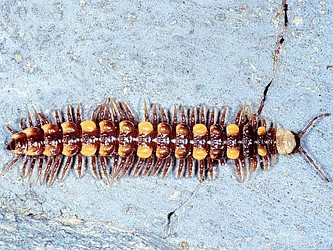

---
aliases:
- Banddubbelfotingar
- Bandfüßer
- Jááłánii biziiz łání
- Karimás ikerszelvényes-alakúak
- Merocheta
- ploske kačice
- Polidèsmides
- Polydesmida
- Çoxbağlılar
- многосвязы
- متعددة الأربطة
- متعددة الاربطه
- オビヤスデ目
- 多带马陆目
- 帶馬陸目
- 띠노래기목
title: Polydesmida
has_id_wikidata: Q282015
dv_has_:
  name_:
    an: Polydesmida
    ar: متعددة الأربطة
    arz: متعددة الاربطه
    ast: Polydesmida
    az: Çoxbağlılar
    bg: Polydesmida
    ca: Polidèsmides
    ceb: Polydesmida
    cs: Polydesmida
    de: Bandfüßer
    el: Polydesmida
    en: Polydesmida
    eo: Polydesmida
    es: Polydesmida
    eu: Polydesmida
    ext: Polydesmida
    fi: Polydesmida
    fr: Polydesmida
    ga: Polydesmida
    gl: Polydesmida
    hu: Karimás ikerszelvényes-alakúak
    ia: Polydesmida
    id: Polydesmida
    ie: Polydesmida
    io: Polydesmida
    it: Polydesmida
    ja: オビヤスデ目
    ko: 띠노래기목
    la: Polydesmida
    mul: Polydesmida
    nb: Polydesmida
    nl: Polydesmida
    nn: Polydesmida
    nv: Jááłánii biziiz łání
    oc: Polydesmida
    pl: Polydesmida
    pt: Polydesmida
    pt_br: Polydesmida
    ro: Polydesmida
    ru: многосвязы
    sl: ploske kačice
    sq: Polydesmida
    sv: Banddubbelfotingar
    tr: Polydesmida
    uk: Polydesmida
    vi: Polydesmida
    vo: Polydesmida
    war: Polydesmida
    zh: 多带马陆目
    zh_cn: 多带马陆目
    zh_hans: 多带马陆目
    zh_tw: 帶馬陸目
---

# [[Merocheta]]  

Polydesmida 

 

## #has_/text_of_/abstract 

> **Polydesmida** (from the Greek poly "many" and desmos "bond") 
> is the largest order of millipedes, with more than 5,000 species, 
> including all the millipedes reported to produce hydrogen cyanide (HCN). 
> 
> This order is also the most diverse of the millipede orders in terms of morphology. 
> Millipedes in this order are found in all regions of the world other than Antarctica.
>
> [Wikipedia](https://en.wikipedia.org/wiki/Polydesmida) 

## Phylogeny 

-   « Ancestral Groups  
    -  [Diplopoda](../Diplopoda.md) 
    -  [Arthropoda](../../../Arthropoda.md) 
    -  [Bilateria](../../../../Bilateria.md) 
    -  [Animals](../../../../../Animals.md) 
    -  [Eukarya](../../../../../../Eukarya.md) 
    -   [Tree of Life](../../../../../../Tree_of_Life.md)

-   ◊ Sibling Groups of  Diplopoda
    -   [Polyxenida](Polyxenida)
    -   [Glomeridesmus](Glomeridesmus)
    -  [Sphaerotheriida](Sphaerotheriida.md) 
    -  [Glomerida](Glomerida.md) 
    -   [Siphoniulus neotropicus](Siphoniulus_neotropicus)
    -  [Platydesmida](Platydesmida.md) 
    -  [Siphonophorida](Siphonophorida.md) 
    -  [Polyzoniida](Polyzoniida.md) 
    -  [Stemmiulida](Stemmiulida.md) 
    -  [Callipodida](Callipodida.md) 
    -  [Chordeumatida](Chordeumatida.md) 
    -  [Julida](Julida.md) 
    -  [Spirobolida](Spirobolida.md) 
    -  [Spirostreptida](Spirostreptida.md) 
    -   Polydesmida

-   » Sub-Groups 

	-   *Ammodesmidae*
	-   *Aphelidesmidae*
	-   *Campodesmidae*
	-   *Chelodesmidae*
	-   *Cryptodesmidae*
	-   *Cyrtodesmidae*
	-   *Dalodesmidae*
	-   *Doratodesmidae*
	-   *Dorsoporidae*
	-   *Eurymerodesmidae*
	-   *Euryuridae*
	-   *Fuhrmannodesmidae*
	-   *Gomphodesmidae*
	-   *Haplodesmidae*
	-   *Holistophallidae*
	-   *Macrosternodesmidae*
	-   *Nearctodesmidae*
	-   *Oniscodesmidae*
	-   *Opisotretidae*
	-   *Oxydesmidae*
	-   *Paradoxosomatidae*
	-   *Platyrhacidae*
	-   *Polydesmidae*
	-   *Pygrodesmidae*
	-   *Rhachodesmidae*
	-   *Sphaeriodesmidae*
	-   *Trichopolydesmidae*
	-   *Tridontomidae*
	-   *Vaalogonopodidae*
	-   *Xystodesmidae*

## Title Illustrations

----------------------------------------------------------------------------

scientific_name ::     Diplopoda:Polydesmoidea:Polydesmidae: Brachydesmus superus
location ::           "Corno alle Scale" Park, Bologna Province, Emilia Romagna, Italy
specimen_condition ::  Live Specimen
Image Use ::    [Attribution-NonCommercial 2.0 Creative Commons License](http://creativecommons.org/licenses/by-nc/2.0/).
copyright ::            © 2005 [Cesare Brizio](http://xoomer.virgilio.it/cebrizio/) 

## Confidential Links & Embeds: 

### #is_/same_as :: [[/_Standards/bio/bio~Domain/Eukarya/Animal/Bilateria/Arthropoda/Myriapoda/Diplopoda/Merocheta|Merocheta]] 

### #is_/same_as :: [[/_public/bio/bio~Domain/Eukarya/Animal/Bilateria/Arthropoda/Myriapoda/Diplopoda/Merocheta.public|Merocheta.public]] 

### #is_/same_as :: [[/_internal/bio/bio~Domain/Eukarya/Animal/Bilateria/Arthropoda/Myriapoda/Diplopoda/Merocheta.internal|Merocheta.internal]] 

### #is_/same_as :: [[/_protect/bio/bio~Domain/Eukarya/Animal/Bilateria/Arthropoda/Myriapoda/Diplopoda/Merocheta.protect|Merocheta.protect]] 

### #is_/same_as :: [[/_private/bio/bio~Domain/Eukarya/Animal/Bilateria/Arthropoda/Myriapoda/Diplopoda/Merocheta.private|Merocheta.private]] 

### #is_/same_as :: [[/_personal/bio/bio~Domain/Eukarya/Animal/Bilateria/Arthropoda/Myriapoda/Diplopoda/Merocheta.personal|Merocheta.personal]] 

### #is_/same_as :: [[/_secret/bio/bio~Domain/Eukarya/Animal/Bilateria/Arthropoda/Myriapoda/Diplopoda/Merocheta.secret|Merocheta.secret]] 

