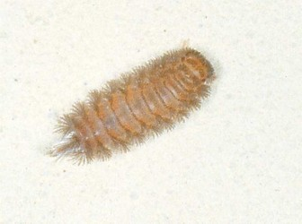

---
aliases:
- Jáálánii diʼilígíí
- Penicillata
- Penseldubbelfotingar
- Polyxenida
- Кистевики
- مخصلة
- フサヤスデ亜綱
- 多毛马陆目
- 毛馬陸目
- 털보노래기목
title: Polyxenida
has_id_wikidata: Q6449719
dv_has_:
  name_:
    ar: مخصلة
    ast: Polyxenida
    bg: Polyxenida
    ca: Polyxenida
    ceb: Polyxenida
    de: Polyxenida
    en: Polyxenida
    es: Polyxenida
    fi: Polyxenida
    fr: Polyxenida
    ga: Polyxenida
    it: Polyxenida
    ja: フサヤスデ亜綱
    ko: 털보노래기목
    la: Polyxenida
    mul: Polyxenida
    nl: Polyxenida
    nv: Jáálánii diʼilígíí
    pl: Polyxenida
    pt: Polyxenida
    ro: Polyxenida
    ru: Кистевики
    sq: Polyxenida
    sv: Penseldubbelfotingar
    tr: Polyxenida
    uk: Polyxenida
    vi: Polyxenida
    war: Polyxenida
    zh: 多毛马陆目
    zh_cn: 多毛马陆目
    zh_hans: 多毛马陆目
    zh_tw: 毛馬陸目
---
# [[Penicillata]]  

## [[Penicillata]] 

Polyxenida 

 

## #has_/text_of_/abstract 

> Polyxenida is an order of millipedes readily 
> distinguished by a unique body plan consisting of a soft, non-calcified body 
> ornamented with tufts of bristles. 
> 
> These features have inspired the common names bristly millipedes or pincushion millipedes. 
> This order includes about 148 species in four families worldwide, 
> which represent the only living members of the subclass **Penicillata**.
>
> [Wikipedia](https://en.wikipedia.org/wiki/Polyxenida) 

## Phylogeny 

-   « Ancestral Groups  
    -  [Diplopoda](../Diplopoda.md) 
    -  [Arthropoda](../../../Arthropoda.md) 
    -  [Bilateria](../../../../Bilateria.md) 
    -  [Animals](../../../../../Animals.md) 
    -  [Eukarya](../../../../../../Eukarya.md) 
    -   [Tree of Life](../../../../../../Tree_of_Life.md)

-   ◊ Sibling Groups of  Diplopoda
    -   Polyxenida
    -   [Glomeridesmus](Glomeridesmus)
    -  [Sphaerotheriida](Sphaerotheriida.md) 
    -  [Glomerida](Glomerida.md) 
    -   [Siphoniulus neotropicus](Siphoniulus_neotropicus)
    -  [Platydesmida](Platydesmida.md) 
    -  [Siphonophorida](Siphonophorida.md) 
    -  [Polyzoniida](Polyzoniida.md) 
    -  [Stemmiulida](Stemmiulida.md) 
    -  [Callipodida](Callipodida.md) 
    -  [Chordeumatida](Chordeumatida.md) 
    -  [Julida](Julida.md) 
    -  [Spirobolida](Spirobolida.md) 
    -  [Spirostreptida](Spirostreptida.md) 
    -   [Polydesmida](Polydesmida)

-   » Sub-Groups 

	-   *Hypogexenidae*
	-   *Lophoproctidae*
	-   *Polyxenidae*
	-   *Synxenidae*

## Title Illustrations

----------------------------------------------------------------------------

scientific_name ::     Diplopoda:Schizocephala:Polyxenidae: Polyxenus sp.
location ::           Marina di Pietrasanta, Lucca Province, Tuscany, Italy
specimen_condition ::  Live Specimen
Image Use ::    [Attribution-NonCommercial 2.0 Creative Commons License](http://creativecommons.org/licenses/by-nc/2.0/).
copyright ::            © 2005 [Cesare Brizio](http://xoomer.virgilio.it/cebrizio/) 

## Confidential Links & Embeds: 

### #is_/same_as :: [[/_Standards/bio/bio~Domain/Eukarya/Animal/Bilateria/Arthropoda/Myriapoda/Diplopoda/Penicillata|Penicillata]] 

### #is_/same_as :: [[/_public/bio/bio~Domain/Eukarya/Animal/Bilateria/Arthropoda/Myriapoda/Diplopoda/Penicillata.public|Penicillata.public]] 

### #is_/same_as :: [[/_internal/bio/bio~Domain/Eukarya/Animal/Bilateria/Arthropoda/Myriapoda/Diplopoda/Penicillata.internal|Penicillata.internal]] 

### #is_/same_as :: [[/_protect/bio/bio~Domain/Eukarya/Animal/Bilateria/Arthropoda/Myriapoda/Diplopoda/Penicillata.protect|Penicillata.protect]] 

### #is_/same_as :: [[/_private/bio/bio~Domain/Eukarya/Animal/Bilateria/Arthropoda/Myriapoda/Diplopoda/Penicillata.private|Penicillata.private]] 

### #is_/same_as :: [[/_personal/bio/bio~Domain/Eukarya/Animal/Bilateria/Arthropoda/Myriapoda/Diplopoda/Penicillata.personal|Penicillata.personal]] 

### #is_/same_as :: [[/_secret/bio/bio~Domain/Eukarya/Animal/Bilateria/Arthropoda/Myriapoda/Diplopoda/Penicillata.secret|Penicillata.secret]] 

