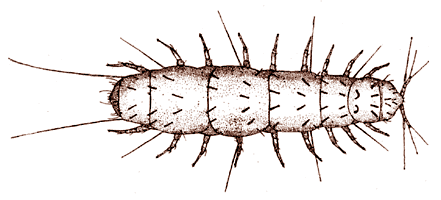

---
title: Pauropoda
---

# [[Pauropoda]] 

pauropods 

 

## #has_/text_of_/abstract 

> **Pauropoda** is a class of small, pale, millipede-like arthropods in the subphylum Myriapoda. 
> 
> More than 900 species in twelve families are found worldwide, living in soil and leaf mold. 
> 
> Pauropods look like centipedes or millipedes and may be a sister group of the latter, 
> but a close relationship with Symphyla has also been posited. 
> 
> The name Pauropoda derives from the Greek pauros (meaning "small" or "few") and pous, 
> genitive podos (meaning "foot"), 
> because most species in this class have only nine pairs of legs as adults, 
> a smaller number than those found among adults in any other class of myriapods.
>
> [Wikipedia](https://en.wikipedia.org/wiki/Pauropoda) 

### Information on the Internet

-   [Centre International de     Myriapodologie](http://www.mnhn.fr/assoc/myriapoda/INDEX.HTM).
    International Society of Myriapodology and Onychophorology.

## Introduction

Pauropods are small (less than 5 mm), pale, [terrestrial]
arthropods that are rarely encountered by the casual observer. 
Superficially they may resemble insects such as
[collembolans](tree?group=Collembola){target="_self"}
or
[psocopterans](tree?group=Psocoptera){target="_self"},
but adult pauropods have 11 (or sometimes 12) body segments and 9 (or
sometimes 10 or 11) pairs of legs.  They also possess unique forked
antennae (see figure below) and a distinctive locomotory pattern
characterized by rapid burst of movement and frequent abrupt changes in
direction.  Most pauropods lack eyes and a tracheal system.
){width="441"}

Habitus of a typical pauropod, *Pauropus huxleyi*. Note the unique
forked antennae. There are eleven body segments, and nine of the
segments feature a single pairs of legs. From above the apparent number
of segments is smaller since a few of the segments are partially fused
along the back.  Drawing after Lubbock from Dr. H. G. Bronns Klassen und
Ordnungen des Tierreichs. Fünfter Band. II. Abteilung. Gliederfüssler:
Arthropoda. 3. Buch: Symphyla und Pauropoda. Akademische
Verlagsgesellschaft m. b. H., Leipzig. 1934.

Pauropods can be found in soil, decaying wood, leaf litter, and other
moist places, where they feed on fungi and [decaying organic
matter].  Over 500 species of pauropods have been described so
far.\

## Phylogeny 

-   « Ancestral Groups  
    -  [Arthropoda](../../Arthropoda.md))
    -  [Bilateria](../../../Bilateria.md))
    -  [Animals](../../../../Animals.md))
    -  [Eukarya](../../../../../Eukarya.md))
    -   [Tree of Life](../../../../../Tree_of_Life.md)

-   ◊ Sibling Groups of  Arthropoda
    -  [Hexapoda](../Hexapoda.md))
    -  [Crustacea](../Crustacea.md))
    -   Pauropoda
    -  [Diplopoda](Diplopoda.md))
    -  [Chilopoda](Chilopoda.md))
    -  [Symphyla](Symphyla.md))
    -  [Arachnida](../Chelicerata/Arachnida.md))
    -   [[Sea_Scorpion](../Chelicerata/Sea_Scorpion.md)    -   [Horseshoe_Crab](../Chelicerata/Horseshoe_Crab.md)
    -   [Sea_Spider](../Chelicerata/Sea_Spider.md)
    -  [Trilobites](../Trilobites.md))

-   » Sub-Groups
    -  [Millotauropodidae](Pauropoda/Millotauropodidae.md))
    -  [Pauropodidae](Pauropoda/Pauropodidae.md))
    -  [Brachypauropodidae](Pauropoda/Brachypauropodidae.md))
    -   [Afrauropus occiduus](Afrauropus_occiduus)
    -  [Eurypauropodidae](Pauropoda/Eurypauropodidae.md))

	-   [Millotauropodidae](Pauropoda/Millotauropodidae.md "go to ToL page"))*
	-   [Pauropodidae](Pauropoda/Pauropodidae.md "go to ToL page"))*
	-   [Brachypauropodidae](Pauropoda/Brachypauropodidae.md "go to ToL page"))*
	-   *[Afrauropodidae](Afrauropus_occiduus)*
	-   [Eurypauropodidae](Pauropoda/Eurypauropodidae.md "go to ToL page"))*

## Title Illustrations

---------------------------------------------------------------------------)
Scientific Name ::     Pauropoda
Location ::           USA: North Carolina: Eno River State Park
Specimen Condition   Live Specimen
Copyright ::            © 2004 [David R. Maddison](http://david.bembidion.org/) 

## Confidential Links & Embeds: 

### #is_/same_as ::[Pauropoda](Pauropoda.md)) 

### #is_/same_as :: [Pauropoda.public](/_public/bio/bio~Domain/Eukarya/Animal/Bilateria/Arthropoda/Myriapoda/Pauropoda.public.md) 

### #is_/same_as :: [Pauropoda.internal](/_internal/bio/bio~Domain/Eukarya/Animal/Bilateria/Arthropoda/Myriapoda/Pauropoda.internal.md) 

### #is_/same_as :: [Pauropoda.protect](/_protect/bio/bio~Domain/Eukarya/Animal/Bilateria/Arthropoda/Myriapoda/Pauropoda.protect.md) 

### #is_/same_as :: [Pauropoda.private](/_private/bio/bio~Domain/Eukarya/Animal/Bilateria/Arthropoda/Myriapoda/Pauropoda.private.md) 

### #is_/same_as :: [Pauropoda.personal](/_personal/bio/bio~Domain/Eukarya/Animal/Bilateria/Arthropoda/Myriapoda/Pauropoda.personal.md) 

### #is_/same_as :: [Pauropoda.secret](/_secret/bio/bio~Domain/Eukarya/Animal/Bilateria/Arthropoda/Myriapoda/Pauropoda.secret.md)

