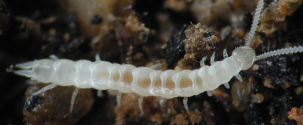

---
aliases:
  - Symphyla
title: Symphyla
---

# [[Symphyla]] 

## #has_/text_of_/abstract 

> **Symphyla**ns, also known as garden centipedes or pseudocentipedes, are soil-dwelling arthropods of the class Symphyla in the subphylum Myriapoda. Symphylans resemble centipedes, but are very small, non-venomous, and may or may not form a clade with centipedes. More than 200 species are known worldwide.
>
> Symphyla are primarily herbivores and detritus feeders living deep in the soil, under stones, in decaying wood, and in other moist places. They are rapid runners, can move quickly through the pores between soil particles, and are typically found from the surface down to a depth of about 50 centimetres (20 in). They consume decaying vegetation, but can do considerable harm in an agricultural setting by consuming seeds, roots, and root hairs in cultivated soil. For example, the garden symphylan, Scutigerella immaculata can be a pest of crops. A species of Hanseniella has been recorded as a pest of sugar cane and pineapples in Queensland. A few species are found in trees and in caves. A species of Symphylella has been shown to be predominantly predatory, and some species are saprophagous.
>
> [Wikipedia](https://en.wikipedia.org/wiki/Symphyla) 

### Information on the Internet

-   [Centre International de     Myriapodologie](http://www.mnhn.fr/assoc/myriapoda/INDEX.HTM).
    International Society of Myriapodology and Onychophorology.
-   [Tasmanian     Symphyla](http://www.qvmag.tas.gov.au/zoology/multipedes/tassymph/symintro.html)

## Phylogeny 

-   « Ancestral Groups  
    -  [Arthropoda](../../Arthropoda.md) 
    -  [Bilateria](../../../Bilateria.md) 
    -  [Animals](../../../../Animals.md) 
    -  [Eukarya](../../../../../Eukarya.md) 
    -   [Tree of Life](../../../../../Tree_of_Life.md)

-   ◊ Sibling Groups of  Arthropoda
    -  [Hexapoda](../Hexapoda.md) 
    -  [Crustacea](../Crustacea.md) 
    -  [Pauropoda](Pauropoda.md) 
    -  [Diplopoda](Diplopoda.md) 
    -  [Centipede](Centipede.md) 
    -   Symphyla
    -  [Arachnida](../Chelicerata/Arachnida.md) 
    -   [[Sea_Scorpion](../Chelicerata/Sea_Scorpion.md)    -   [Horseshoe_Crab](../Chelicerata/Horseshoe_Crab.md)
    -   [Sea_Spider](../Chelicerata/Sea_Spider.md)
    -  [Trilobites](../Trilobites.md) 

-   » Sub-Groups 
	-   *Scutigerellidae*
	    -   *Scutigerella*
	    -   *Neoscutigerella*
	    -   *Scopoliella*
	    -   *Scolopendrelloides*
	    -   *Hanseniella*
	    -   *Millotellina*
	    -   *Tasmaniella*
	-   *Scolopendrellidae*
	    -   *Scolopendrella*
	    -   *Scolopendrellopsis*
	    -   *Symphylella*
	    -   *Symphylellina*
	    -   *Geophilella*
	    -   *Remysymphyla*
	    -   *Symphylellopsis*
	    -   *Ribautiella*

## Title Illustrations

---------------------------------------------------------------------------
 
Scientific Name ::     Symphyla
Location ::           USA: Arizona: Tucson
Specimen Condition   Live Specimen
Copyright ::            © 2004 [David R. Maddison](http://david.bembidion.org/) 

## Confidential Links & Embeds: 

### #is_/same_as :: [Symphyla](/_Standards/bio/bio~Domain/Eukarya/Animal/Bilateria/Arthropoda/Myriapoda/Symphyla.md) 

### #is_/same_as :: [Symphyla.public](/_public/bio/bio~Domain/Eukarya/Animal/Bilateria/Arthropoda/Myriapoda/Symphyla.public.md) 

### #is_/same_as :: [Symphyla.internal](/_internal/bio/bio~Domain/Eukarya/Animal/Bilateria/Arthropoda/Myriapoda/Symphyla.internal.md) 

### #is_/same_as :: [Symphyla.protect](/_protect/bio/bio~Domain/Eukarya/Animal/Bilateria/Arthropoda/Myriapoda/Symphyla.protect.md) 

### #is_/same_as :: [Symphyla.private](/_private/bio/bio~Domain/Eukarya/Animal/Bilateria/Arthropoda/Myriapoda/Symphyla.private.md) 

### #is_/same_as :: [Symphyla.personal](/_personal/bio/bio~Domain/Eukarya/Animal/Bilateria/Arthropoda/Myriapoda/Symphyla.personal.md) 

### #is_/same_as :: [Symphyla.secret](/_secret/bio/bio~Domain/Eukarya/Animal/Bilateria/Arthropoda/Myriapoda/Symphyla.secret.md)

