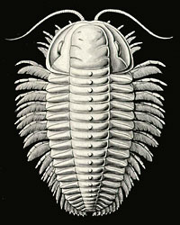
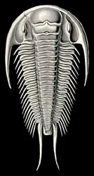
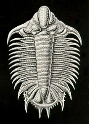

---
aliases:
  - Trilobites
title: Trilobites
---

# [[Trilobites]]

Trilobita 
)   

## #has_/text_of_/abstract 

> **Trilobites** (; meaning "three-lobed entities") are extinct marine arthropods that form the class Trilobita. One of the earliest groups of arthropods to appear in the fossil record, trilobites were among the most successful of all early animals, existing in oceans for almost 270 million years, with over 22,000 species having been described. Because trilobites had wide diversity and an easily fossilized mineralised exoskeleton made of calcite, they left an extensive fossil record. The study of their fossils has facilitated important contributions to biostratigraphy, paleontology, evolutionary biology, and plate tectonics. Trilobites are placed within the clade Artiopoda, which includes many organisms that are morphologically similar to trilobites, but are largely unmineralised. The relationship of Artiopoda to other arthropods is uncertain.
>
> Trilobites evolved into many ecological niches; some moved over the seabed as predators, scavengers, or filter feeders, and some swam, feeding on plankton. Some even crawled onto land. Most lifestyles expected of modern marine arthropods are seen in trilobites, with the possible exception of parasitism (where scientific debate continues). Some trilobites (particularly the family Olenidae) are even thought to have evolved a symbiotic relationship with sulfur-eating bacteria from which they derived food. The largest trilobites were more than 70 centimetres (28 in) long and may have weighed as much as 4.5 kilograms (9.9 lb).
>
> The first appearance of trilobites in the fossil record defines the base of the Atdabanian/Cambrian Stage 3 time period of the Early Cambrian around 521 million years ago. Trilobites were already diverse and globally dispersed shortly after their origination, with trilobites reaching an apex of diversity during the late Cambrian–Ordovician, and remained diverse during the following Silurian and early Devonian. During the mid-late Devonian, their diversity strongly declined, being impacted by successive extinction events, including the Taghanic event, the Late Devonian mass extinction/Kellwasser event and the Hangenberg/end-Devonian mass extinction, wiping out most trilobite diversity and leaving Proetida as the only surviving order. Their diversity moderately recovered during the Early Carboniferous, before dropping to persistently low levels during the late Carboniferous and Permian periods, though they remained widespread until the end of their existence. The last trilobites disappeared in the end-Permian mass extinction event about 251.9 million years ago, by which time only a handful of species remained.
>
> [Wikipedia](https://en.wikipedia.org/wiki/Trilobite) 

### Information on the Internet

-   [Guide to the Orders of     Trilobites](http://www.aloha.net/%7Esmgon/ordersoftrilobites.htm).
-   [Trilobite     Identification](http://www.es.mq.edu.au/MUCEP/flagship/trilobites/index.htm).
    Peter Cockle, Luke Strotz, John Paterson, Macquarie University
    Centre for Ecostratigraphy and Palaeobiology (MUCEP).
-   [Kevin\'s TRILOBITE home     page](http://24.114.7.13/kevin/Trilobites.html).
-   [Trilobite     Page](http://www.peripatus.gen.nz/Taxa/Arthropoda/Trilobita/Trilobite.html).
-   [TRILOBITES\...and their evolution through     time](http://www.brookes.ac.uk/geology/8361/1998/kirsty/trilo.html).

## Phylogeny 

-   « Ancestral Groups  
    -  [Arthropoda](../Arthropoda.md) 
    -  [Bilateria](../../Bilateria.md) 
    -  [Animals](../../../Animals.md) 
    -  [Eukarya](../../../../Eukarya.md) 
    -   [Tree of Life](../../../../Tree_of_Life.md)

-   ◊ Sibling Groups of  Arthropoda
    -  [Hexapoda](Hexapoda.md) 
    -  [Crustacea](Crustacea.md) 
    -  [Pauropoda](Myriapoda/Pauropoda.md) 
    -  [Diplopoda](Myriapoda/Diplopoda.md) 
    -  [Centipede](Myriapoda/Centipede.md) 
    -  [Symphyla](Myriapoda/Symphyla.md) 
    -  [Arachnida](Chelicerata/Arachnida.md) 
    -   [[Sea_Scorpion](Chelicerata/Sea_Scorpion.md)    -   [Horseshoe_Crab](Chelicerata/Horseshoe_Crab.md)
    -   [Sea_Spider](Chelicerata/Sea_Spider.md)
    -   Trilobites

-   » Sub-Groups 
	-   *Redlichiida* †
	-   *Corynexochida* †
	-   *Ptychopariida* †
	-   *Phacopida* †
	-   *Proetida* †
	-   *Lichida* †
	-   *Asaphida* †

## Title Illustrations

-   Triarthrus (Ptychopariida)
-   Paradoxides (Redlichiida)
-   Lichas (Lichida)

Images from Ernst Haeckel\'s Kunstformen der Natur published 1899-1904
by Verlag des Bibliographischen Instituts, Leipzig and Vienna. Scans
courtesy of [Kurt Stüber\'s online library of historic and classical biology books.](http://caliban.mpiz-koeln.mpg.de/%7Estueber/stueber_library.html)
)
)

 

## Confidential Links & Embeds: 

### #is_/same_as :: [Trilobites](/_Standards/bio/bio~Domain/Eukarya/Animal/Bilateria/Arthropoda/Trilobites.md) 

### #is_/same_as :: [Trilobites.public](/_public/bio/bio~Domain/Eukarya/Animal/Bilateria/Arthropoda/Trilobites.public.md) 

### #is_/same_as :: [Trilobites.internal](/_internal/bio/bio~Domain/Eukarya/Animal/Bilateria/Arthropoda/Trilobites.internal.md) 

### #is_/same_as :: [Trilobites.protect](/_protect/bio/bio~Domain/Eukarya/Animal/Bilateria/Arthropoda/Trilobites.protect.md) 

### #is_/same_as :: [Trilobites.private](/_private/bio/bio~Domain/Eukarya/Animal/Bilateria/Arthropoda/Trilobites.private.md) 

### #is_/same_as :: [Trilobites.personal](/_personal/bio/bio~Domain/Eukarya/Animal/Bilateria/Arthropoda/Trilobites.personal.md) 

### #is_/same_as :: [Trilobites.secret](/_secret/bio/bio~Domain/Eukarya/Animal/Bilateria/Arthropoda/Trilobites.secret.md)

